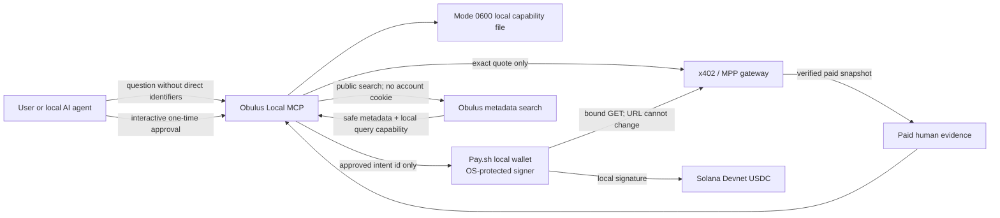

# Obulus Local Agent

Obulus Local Agent is the accountless buyer path for the human-evidence market.
It is a standalone MCP application, not a browser-wallet wrapper. It never asks
for an email, password, contributor profile, Phantom connection, seed phrase,
or private key.

The central service still performs public metadata search, quote commitment,
paid-delivery verification, and evidence synthesis. The local MCP runtime keeps
the query-scoped capability and Pay.sh signer on the user's machine. Only the
minimum request required for the market operation crosses the boundary.

## Trust boundary



### Remains local

- Pay.sh private key and account selection
- query-scoped payment capability
- payment-intent history
- direct identifiers blocked or redacted before a query is sent
- no Phantom session, email/password session, or contributor profile

### Necessarily leaves the device

- the minimized research question and coarse filters
- selected evidence handles and exact quote id
- the public payer address and transaction receipt during settlement
- the paid evidence returned to the requesting local agent

This is data minimization and local key custody, not transaction anonymity.
Solana payer addresses and receipts are public. The current server also stores
the query needed to rank and audit a purchase. Do not place personal identifiers
in research questions; strict mode blocks common identifiers by default.

This first local path protects **buyers**. Contributor memories are still held
by the current Obulus prototype. A future self-hosted contributor node would
need federated metadata registration, local encrypted evidence storage, online
availability, consent revocation, and receipt verification before the raw
contributor corpus could be removed from the central data plane.

## Why Pay.sh replaces Phantom here

Obulus MCP only searches and prepares exact quotes. It has no signing tool. The
user approves one stored intent in a real terminal, where the exact amount,
network, asset, recipient, immutable quote ID, named Pay.sh account and purpose
are shown. A constrained payment MCP then
accepts only that intent id. It cannot accept a model-supplied URL, method,
headers, body, amount or recipient. The broker executes an immutable quote-ID
URL through `pay fetch --account NAME`, whose key remains in the local
OS-protected account. A missing pinned Pay.sh installation or named account
fails closed; it never falls back to a PATH binary or runtime package download.

This separation prevents the language model or Obulus server from receiving a
wallet private key, and prevents an Obulus tool call from silently turning a
search into a payment.

## File structure

```text
apps/obulus-local-agent/
├── mcp_config.json       # Obulus + Pay.sh MCP processes
├── package.json
├── README.md
├── src/
│   ├── cli.mjs           # doctor, tools, forget, MCP entry point
│   ├── approval.mjs      # interactive one-time intent approval
│   ├── config.mjs        # HTTPS-only remote origin policy
│   ├── constants.mjs     # fixed Devnet network and USDC mint
│   ├── errors.mjs        # safe MCP error surface
│   ├── http.mjs          # bounded JSON transport
│   ├── marketplace.mjs   # accountless search, quote, recovery, synthesis
│   ├── mcp.mjs           # MCP 2025-06-18 server
│   ├── pay-mcp.mjs       # approved-intent-only payment MCP
│   ├── payment-broker.mjs # exact intent binding and Pay.sh execution
│   ├── pay-sh.mjs        # pinned project Pay.sh resolution (fail closed)
│   ├── privacy.mjs       # direct-identifier blocking and request minimization
│   ├── quotes.mjs        # network, mint, amount, recipient and bundle checks
│   ├── state.mjs         # atomic mode-0600 local capabilities
│   └── tools.mjs         # seven buyer-only tools and schemas
└── test/
    └── local-agent.test.mjs
```

## Run

From the repository root:

```bash
npm run local-agent:doctor
npm run local-agent:tools
npm run local-agent:mcp
# after prepare_evidence_payment returns an intent id:
npm run local-agent:approve -- intent_...
```

Register the constrained Obulus MCP surfaces in Codex, Claude, or both:

```bash
npm run local-agent:install-mcp -- codex
npm run local-agent:install-mcp -- claude
npm run local-agent:install-mcp -- all
```

The broad official Pay.sh MCP remains explicit opt-in; human-evidence purchases
should use the more constrained `obulus-pay` surface. For manual configuration,
copy `mcp_config.json` into an MCP client. Hosted endpoints use:

```bash
export OBULUS_API_URL=https://api.example.com
export OBULUS_GATEWAY_URL=https://pay.example.com
export OBULUS_PAY_ACCOUNT=research
```

Remote origins must use HTTPS. Loopback HTTP is allowed for development. Run
`pay setup` deliberately before the first real payment; installation and free
search never create or fund a wallet automatically. If Pay.sh returns an
ambiguous failure or a response that does not match the approved receipt, the
intent is not retried automatically. Use `evidence_payment_status` with the
immutable quote/job ID first; direct documents and bundles both have a
capability-scoped recovery path.
