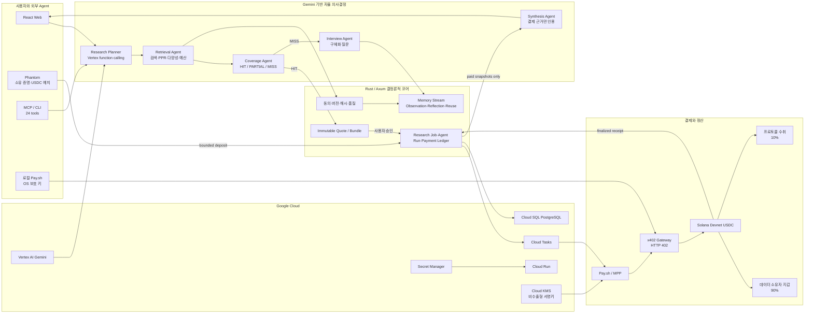

# Obolus 결선 기술·상용화 준비도

기준일: 2026-08-20
검토 범위: 웹, Rust API, 검색·메모리·품질 로직, Gemini/Vertex AI, MCP/CLI,
x402 gateway, Pay.sh orchestrator, Solana Devnet, Cloud Run·Cloud SQL·Cloud
Tasks·Cloud KMS·Secret Manager, 테스트 및 현재 GCP 서빙 상태

## 결론

Obolus의 가장 강한 포지션은 **B. Autonomous On-chain Settlement**다. 질문자가
질문별 최대 예산을 한 번 승인하면 Agent가 사람 DB를 검색·랭킹하고, 필요한 최소
근거만 선택한 뒤, 정해진 예산과 정책 안에서 문서별 Solana USDC 결제를 수행한다.
**A. Agent-Initiated Commerce**도 함께 충족하지만, 핵심 차별점은 단순 결제 요청이
아니라 검색 결과와 결제 대상·금액·수취인을 자동 결정하고 복구 가능한 원장으로
정산한다는 점이다. 현재 코드에는 A2A 프로토콜이나 Passkey가 구현돼 있지 않으므로
그 둘을 사용했다고 주장해서는 안 된다.

소스 코드 기준 핵심 제품 흐름은 구현됐고 로컬 전체 자동 검증 435개가 통과한다. 다만 이
revision의 두 단계 Vertex 흐름은 아직 현재 서빙 API와 공개 autonomy artifact에
승격·재기록되지 않았다. 따라서 `npm run pitch:verify-live`가 최신 인프라 revision,
Cloud Run 실행 로그, autonomy v2와 Devnet v2의 24시간 신선도·2시간 상호 시각 범위를
함께 통과하기 전에는 “현재 세 gate ready”라고 주장하지 않는다. Devnet gate도
Open Call funding·payout·refund lifecycle의 증거이지 HIT 구매·인용 합성의 동일 run
증거가 아니다. 운영 구조와 개별 capability 실증은 Mainnet 출시 승인이나 실제 고객
수요 검증을 뜻하지 않는다.

## 제품을 한 문장으로 설명하면

Obolus는 범용 LLM이 알 수 없는 지역·직업·생활 경험을 실제 사람들의 동의된 DB에서
검색하고, Agent가 답변에 필요한 근거만 문서 단위로 구매해 데이터 소유자에게
Solana USDC로 정산하는 human evidence network다.

사람의 답변은 일회성 설문으로 사라지지 않는다. 품질 검증을 통과한 응답은 해시,
버전, 동의 범위, 수취 지갑과 연결된 개인 memory stream에 들어간다. 이후 관련
질문에서 다시 선택되면 원문을 새로 생성하지 않고 같은 경험 문서가 재사용되며,
실제 열람될 때마다 다시 정산된다. 검색 결과가 부족하면 대상·인원·보상을 명시한
Open Call로 전환되어 새로운 사람 데이터가 공급된다.

## 심사 항목별 구현과 남은 과제

### 1. AI 기술 자율성 — 30%

#### 현재 구현

- 인증된 질문의 첫 Vertex AI Gemini function call이 `search_human_evidence`를
  호출해 검색 수량, 카테고리, 지역, 연령·가구·분야 filter를 보완한다. 사용자가
  정한 예산은 모델 schema에 없다.
- Rust가 텍스트 관련성, 핵심어 coverage, 질문별 personalized
  PageRank, 신뢰도, 최신성, 작성자 다양성, 중복도와 예산을 함께 계산한다.
- 검색 뒤 두 번째 Vertex function call은 aggregate HIT/PARTIAL/MISS, 후보 수,
  선택 수, quote 유무만 관찰하고 기존 근거 구매 제안, hybrid research, Open Call,
  무료 baseline 또는 종료 중 하나를 선택한다.
- `research_planner → retrieval_agent → coverage_agent` 세 단계가 `agent_runs`,
  `agent_steps`에 영속 저장된다. 이 이름은 실행 역할이며 독립 Agent나 A2A가 아니다.
- 모델 장애·잘못된 도구·범위 밖 인자가 발생하면 동일한 정책의 결정론적 fallback을
  사용한다. 실행 기록에는 도구와 결과만 남고 chain-of-thought나 원문 prompt는
  저장하지 않는다.
- Gemini는 검색 MISS의 무료 baseline, 기여자 인터뷰 질문, 결제된 근거만을
  사용하는 citation 합성의 세 역할을 맡는다.
- 웹 외부에서도 24개의 MCP 도구로 검색, quote, 결제 준비, 근거 합성, Open Call,
  memory, 수익·지급 상태를 호출할 수 있다.

#### 안전 경계

Gemini가 사용할 수 있는 검색 도구에는 지갑, 수취인, 자산, 가격, 송금 기능이 없다.
모델은 사용자가 정한 문서 수와 예산을 늘릴 수 없고, 결제 전 private passage를 볼
수 없다. HIT가 발생해도 실행은 `awaiting_user_approval`에서 멈추며, 사용자 승인과
서버의 immutable quote가 일치해야만 결제 단계로 넘어간다. 즉 확률적 AI는 계획과
해석을 담당하고, 동의·가격·해시·버전·결제·본문 공개는 결정론적 시스템이 통제한다.

#### 심사에서 정확히 표현할 범위

현재 구조는 **두 번의 실제 Vertex 함수 호출 사이에 결정적 Rust tool 실행이 있는
bounded autonomy loop**다. A2A나 multi-agent 구현은 아니다. 세 trace 이름을 세
Agent처럼 설명하거나 Google A2A Agent Card·task protocol을 사용했다고 말하면 안 된다.

#### 보완 우선순위

- 완료: API에서 검색 전 계획과 검색 후 다음 행동을 서로 다른 Vertex function
  call로 실행하고, 각 호출 전에 일일 budget fence와 create-only 감사 intent를 남긴다.
- 배포 gate: 최신 API 리비전에 이 두 호출과 3단계 trace, 사용자 승인 정지를 한
  질문으로 다시 연결한 비밀 없는 evidence v2 gate가 12/12를 통과해야 한다.
- P1: agent run 상세 조회 API와 운영 대시보드에 tool latency, fallback rate,
  HIT/PARTIAL/MISS별 다음 행동, 사용자 승인 전환율을 추가한다.
- P1: fallback rate와 질문 복잡도를 계측한 뒤에만 최대 1회 bounded re-planning을
  검토한다. 현재는 검색 전·후 고정 두 호출이며 반복 루프라고 주장하지 않는다.
- P2: 외부 기업 Agent와 통신해야 할 실제 고객 요구가 생길 때 A2A를 추가한다.
  해커톤 가점을 위해 빈 프로토콜을 억지로 붙이는 것보다 현재 MCP와 감사 가능한
  실행 기록을 완성하는 편이 더 설득력 있다.

### 2. 비즈니스 가치 및 UX — 30%

#### 해결하는 문제

시장조사 기관, 브랜드, 소셜 월드모델 기업은 특정 지역·직업·상황의 최신 인간
경험을 얻기 위해 매번 패널을 모집하고 인터뷰한다. 같은 사람이 비슷한 질문에
반복 응답해도 데이터는 프로젝트 보고서에 갇히고, 응답자는 최초 보상 이후의 재사용
가치에 참여하지 못한다. 범용 LLM은 공개 웹의 평균적 패턴에는 강하지만 최근의
지역 선택, 실제 구매 이유, 실패 경험처럼 공개되지 않은 firsthand evidence를
정확히 알 수 없다.

#### 현재 UX

- 질문 한 번으로 무료 metadata 검색과 랭킹을 수행한다.
- 질문 조건에 맞는 최소 독립 근거 집합과 정확한 총액을 결제 전에 보여준다.
- 사용자는 문서마다 결제하지 않고 질문별 한도를 한 번 승인한다.
- x402 facilitator가 Devnet 네트워크 수수료를 부담하므로 구매자는 테스트 USDC만
  필요하고 SOL은 필요하지 않다.
- Phantom은 지갑 소유 증명과 잔액 부족 시 bounded USDC 예치만 서명한다. 서버는
  사용자의 개인키나 token delegate 권한을 받지 않는다.
- 결제된 passage만 인용되며, 데이터가 부족하면 필요한 대상·인원·보상이 명확한
  Open Call을 제안한다.
- 기여자는 자신의 memory, lock·수정·삭제, 접근과 수익을 관리할 수 있다.
- 인증 서버가 일시 장애일 때 기존 세션을 무조건 삭제하지 않고 복구 UI를 제공한다.

#### 마이크로페이 수익 모델

현재 문서 가격대는 **₩5·₩10·₩15·₩25**이며 검색과 metadata 비교는 무료다.
제품 UI가 표시하는 목표 정책은 결제액 내 소유자 90% / 프로토콜 10%이지만, 현재
hosted Devnet Pay.sh receipt는 primary split 제약 때문에 1 atomic만 남기고 나머지를
소유자에게 보낸다. 동일 receipt의 exact 90/10은 아직 구현되지 않은 Mainnet 전
gate다. 구독이 기본 모델은 아니며 현재 가격은 상용 margin 증거가 아니다.

플랫폼 매출은 다음처럼 설명하는 것이 가장 정확하다.

`플랫폼 매출 = 유료 evidence open 총액 × 10% + Open Call 정산 수수료(향후 정책)`

기업용 private panel, SLA나 데이터 적재 서비스는 별도 계약 가능성이 있지만 현재
제품의 핵심 경제는 월 구독이 아니라 문서 단위 machine micropayment다.

#### 보완 우선순위

- P0: 현재 GCP에 최신 gas-sponsored/90:10 UX를 승격하고 실제 브라우저에서
  “SOL 없이 USDC 예치 → 자동 문서별 정산 → 영수증”을 증명한다.
- P0: 브라우저 세션에만 남는 질문 UI 기록과 별개로, 서버 원장의 buyer receipt를
  계정별로 조회하는 API와 영수증 화면을 제공한다.
- P1: 해커톤 이후 소비자 Web3 진입장벽을 더 낮추려면 WebAuthn Passkey 또는
  passkey-backed embedded wallet을 검토한다. 현재는 wallet-only signMessage와
  gas sponsorship으로 진입 단계를 줄였지만 Passkey 자체는 구현돼 있지 않다.
- P1: 실제 PoC에서 HIT rate, 질문당 유료 문서 수, 답변 시간, 반복 사용률,
  contributor 재수익률, 환불률을 측정한다.
- P1: 건강·법률·신용·채용 자동결정은 초기 시장에서 제외하고, 브랜드·F&B·리테일,
  시장조사, 소셜 월드모델 검증 데이터처럼 탐색적 research부터 시작한다.

### 3. GCP 인프라 확장성 — 15%

#### 소스와 리소스에 구현된 구조

- Cloud Run: React web, Rust API, x402 gateway, Pay.sh orchestrator/collector
- Vertex AI Gemini: function calling, baseline, interview prompt, paid evidence synthesis
- Cloud SQL PostgreSQL 16: 결제·동의·메모리·agent run·복구 원장
- Cloud Tasks: settlement 작업의 bounded retry와 동시성 제한
- Cloud KMS: 비수출형 Solana 운영 키 서명
- Secret Manager: DB URL, RPC, 내부 인증정보
- Cloud Build/Artifact Registry: 서비스별 이미지 빌드와 배포
- GCS create-only rollback audit: 외부 side effect 전 독립 감사 경계
- `/readyz`, 구조화된 복구 상태, 전용 service account 및 fail-closed 설정 검사

#### 현재 실제 운영 검사 결과

2026-08-11 읽기 전용 검증기 기준 77/77이 통과했다.

- API `obolus-api-hotfix-7265e30`, gateway·orchestrator·Pay의 서비스별 리비전이
  각각 명시적으로 100% 트래픽을 받고 올바른 image repository와 digest를 사용한다.
- API·gateway·orchestrator는 각각 전용 service account를 사용한다.
- gateway의 x402·Pay.sh와 orchestrator의 Pay.sh 최종성 검사는 서로 다른 origin의
  RPC 두 개를 사용한다.
- API·gateway·orchestrator readiness는 200이고 Pay.sh 내부 health는 public
  boundary에서 404로 차단된다.
- `ax-apps-db`는 PostgreSQL 16, backup, PITR, 7일 보존, `ENCRYPTED_ONLY`이며 API가
  Cloud SQL을 mount하고 Secret Manager의 DB URL을 사용한다.
- Cloud Tasks settlement queue는 bounded retry·dispatch 한도를 갖고, Cloud KMS
  signer는 비수출형 키와 전용 권한을 사용한다.

이 상태를 감추지 않기 위해 `finalist:verify-infra`와
`finalist:guard-promotion`을 추가했다. 승격 가드는 정확한 revision, image repository,
digest, 전용 service account, Cloud Tasks, KMS, 독립 RPC 조건을 확인하기 전에는
통과하지 않으며 `--to-latest` 사용을 금지한다.

#### 보완 우선순위

- P0: 배포마다 `finalist:guard-promotion`과 `finalist:verify-infra`를 다시 실행하고,
  `summary.ready=true`인 정확한 revision ID만 승격한다.
- P1: Cloud Monitoring SLO, error budget, 결제 reconciliation backlog, Vertex fallback
  rate, queue age, RPC 불일치 알람을 대시보드와 alert policy로 고정한다.
- P1: 실제 트래픽 증가 전 Cloud SQL HA, private IP/VPC connector, restore drill,
  Cloud Armor/rate limit을 검증한다.

### 4. Solana 온체인 결제 — 15%

#### 현재 구현

- 보호된 문서 URL이 exact price, Devnet USDC mint, network, owner recipient가 포함된
  HTTP 402/x402 또는 MPP challenge를 반환한다.
- Agent는 질문별 immutable bundle에서 선택된 문서만 결제하고, 각 quote는 content
  hash, document version, consent version, owner wallet, amount, expiry와 결합된다.
- hosted 경로는 prepaid balance를 원자적으로 reserve한 뒤 Cloud Run Pay.sh
  orchestrator와 KMS signer를 사용한다. 외부 Agent 경로는 MCP/CLI와 로컬 Pay.sh
  credential store를 사용한다.
- 최종 응답 공개 전에 두 독립 RPC가 같은 finalized transaction bytes, 금액, mint,
  수취인, memo/attempt를 재현해야 한다.
- 결제 응답 유실, worker 재시작, blockhash 만료, RPC 지연, partial failure에서
  같은 signed transaction만 복구하며 새 송금을 중복 생성하지 않는다.
- 미사용 reserve는 환불 claim으로 복구되고, payout/refund worker는 lease와 durable
  outbox를 사용한다.
- Open Call은 미래 수취인이 정해지지 않으므로 기존 문서 결제와 분리된 escrow
  funding·deterministic payout claim·미사용분 환불 흐름을 사용한다.

#### 실측 완료와 보완 우선순위

- hosted run `hosted-devnet-1786442491484`에서 7,408 atomic Devnet USDC funding,
  3,704 atomic 기여자 payout, 3,704 atomic 미사용분 refund를 실행했다.
- funding·payout·refund는 각각 서로 다른 두 RPC에서 finalized·오류 없음으로
  재현됐고, 동일 durable job의 취소 재시도에서 duplicate settlement는 0건이었다.
- 이전 v1 recorder는 질문·인터뷰·개인키·RPC URL을 제외한 증거 13/13을 기록했다.
  현재 v2 gate는 이 실행을 Open Call lifecycle로 정확히 분류하고 canonical mint,
  quote↔transaction exact delta, payer debit, refund 산술까지 17/17로 재검증해야 한다.
- P1: Mainnet 전환 전 treasury와 사용자 자금을 법적으로 분리하고 KYC/AML, 제재
  주소, 세금, 환불·분쟁, 회계 원장 정책을 확정한다.
- P1: Open Call escrow를 장기적으로 trust-minimized하게 만들 필요가 있으면 Solana
  program과 감사된 program-derived escrow를 도입한다. 현재는 backend ledger와
  service-wallet payout 구조이므로 “온체인 에스크로 프로그램”이라고 부르면 안 된다.

## 전체 아키텍처

## 구현의 혁신성을 뾰족하게 설명하는 방법

1. **LLM 답변 서비스가 아니라 인간 근거를 거래하는 검색 인프라다.** Gemini가
   사람을 흉내 내지 않고, 어떤 사람 DB가 필요한지 계획하고 이미 결제된 근거만
   합성한다.
2. **검색과 결제를 분리한다.** 안전한 metadata는 무료로 비교하고, 관련성·신뢰·
   다양성·예산을 계산한 최소 근거 집합만 유료로 연다.
3. **인기도가 아니라 질문별 권위를 계산한다.** Google의 링크 기반 검색과 스팸
   방어 원리를 인간 evidence graph에 맞게 재해석했다. paid·sponsored·self·copied
   관계는 positive authority를 만들 수 없다.
4. **검색 실패가 공급을 만든다.** MISS는 빈 화면이 아니라 필요한 대상·인원·보상을
   가진 Open Call이 되고, 채택된 답변은 다음 질문에서 재사용 가능한 memory가 된다.
5. **사람의 데이터가 반복 수익 자산이 된다.** 정확한 원문을 버전·동의·해시와 함께
   보존하고, 동일 경험이 다시 필요할 때 생성형 impersonation 없이 재사용한다.
6. **결제가 정보 접근 권한을 결정한다.** payment proof가 진실을 증명하는 것은
   아니지만, 어떤 버전의 passage를 누가 얼마에 열었고 어떤 답변에 사용할 수 있는지
   기계적으로 고정한다.
7. **사람이 매번 클릭하지 않아도 된다.** 질문별 한도 안에서 Agent가 문서 단위
   마이크로페이를 수행하고, MCP를 통해 외부 Agent도 같은 시장을 사용할 수 있다.

## 상용화 단계

### 결선 현재 완료

- API·gateway·orchestrator·Pay를 서비스별 올바른 Cloud Run 리비전과 전용 identity로 배포
- GCP 검증 77개 전부 통과, `summary.ready=true`
- SOL 없는 신규 Phantom 지갑의 USDC-only 온보딩 확인

### 배포 직후 재검증

- hosted Pay.sh 실제 Devnet Open Call 지급·환불 evidence의 v2 gate 재기록
- signed-in 질문에서 검색 전·후 Vertex tool call, 3단계 역할 trace와 동일 revision Cloud Run log 확인
- 세 artifact의 24시간 신선도, 2시간 생성 범위와 API serving revision 상관관계 확인

### P1 — 유료 PoC 전에 완료

- 동의 문구·사용 목적·보존 기간·철회·삭제 처리에 대한 법률 검토
- 실제 사람 30~100명 규모의 좁은 패널과 20~50개 질문으로 품질·HIT rate 검증
- representative sample이 아님을 표시하고 diversity/coverage 경고 제공
- buyer·contributor support, dispute SLA, payout reconciliation 운영 절차
- 실제 문서 결제 한 건에서 UI·quote·90/10 on-chain split을 같은 receipt로 연결
- buyer server receipt 조회 API와 계정별 영수증 화면
- Passkey/embedded wallet 또는 검증된 fiat-to-USDC 진입 경로
- SLO·alert·incident drill·Cloud SQL restore drill·KMS rotation drill
- mainnet 경제 모델과 수수료, treasury, 세무·회계·제재 정책 검증

### P2 — 네트워크 확장

- outcome-verified evidence와 산업별 trust graph
- 대규모 hybrid retrieval과 multilingual embedding
- 기업 private panel과 세분화된 access policy
- 실제 파트너 요구가 있을 때 A2A/AP2 interoperability
- 외부 감사를 통과한 Solana escrow program과 Mainnet settlement

## 검증 결과

- frontend unit: 25/25
- Cloudflare Pages proxy: 3/3
- Antigravity MCP runtime: 14/14
- 로컬 Agent MCP/CLI: 24/24
- 독립 Obulus MCP: 7/7
- 결선 evidence tooling: 13/13
- x402 payment gateway: 102/102
- Pay.sh orchestrator: 53/53
- Rust library/API: 176/176
- Rust API main: 1/1
- Rust agent autonomy contract: 7/7
- Rust contract/PostgreSQL concurrency: 2/2
- Solana settlement program: 8/8
- 총 435개 테스트 통과
- TypeScript build/typecheck, Vite production build, Pages bundle verification, oxlint,
  Rust fmt, Clippy `-D warnings`, `git diff --check` 통과
- root/payment-gateway/agent-orchestrator/local-agent npm production dependency audit: 취약점 0
- RustSec audit은 현재 로컬 도구가 설치돼 있지 않아 이번 기준선에서 재실행하지 못했다.
  Mainnet 후보 판정 전 CI 또는 별도 검증 환경에서 반드시 통과시킨다.
- gateway mutation: 200/200 killed, 100%
- Rust 전체 mutation 기준선: 437개 중 197 caught, 221 missed, 19 unviable. 이 수치는
  통과가 아니며 survivor 축소가 Mainnet 전 필수 후속 작업이다.

## 현실적인 점수 판단

운영·Gemini·Devnet 실증까지 포함하면 AI 자율성 26~28/30, 비즈니스·UX 24~26/30,
GCP 14~15/15, Solana 14~15/15 수준의 근거가 있다. 발표 점수를 제외한 90점 중
약 82~87점을 방어할 수 있다. 남은 가장 큰 불확실성은 코드량이 아니라 좁고 명확한
고객 PoC의 독립 품질·시간 절감 지표와 Rust mutation survivor다. Mainnet은 법률·
treasury·회계·제재 정책과 외부 보안 검토 전에는 출시 완료로 표현하지 않는다.
