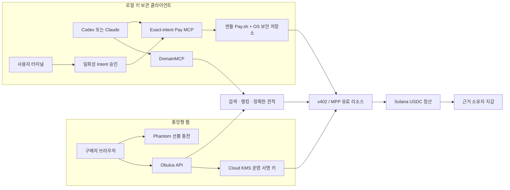
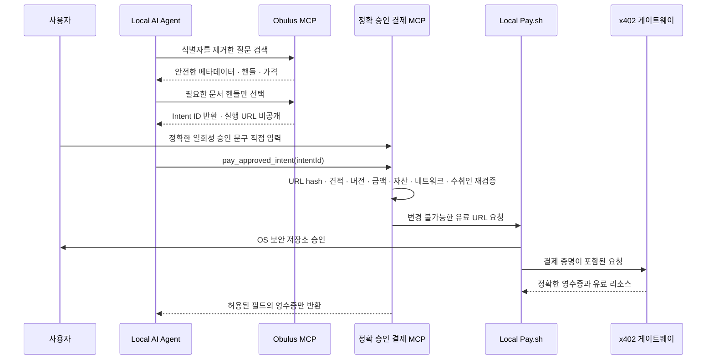

# Obulus 로컬 결제 보관 아키텍처

Obulus는 하나의 인간 근거 시장을 공유하면서, 구매자의 선택에 따라 두 가지
결제 보관 방식을 제공합니다.

웹 경로는 질문별 한도가 있는 선불 권한과 운영용 KMS 서명 키를 사용합니다.
로컬 경로의 구매자 검색은 계정과 프로필을 요구하지 않고, 서명을 구매자 기기의
OS 보안 저장소에 있는 Pay.sh 계정으로 옮깁니다. 기여자 작업이나 Open Call
게시에는 Pay.sh SIWX 소유권 증명으로 만든 wallet-only 세션을 사용합니다.
이메일·비밀번호 로그인과 Phantom은 필요하지 않습니다. 어느 경로도 개인정보
원문을 온체인에 저장하지 않습니다.

## 정확한 결제 의도만 실행하는 경계

AI는 결제 금액과 수취 조건을 변경할 수 없습니다. Pay.sh 프로세스가 정상
종료했다는 사실만으로도 성공 처리하지 않습니다. 반환된 문서 또는 작업 영수증이
사용자가 승인한 조건과 정확히 일치해야 합니다. 결과가 불명확하면 `ambiguous`
상태로 전환하고 복구 확인 전 자동 재결제를 막아 중복 결제를 방지합니다.

## 여전히 남는 위험

- 서버 검색과 접근 제어를 위해 최소화된 질문과 선택한 문서 핸들은 서버가
  확인합니다.
- 채팅 에이전트의 현재 프롬프트와 필요한 도구 결과는 사용자가 구성한 Claude
  endpoint로 전송됩니다. API 키와 전체 로컬 대화 아카이브는 전송하지 않습니다.
- 사용자가 기여자 프로필 저장을 요청하면 동의된 프로필·선호 필드는 Obulus
  서버에 저장됩니다. 로컬 보관은 서비스 기능에 필요한 모든 데이터까지 로컬에만
  둔다는 뜻이 아닙니다.
- 사용자 컴퓨터나 OS 보안 저장소가 침해되면 로컬 지갑도 위험할 수 있습니다.
  로컬 보관은 위험의 주체를 바꾸지만 단말 보안 위험을 없애지는 않습니다.
- Solana 결제 주소와 영수증은 공개됩니다. 로컬 보관은 결제 익명성을
  의미하지 않습니다.
- 공식 Pay.sh MCP는 더 엄격한 Obulus 결제 broker와 의도적으로 분리했습니다.
  인간 근거 구매에는 `obulus-pay`를 우선 사용해야 합니다.
- 공개 배포에는 패키지 provenance, 고정된 의존성, 체크섬, 재현 가능한 빌드
  증거와 안전한 MCP 설치·업데이트 경로가 필요합니다.
