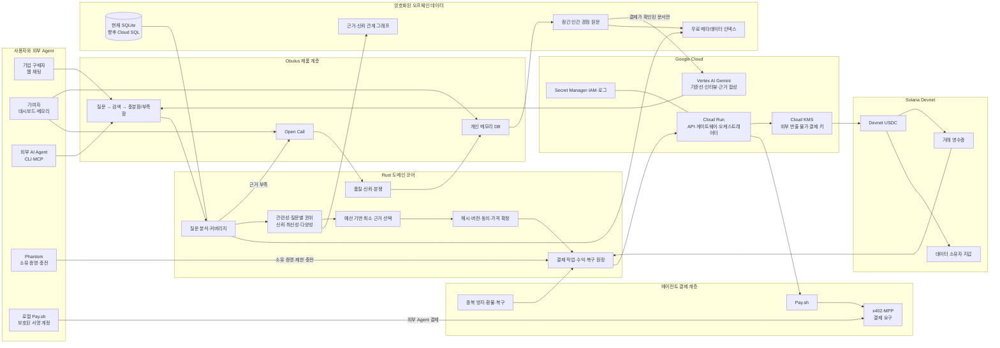

# Obulus PPT 기획안

> Google Cloud × Solana 해커톤 발표 및 기업 PoC 소개용

> **현재 발표 정본 안내:** 아래 16장 구성은 상세 콘텐츠 저장소다. 실제 결선 본편은
> 표지 포함 8장과 90초 라이브 데모이며, D0~D9의 정확한 노드·화살표·발표 문구는
> [`OBULUS-PITCH-DIAGRAM-BRIEF.ko.md`](./OBULUS-PITCH-DIAGRAM-BRIEF.ko.md)를 따른다.
> 주최 측이 요구한 `타깃 기관/기업/개인 → 해결 문제 → 도입 시나리오 → 아키텍처`는
> 텍스트 목록이 아니라 이 일곱 개 다이어그램으로 증명한다. 정확한 무대 전환과 시간은
> [`FINAL-PITCH-RUNBOOK.ko.md`](./FINAL-PITCH-RUNBOOK.ko.md)가 단일 정본이다.

## 1. 발표 자료의 목표

이 자료는 Obulus를 처음 보는 사람이 다음 다섯 가지를 순서대로 이해하도록
만든다.

1. 범용 AI와 공개 웹에는 왜 실제 인간의 경험이 부족한가
2. 기존 시장조사는 왜 느리고 반복 비용이 큰가
3. Obulus는 인간 경험을 어떻게 검색 가능한 데이터 자산으로 만드는가
4. Gemini, Google Cloud, x402, Pay.sh, Solana가 왜 필요한가
5. 이 구조가 기업과 개인에게 어떤 경제적 가치를 만드는가

아래 **16장**은 콘텐츠 저장소이며 실제 본편은 8장이다. 정확한 알고리즘 가중치와
품질 임계값은 발표자가 질문받았을 때 설명할 보조 자료로만 준비하고, 본편에는 핵심
원리만 보여준다.

### 반드시 드러낼 해커톤 평가 기준

- **혁신성 및 사용자 경험**: 질문 한 번으로 검색, 결제, 신규 조사까지 연결
- **Gemini·Google Cloud 활용**: 인간 데이터를 대체하지 않는 세 가지 AI 역할
- **기술 완성도**: 검색·권한·결제·복구가 하나의 일관된 구조로 동작
- **실제 구동 여부**: 제품 화면, 실행 로그, Devnet 거래와 지급 증거

### 표현 원칙

- 공식 제품명은 **Obulus**, 에이전트명은 **Obulus Agent**로 통일한다.
- `OPENSHELF`, `SHELF-1`은 이전 코드명이다.
- Obulus를 설문 앱, 페르소나 판매 서비스, 사람 복제 AI로 설명하지 않는다.
- 기술명보다 먼저 그 기술이 해결하는 문제를 설명한다.
- 구현된 내용은 `[구현 확인]`, 실제 외부 거래가 필요한 내용은 `[실증 필요]`,
  미래 계획은 `[향후 계획]`, 가격 등 미확정 내용은 `[사업 가정]`으로 표시한다.

---

## 2. 전체 이야기 흐름

AI는 공개 웹을 검색할 수 있지만, 기업이 정말 필요로 하는 최근의 지역적이고
구체적인 경험은 아직 사람 안에 남아 있다. 기업은 이를 얻기 위해 비슷한 사람을
매번 새로 모집하고, 응답자는 한 번만 보상받으며, 풍부한 인터뷰는 일회성
보고서로 사라진다.

Obulus는 한 사람의 동의된 경험 데이터베이스를 웹사이트처럼, 개별 경험 문서를
웹페이지처럼 다룬다. Agent는 안전한 메타데이터를 무료로 검색하고, 질문에 가장
필요한 소수의 독립 근거를 먼저 선택한 뒤, 실제로 여는 문서에 대해서만
x402·Pay.sh·Solana USDC로 정산한다.

검색 결과가 충분하면 기존 근거를 즉시 재사용한다. 부족하면 그 공백이 정확한
Open Call이 되어 새로운 인간 경험을 수집한다. 채택된 답변은 개인의 장기
메모리 데이터베이스에 쌓이고, 다음 질문에서 다시 검색되고 보상될 수 있다.

Gemini는 인간을 흉내 내는 역할이 아니라, 부족한 근거를 식별하고, 구체적인
인터뷰를 돕고, 결제가 확인된 근거만 인용해 합성한다. 그 결과 Obulus는 단순한
조사 도구가 아니라, 인간 경험의 발견·권한·가격·정산을 연결하는 에이전트용
데이터 인프라가 된다.

---

## 3. 슬라이드별 기획

## 슬라이드 1. 표지 — AI가 실제 사람의 경험을 검색하는 방법

### 한 문장 메시지

> Obulus는 인간의 실제 경험을 검색 가능하고, 허가 가능하고, 결제 가능한
> 데이터 자산으로 만든다.

### 화면 문구

- **Obulus**
- AI를 위한 인간 경험 검색·결제 네트워크
- 실제 경험을 검색하고, 열어본 근거에만 지불합니다.

### 화면 구성

- 왼쪽 40%: 제품명과 한 문장 설명
- 오른쪽 60%: 실제 질문창이 보이는 제품 화면
- 하단 작은 배지: Gemini · Google Cloud · Solana · x402 · Pay.sh · MCP

### 사용할 사진

- `docs/pitch-deck-assets/01-home-hero.png`
- 질문 입력창과 중앙 제품 문구가 보이도록 잘라 사용한다.
- 현재 화면의 이전 브랜드명은 발표 전 Obulus로 변경한 뒤 다시 촬영한다.

### 발표 포인트

“Obulus는 사람을 AI로 복제하는 서비스가 아닙니다. 실제 사람이 제공한 경험을
검색하고, 사용한 근거의 소유자에게 직접 보상하는 인프라입니다.”

### 평가 연결

- 혁신성 및 사용자 경험

---

## 슬라이드 2. 해결 문제 — 공개 웹 밖에 있는 인간 경험

### 한 문장 메시지

> AI는 공개된 정보에는 강하지만, 최근의 구체적인 실제 경험에는 접근하기 어렵다.

### 화면 문구

**범용 AI가 주로 답하는 것**

- 공개 웹에 많이 나타난 일반적 패턴
- 평균적인 지역·직군·연령 페르소나
- 출처가 모호한 그럴듯한 설명

**기업이 실제로 알고 싶은 것**

- 지난주 평일 저녁에 실제로 무엇을 선택했는가
- 어느 표현이나 경험 때문에 구매를 포기했는가
- 얼마를 지불했고, 어떤 대안을 비교했는가
- 최근 몇 달 사이 행동과 선호가 어떻게 바뀌었는가

### 화면 구성

- 왼쪽: 일반적인 AI 답변 세 줄
- 오른쪽: 시간·장소·가격·행동이 포함된 인간 경험 카드 세 장
- 중앙에 “공개 정보와 실제 경험의 간극” 표시

### 사용할 사진

- 제품 캡처보다 직접 제작한 비교 도식을 사용한다.
- 사람 얼굴 스톡 사진보다 익명 근거 카드 형태를 우선한다.

### 발표 포인트

“검색엔진이 찾는 것은 사람들이 이미 공개한 정보입니다. 하지만 의사결정을
바꾸는 희소한 정보는 아직 사람의 머릿속과 생활 경험 속에 있습니다.”

### 평가 연결

- 혁신성
- 문제의 당위성

---

## 슬라이드 3. 기존 방식의 한계 — 매번 다시 사고, 한 번만 보상한다

### 한 문장 메시지

> 기존 시장조사는 같은 종류의 경험을 반복 수집하면서도 이를 재사용 가능한
> 자산으로 만들지 못한다.

### 화면 문구

**기존 조사**

질문 설계 → 패널 모집 → 인터뷰 → 요약 보고서 → 다음 프로젝트에서 다시 모집

**구조적 문제**

- 응답자는 한 번만 보상받는다.
- 풍부한 원문은 평균과 요약으로 압축된다.
- 어떤 실제 근거가 최종 판단에 쓰였는지 추적하기 어렵다.
- 작은 질문에도 전체 조사 비용이 발생한다.

**시장 변화**

- 소셜 월드모델과 AI 평가 시장에서 장기 인간 인터뷰의 가치가 커지고 있다.
- 인간 경험은 일회성 응답이 아니라 반복 사용 가능한 데이터 자산이 될 수 있다.

### 화면 구성

- 위: 기존 조사의 직선형 흐름
- 아래: 답변 → 메모리 자산 → 반복 검색 → 반복 보상의 순환형 흐름

### 사용할 사진

- 별도 캡처 없이 직접 제작한 전후 비교 다이어그램

### 발표 포인트

“지금은 인터뷰를 수집한 플랫폼이 대부분의 재사용 가치를 가져갑니다. Obulus는
실제 데이터 소유자도 반복 사용의 경제에 참여하게 합니다.”

### 평가 연결

- 혁신성
- 비즈니스 영향

---

## 슬라이드 4. 해결책 — 질문하고, 랭킹하고, 열어본 만큼 지불한다

### 한 문장 메시지

> 자연어 질문 하나가 인간 데이터 검색, 근거 선택, 결제와 인용까지 이어진다.

### 화면 문구

1. 도메인에 특화된 질문을 입력한다.
2. 신뢰할 수 있는 인간 데이터베이스를 랭킹한다.
3. 실제로 연 근거에 대해서만 지불한다.

하단 문구:

> 검색은 무료입니다. 인간 경험의 원문 열람만 유료입니다.

### 화면 구성

- 왼쪽 35%: 세 단계 설명
- 오른쪽 65%: 실제 로그인 제품 소개 화면

### 사용할 사진

- `docs/pitch-deck-assets/03-login-product-flow.png`
- 오른쪽의 세 단계 제품 설명을 크게 보여준다.

### 발표 포인트

“사용자는 조사 프로젝트를 설계할 필요가 없습니다. 질문하면 Obulus Agent가
필요한 대상과 근거 조건을 구조화하고, 먼저 기존 데이터를 검색합니다.”

### 평가 연결

- 혁신성 및 사용자 경험
- 기술 완성도

---

## 슬라이드 5. 핵심 아이디어 — Google 웹 검색을 인간 데이터에 재해석

### 한 문장 메시지

> 개인 데이터베이스는 웹사이트, 경험 문서는 웹페이지, 유료 접근 주소는 URL처럼
> 작동한다.

### 화면 문구

| 공개 웹 | Obulus |
| --- | --- |
| 웹사이트 | 한 사람이 소유한 경험 데이터베이스 |
| 웹페이지 | 동의된 인간 경험 문서 |
| URL | 안정적인 유료 데이터 주소 |
| 검색 인덱스 | 원문을 제외한 무료 메타데이터 |
| 링크 권위 | 독립 근거와 검증 결과의 관계 |
| 검색 결과 클릭 | 결제 후 근거 원문 열람 |
| 광고 가치 | 데이터 소유자 직접 수익 |
| 검색 결과 부족 | Open Call로 신규 데이터 생성 |

### 하단 핵심 문구

> Google은 공개 웹을 정리했습니다. Obulus는 아직 웹에 없던 인간 경험을
> 검색 가능한 구조로 만듭니다.

### 화면 구성

- 좌우 대응형 도식
- 가운데에 `사이트 → 문서 → 유료 URL` 연결 표시

### 사용할 사진

- 직접 제작한 대응 다이어그램이 중심
- `docs/pitch-deck-assets/06-whitepaper-product-system.png`는 배경 또는 작은 보조
  화면으로만 사용

### 발표 포인트

“Google의 현재 알고리즘을 복제했다는 뜻은 아닙니다. URL, 인덱싱, 관련성,
권위, 스팸 방어, 상위 결과 선택이라는 검색 구조를 인간 경험과 결제에 맞게
재해석했습니다.”

### 평가 연결

- 혁신성
- 기술적 독창성

---

## 슬라이드 6. 핵심 사용자 흐름 — 검색 성공과 검색 부족

### 한 문장 메시지

> 기존 근거가 있으면 즉시 구매하고, 부족하면 필요한 부분에만 새 조사를 만든다.

### 화면 문구

**검색 성공**

- 적합한 인간 데이터베이스 발견
- 소수의 독립 근거만 선택
- 정확한 총가격 확인
- 한 번의 질문 예산 승인
- 결제된 근거만 인용

**검색 부족**

- Gemini의 무료 일반 기준선
- 부족한 실제 인간 근거를 명시
- 대상·인원·보상을 정해 Open Call
- 새 답변이 미래 검색 자산으로 축적

### 화면 구성

- 왼쪽: 검색 성공 화면
- 오른쪽: 검색 부족 및 Open Call 화면
- 가운데 분기: `검색 → 충분함 / 부족함`

### 사용할 사진

- 왼쪽 `docs/pitch-deck-assets/10-chat-hit-exact-quote.png`
- 오른쪽 `docs/pitch-deck-assets/09-chat-ranked-human-evidence.png`

### 발표 포인트

“기존 시장조사는 조사를 먼저 시작합니다. Obulus는 먼저 검색하고, 검색이
실패한 부분에 대해서만 새 조사 비용을 사용합니다. 검색 실패 자체가 다음 데이터
공급을 만드는 수요 신호가 됩니다.”

### 평가 연결

- 혁신성 및 사용자 경험
- Gemini 활용
- 실제 제품 동작

---

## 슬라이드 7. 검색 엔진 — 결제하기 전에 최소 근거 집합을 고른다

### 한 문장 메시지

> Obulus는 가장 인기 있는 사람을 고르는 것이 아니라, 현재 질문에 필요한 최소한의
> 신뢰 가능한 근거 집합을 고른다.

### 화면 문구

**1. 후보 제한**

- 지역·연령·분야·가격·동의·최신성

**2. 질문별 랭킹**

- 텍스트 관련성
- 핵심 개체와 희귀 단어 일치
- 질문별 PageRank형 권위
- 작성자 신뢰도와 최신성

**3. 구매 묶음 최적화**

- 같은 작성자 중복 제거
- 유사 문서 중복 감점
- 표본 다양성
- 목표 수량과 예산 안에서 선택

### 반드시 설명할 원칙

- 결제·광고·자기추천 관계는 권위를 올리지 않는다.
- 독립 검증과 실제 결과가 확인된 관계만 긍정 권위를 전달한다.
- 플랫폼은 많은 문서를 파는 것이 아니라 필요한 문서만 고른다.

### 화면 구성

- `후보 80개 → 랭킹 12개 → 독립 근거 5개 → 결제` 깔때기 도식
- 우측에 실제 검색 원리 화면

### 사용할 사진

- `docs/pitch-deck-assets/04-coverage-search-model.png`

### 발표 포인트

“관련성이 높은지 보기 전에 원문을 열면 개인정보도 노출되고 비용도 발생합니다.
그래서 Obulus는 무료 메타데이터와 신뢰 신호로 먼저 랭킹한 뒤, 최소 근거만
결제합니다.”

### 평가 연결

- 기술 완성도
- 혁신성

---

## 슬라이드 8. 인간 메모리 자산 — 답변 한 번이 장기 데이터가 된다

### 한 문장 메시지

> 채택된 답변은 해시·버전·동의 상태를 가진 문서가 되어, 통제권을 유지하면서
> 다시 검색되고 보상될 수 있다.

### 화면 문구

답변 → 품질 검증 → 경험 문서 → 검색 노출 → 유료 열람 → 수익 → 최신화

**문서가 보존하는 것**

- 실제 발화와 질문 맥락
- 문서 해시와 버전
- 동의 버전과 판매 가능 상태
- 접근 기록과 수익 기록
- 정정·잠금·내보내기·삭제

**중요한 경계**

- 사적인 인터뷰 문맥 전체를 자동 판매하지 않는다.
- 요약과 추론은 원본 근거를 유지하며 직접 발화처럼 판매하지 않는다.
- 자동 재사용은 과거 원문 재사용이지, AI가 사용자를 흉내 내는 것이 아니다.

### 화면 구성

- 가로형 메모리 생애주기
- `답변 버전 1 → 유료 사용 → 정정 → 버전 2` 시간축 포함

### 사용할 사진

- 직접 제작한 메모리 생애주기 다이어그램
- 필요하면 `docs/pitch-deck-assets/08-dashboard-live-demand.png`의 일부를 보조로 사용

### 발표 포인트

“구매 당시 무엇을 열었는지 증명하려면 과거 버전을 보존해야 하고, 사용자가
기억을 정정할 권리도 있어야 합니다. 그래서 덮어쓰지 않고 새 버전을 만듭니다.”

### 평가 연결

- 혁신성
- 기술 완성도
- 데이터 거버넌스

---

## 슬라이드 9. 기여자 경험 — 성실한 답변이 반복 수익이 되는 구조

### 한 문장 메시지

> 좋은 인간 경험은 일회성 노동으로 끝나지 않고, 미래 질문에 재사용되는 개인
> 데이터 자산이 된다.

### 화면 문구

더 구체적인 답변
→ 더 풍부한 메모리
→ 더 정확한 질문 매칭
→ 더 많은 적합한 유료 열람
→ 더 많은 개인 수익
→ 지속적인 참여와 데이터 최신화

**저품질 방어**

- 시간·장소·가격·행동 같은 구체성 확인
- 질문 복사, 반복 문장, 유사 답변 탐지
- 구매자 피드백과 신고
- 신뢰도, 경고, 지급 보류, 분쟁 처리

### 화면 구성

- 왼쪽: 실제 기여자 대시보드
- 오른쪽: 인간 근거 선순환 구조

### 사용할 사진

- `docs/pitch-deck-assets/08-dashboard-live-demand.png`

### 발표 포인트

“결제가 진실을 증명하지는 않습니다. 대신 출처, 버전, 독립성, 품질 이력, 실제
구매자의 평가를 쌓아 신뢰를 높입니다.”

### 평가 연결

- 혁신성 및 사용자 경험
- 비즈니스 영향

---

## 슬라이드 10. Gemini와 Google Cloud — 인간을 대체하지 않는 AI

### 한 문장 메시지

> Gemini는 인간 데이터를 생성하는 대신, 부족한 근거를 찾고, 구체적인 답변을
> 끌어내고, 결제된 근거만 합성한다.

### 화면 문구

**1. 검색 부족 기준선**

- 일반적으로 알려진 내용 제공
- 현재 부족한 인간 경험을 명시
- Open Call에 필요한 질문 구조화

**2. 인터뷰 지원**

- 시간·장소·가격·이유를 묻는 후속 질문
- 일반론보다 직접 경험을 끌어냄
- 답변을 대신 작성하지 않음

**3. 결제 후 근거 합성**

- 결제가 확인된 문서만 입력
- 합의점, 차이점, 소수 의견 보존
- 허용된 근거 식별자만 인용

### Google Cloud 구성

- Vertex AI의 Gemini
- Cloud Run의 백엔드·결제 오케스트레이터
- Cloud KMS의 외부 반출 불가능한 결제 키
- Secret Manager, IAM, Cloud Build, 로그

### 하단 원칙

> 확률적 AI는 해석을 담당하고, 결정론적 시스템은 동의·가격·버전·결제를
> 통제합니다.

### 화면 구성

- 기준선 / 인터뷰 / 합성의 세 열
- 각 열 하단에 실제 Google Cloud 구성요소 연결

### 사용할 사진

- 직접 제작한 3단계 AI 역할 다이어그램
- 단순 Gemini 로고 나열은 피한다.

### 발표 포인트

“무료 AI 답변은 인간 문서가 되지 않고 수익이나 권위를 만들지 않습니다. 인간
근거가 충분할 때 AI가 더 싸다는 이유로 그 공급을 우회하지도 않습니다.”

### 평가 연결

- Gemini·Google Cloud 활용도
- 기술 완성도

---

## 슬라이드 11. 유료 URL — x402·Pay.sh·Solana가 연결되는 방식

### 한 문장 메시지

> 인간 경험 문서의 본문 접근 경계가 곧 결제 경계가 된다.

### 화면 문구

1. Agent가 잠긴 인간 경험 주소를 요청한다.
2. 서버가 가격·자산·네트워크·수취인을 포함한 결제 요구를 반환한다.
3. Pay.sh가 결제 요구를 확인하고 서명을 요청한다.
4. 결제 증명과 함께 요청을 다시 보낸다.
5. 서버가 정산을 검증한 뒤 정확한 문서 버전을 공개한다.
6. Gemini가 공개된 근거만 인용한다.

### 기술 역할

- **x402**: HTTP 자원의 결제 경계
- **Pay.sh**: 결제 요구 감지, 서명 연결, 재요청
- **Solana USDC**: 여러 데이터 소유자에게 문서 단위 정산

### 핵심 원칙

> 결제는 진실을 증명하지 않습니다. 어떤 버전의 근거가 열렸고, 누가 보상받아야
> 하며, 최종 답변이 어떤 근거를 사용할 수 있었는지 증명합니다.

### 화면 구성

- 왼쪽: 가격·결제 구조 UI
- 오른쪽: 요청 → 결제 요구 → 서명 → 재요청 → 본문 공개 순서도

### 사용할 사진

- `docs/pitch-deck-assets/05-pricing-paid-evidence.png`

### 발표 포인트

“블록체인은 장식이 아닙니다. 하나의 질문에서 여러 독립 데이터 소유자에게 작은
금액을 기계 속도로 나눠 지급하기 위한 정산 수단입니다.”

### 평가 연결

- 블록체인·인프라 연동
- 혁신성

---

## 슬라이드 12. 안전한 자동결제 — 한 번 승인하되 권한은 제한한다

### 한 문장 메시지

> 자동결제는 사용자 지갑의 무제한 출금 권한이 아니라, 선불 잔액과 질문 예산
> 안에서만 가능한 제한된 정산이다.

### 화면 문구

| 구성요소 | 역할 | 할 수 없는 것 |
| --- | --- | --- |
| Phantom | 지갑 소유 증명, 필요할 때 선불 충전 서명 | 서버에 개인키 제공, 무제한 출금 허용 |
| 선불 권한 | Obulus 내부 잔액의 질문별 예약 | 사용자 지갑 직접 출금 |
| Cloud KMS 키 | 승인된 운영 결제 서명 | 사용자 Phantom 키 대체 |
| 로컬 Pay.sh 계정 | 외부 Agent의 로컬 결제 서명 | AI에 원시 개인키 노출 |
| 기여자 지갑 | 데이터 사용료 수령 | 개인키를 Obulus에 제공 |

**복구 설계**

- 질문 시작 시 정확한 금액을 원자적으로 예약
- 일부 문서 결제 실패 시 사용하지 않은 금액 복원
- 응답 유실 시 이미 결제한 문서를 다시 결제하지 않고 복구
- 같은 작업 재시도 시 중복 지급 방지

### 화면 구성

- 왼쪽: 지갑별 권한 표
- 오른쪽: 실제 온보딩 결제 화면

### 사용할 사진

- `docs/pitch-deck-assets/07-onboarding-wallet-and-x402.png`

### 발표 포인트

“Phantom 연결은 서버에 돈을 마음대로 꺼낼 권한을 주는 것이 아닙니다. 사용자
지갑, 내부 선불 권한, 서버 운영 키, 로컬 Pay.sh 키를 명확히 분리했습니다.”

### 평가 연결

- 기술 완성도
- 보안 사용자 경험
- Google Cloud 인프라

---

## 슬라이드 13. CLI·MCP — 다른 AI Agent가 직접 사용하는 시장

### 한 문장 메시지

> 웹 화면은 사용자 제품을 증명하고, CLI와 MCP는 Obulus가 외부 Agent를 위한
> 인프라임을 증명한다.

### 화면 문구

현재 제공하는 Agent 기능:

- 무료 인간 데이터 검색과 커버리지 확인
- 정확한 구매 계획과 총가격 확인
- 결제, 근거 합성, 실패 복구
- Open Call 생성과 답변 제출
- 개인 메모리·수익·지급 상태 확인

현재 저장소에는 약 23개의 마켓플레이스 도구가 구현되어 있다.

### 보안 경계

- Google/AI 계정, Obulus 계정, Pay 계정은 서로 다른 신원이다.
- 이메일이 같다고 자동 연결하지 않는다.
- Pay.sh 개인키는 로컬 운영체제 보안 저장소에 남는다.

### 화면 구성

- 실제 터미널 화면을 전체 폭으로 사용
- 우측 상단에 `검색 → 견적 → 결제 → 근거` 네 단계만 강조

### 사용할 사진

- `docs/pitch-deck-assets/11-cli-mcp-agent-interface.png`
- 실제 `agent:doctor`, `agent:tools` 출력 기반임을 주석으로 표시한다.

### 발표 포인트

“사용자는 웹에서 쓸 수 있고, 외부 AI Agent는 MCP를 통해 같은 검색과 결제
시장을 호출할 수 있습니다. 이것이 Obulus를 단순 SaaS가 아니라 에이전트 경제의
데이터 계층으로 만듭니다.”

### 평가 연결

- Agent 활용
- 기술 완성도
- 실제 구동 여부

---

## 슬라이드 14. 전체 기술 아키텍처

### 한 문장 메시지

> 검색, 인간 데이터, Gemini, 결제와 복구를 명확한 권한 경계로 연결했다.

### 발표용 다이어그램

### 다이어그램 색상 규칙

- 파란색 실선: 질문과 데이터
- 보라색: Gemini 처리
- 초록색 점선: 결제와 정산
- 주황색: Open Call과 신규 공급
- 빨간색 경계: 개인정보·권한 보호 영역

### 반드시 표시할 문구

> 개인 원문은 오프체인에 남고, 결제와 최소한의 정산 증명만 온체인으로 이동한다.

### 사용할 사진

- 제품 캡처보다 위 다이어그램을 중심으로 사용한다.
- 우측 하단에 실제 Cloud Run 또는 결제 로그를 작은 증거 카드로 추가할 수 있다.

### 발표 포인트

“LLM이 동의나 결제 상태를 판단하지 않습니다. Rust 코어가 검색 조건, 문서 버전,
동의, 가격과 정산 상태를 결정론적으로 검증하고, Gemini는 허용된 근거의 해석만
담당합니다.”

### 평가 연결

- Gemini·Google Cloud 활용
- 블록체인·인프라 연동
- 기술 완성도

---

## 슬라이드 15. 타깃 기업·도입 시나리오·수익 모델

### 한 문장 메시지

> 첫 시장은 특정 소비자 집단의 실제 경험을 빠르게 확보하고 반복 활용하려는
> 기업 리서치 조직이다.

### 화면 왼쪽 — 타깃 기관과 기업

**1차 고객**

- 소비재·F&B·리테일·커머스 기업
- 소비자 인사이트, 브랜드 전략, 제품 전략팀
- 시장조사 회사와 패널 운영사

**확장 고객**

- AI·소셜 월드모델 기업
- 컨설팅·투자·산업 리서치 조직
- 자율 AI Agent 개발사
- 대학·정책 연구기관

### 화면 중앙 — 대표 도입 시나리오

**글로벌 F&B 브랜드**

1. 파리 현지 20~30대의 실제 평일 저녁 선택을 질문
2. 기존 후보 30개에서 독립 근거 7개만 구매
3. 부족한 세그먼트 5명만 Open Call
4. 합의점·반례·세그먼트 차이를 48시간 안에 확인
5. 실제 출시 결과로 근거 품질을 사후 검증

**시장조사 기관**

- 기존 전사문을 고객 소유의 검색 가능한 private DB로 전환
- 과거 패널을 재사용하고 부족한 대상만 새로 모집
- 데이터가 다시 사용될 때 응답자에게 재보상

**AI·소셜 월드모델 기업**

- 합성 결과를 실제 인간 근거로 검증
- 취약한 세그먼트의 인터뷰만 추가 수집
- 동의·출처·최신성이 있는 평가 데이터 확보

### 화면 오른쪽 — 수익 모델

- **근거 열람 수수료**: 실제 문서가 열릴 때 과금 `[사업 가정]`
- **Open Call 수수료**: 모집·품질 검증·정산·분쟁 처리
- **마이크로페이 프로토콜 수수료**: x402로 실제 정산된 인간 근거 문서마다 발생하는 사용량 기반 수수료
- **전용 데이터망 구축**: 기존 인터뷰 변환, 동의 체계, 전용 검색
- **검증·보정 서비스**: 실제 결과 연동, 편향·품질·랭킹 보정

### 핵심 성과 지표

- 질문당 근거 확보 시간과 비용
- 기존 데이터 검색 성공률
- 기존 문서 재사용률
- 신규 모집 인원 감소
- 구매자 반복 사용률
- 기여자 반복 수익

### 화면 구성

- 3열 구조: 고객 / 도입 흐름 / 수익
- 스톡 사진 대신 기업 질문 카드와 흐름 도식을 사용한다.

### 발표 포인트

“첫 진입점은 모든 인간 지식을 거래하는 거대한 시장이 아닙니다. 접근하기 어려운
특정 소비자 집단의 실제 경험을 빠르게 찾고, 같은 패널을 반복 검색하려는 기업
리서치팀입니다.”

### 평가 연결

- 비즈니스 영향
- 시장 진입 가능성
- 혁신성

---

## 슬라이드 16. 비즈니스 영향·해자·실제 구동 증거

### 한 문장 메시지

> Obulus의 장기 해자는 블록체인이 아니라, 사용할수록 함께 쌓이는 인간 메모리와
> 실제 수요·근거·거래 그래프다.

### 화면 왼쪽 — 사업적 선순환

더 많은 질문
→ 더 정확한 데이터 공백 발견
→ 더 정교한 Open Call
→ 더 많은 인간 근거
→ 더 높은 검색 성공률
→ 더 빠르고 저렴한 답변
→ 더 많은 기업 사용
→ 더 많은 기여자 수익과 최신 데이터

### 화면 중앙 — 축적되는 해자

- 인간 메모리 데이터
- 실제 구매 수요와 검색 실패 데이터
- 독립 근거와 검증 결과의 관계
- 실제 유료 사용과 재사용 이력
- 구매자 피드백과 분쟁 결과
- 시간에 따른 개인·집단 변화

거래량이 권위를 직접 사지 못하도록 사용 이력과 검색 권위를 분리한다.

### 화면 오른쪽 — 현재 증거

`[구현 확인]`

- 웹 질문·검색·Open Call·메모리·기여자 화면
- Rust 검색·랭킹·품질·결제 작업·복구 구조
- Vertex AI 기반 기준선·인터뷰·근거 합성 경로
- x402 게이트웨이와 Pay.sh 오케스트레이터
- Phantom·선불 권한·Cloud KMS 역할 분리
- CLI·MCP 마켓플레이스 도구
- 기준 시점 자동화 테스트 90개 통과

`[실증 필요]`

- hosted Pay.sh 경로의 실제 Devnet USDC 거래
- Solana Explorer 거래 주소
- 데이터 소유자 잔액 변화
- 결제 전 요구, 오케스트레이터 로그, 결제 후 문서 공개
- 동일 작업 재시도 시 중복 결제 없음

### 사용할 사진

- 상단 일부: `docs/pitch-deck-assets/10-chat-hit-exact-quote.png`
- 하단 일부: `docs/pitch-deck-assets/11-cli-mcp-agent-interface.png`
- 오른쪽에 실제 Solana Explorer 영수증 자리 확보
- 실제 거래가 없다면 `검증 완료`라고 표시하지 않는다.

### 마지막 문구

> 웹은 공개 정보를 검색 가능하게 만들었습니다. Obulus는 아직 웹에 없던 인간의
> 경험을 검색 가능하고, 허가 가능하고, 결제 가능하게 만듭니다.

### 평가 연결

- 네 가지 평가 기준 전체
- 특히 실제 구동 여부와 사업적 확장성

---

## 4. 사진 사용표

| 사진 파일 | 사용할 슬라이드 | 용도 | 중요도 |
| --- | --- | --- | --- |
| `01-home-hero.png` | 1 | 표지의 실제 질문 UI | 높음 |
| `02-home-full.png` | 예비 | 표지 대체 화면 | 낮음 |
| `03-login-product-flow.png` | 4 | 질문·랭킹·결제의 세 단계 | 높음 |
| `04-coverage-search-model.png` | 7 | 무료 검색, 질문별 권위, 유료 경계 | 높음 |
| `05-pricing-paid-evidence.png` | 11 | 문서별 가격과 결제 구조 | 높음 |
| `06-whitepaper-product-system.png` | 5 | 인간 웹과 유료 URL 개념의 보조 자료 | 중간 |
| `07-onboarding-wallet-and-x402.png` | 12 | Phantom·지급 주소·결제 권한 설명 | 높음 |
| `08-dashboard-live-demand.png` | 8·9 | Open Call, 기여자 수요와 메모리 | 높음 |
| `09-chat-ranked-human-evidence.png` | 6 | 검색 부족과 Open Call 전환 | 최상 |
| `10-chat-hit-exact-quote.png` | 6·16 | 검색 성공, 선택된 DB, 정확한 총가격 | 최상 |
| `11-cli-mcp-agent-interface.png` | 13·16 | 외부 Agent와 MCP 구현 증거 | 최상 |

모든 파일은 `docs/pitch-deck-assets`에 있다.

### 사진 편집 원칙

- 한 슬라이드에서 제품 캡처는 최대 두 장만 사용한다.
- 전체 화면을 축소해 넣기보다 메시지에 필요한 영역을 잘라 크게 보여준다.
- 빨간 박스보다 짧은 번호와 한 줄 설명으로 시선을 안내한다.
- 현재 캡처의 `OPENSHELF`, `SHELF-1`은 실제 UI를 Obulus로 변경한 후 재촬영한다.
- 화면 글자만 편집한 뒤 이미 배포된 제품처럼 제시하지 않는다.
- CLI 사진은 실제 명령 출력 기반이지만 실제 Devnet 거래 영수증은 아니므로 역할을
  구분한다.

---

## 5. 해커톤 평가 기준 대응표

| 평가 기준 | 발표에서 보여줄 핵심 | 관련 슬라이드 | 데모 증거 |
| --- | --- | --- | --- |
| 혁신성 및 사용자 경험 | 검색 우선, 검색 성공/부족 분기, 한 번의 제한된 승인, 근거 인용, 답변의 반복 자산화 | 2–9 | 실제 검색 성공·부족 화면 |
| Gemini·Google Cloud 활용 | 기준선, 인터뷰, 결제 후 합성의 세 역할; Cloud Run, KMS, Secret Manager | 10·12·14 | Vertex 출력과 Cloud Run 로그 |
| 기술 완성도·블록체인 연동 | 최소 근거 선택, x402, Pay.sh, Solana USDC, 버전 확정, 복구와 키 분리 | 7·11–14 | 결제 요구, 서명, 정산, 복구 로그 |
| 실제 구동 여부 | 웹·CLI·MCP, 자동화 테스트, 실제 Devnet 지급과 문서 공개 | 6·13·16 | Explorer 주소, 잔액 변화, 반환 문서 |

### 과장하지 말아야 할 항목

- MCP는 현재 구현되어 있다.
- A2A, AP2, Google ADK는 실제 코드가 없다면 향후 계획으로만 표시한다.
- `@solana/pay-kit` 사용을 곧바로 정식 Solana Pay 구현이라고 표현하지 않는다.
- 자동화 테스트 수는 코드 상태와 보안 불변조건의 증거이지, 제품 정확도나 시장
  적합도 수치가 아니다.
- 샌드박스 결제와 실제 Devnet 거래를 구분한다.
- 결제는 문서의 진실성이 아니라 접근·버전·수취인·금액을 증명한다.

---

## 6. 6분 발표 시간 배분

| 시간 | 슬라이드 | 내용 |
| --- | --- | --- |
| 0:00–0:50 | 1–3 | 인간 경험의 정보 공백과 기존 조사의 비효율 |
| 0:50–1:40 | 4–6 | Obulus 해결책, 인간 웹, 검색 성공/부족 |
| 1:40–2:30 | 7–9 | 검색·랭킹, 메모리 자산, 기여자 선순환 |
| 2:30–3:20 | 10–12 | Gemini, Google Cloud, x402·Pay.sh·Solana, 키 분리 |
| 3:20–3:50 | 13 | CLI·MCP와 외부 Agent |
| 3:50–4:25 | 14 | 전체 기술 아키텍처 |
| 4:25–5:15 | 15 | 타깃 고객, 도입 시나리오, 수익 모델 |
| 5:15–6:00 | 16 | 사업적 해자, 실제 구동 증거, 결론 |

---

## 7. 최종 제작 전 필수 준비

### 발표 전 반드시 해결

- UI의 이전 브랜드명을 Obulus로 변경하고 핵심 화면 재촬영
- Cloud Run 라이브 주소 확보
- 실제 hosted Pay.sh Devnet 거래 1건 이상 완료
- Solana Explorer 거래 주소 확보
- 데이터 소유자 USDC 잔액 전후 캡처
- 결제 요구 → 정산 → 문서 공개 → Gemini 인용 전체 로그 확보
- 같은 결제 작업 재시도 시 중복 지급이 없음을 확인

### 있으면 가점이 큰 자료

- 실제 기업 질문 한 건의 검색 성공과 부족 사례
- Open Call 응답이 메모리 문서로 들어간 전후 화면
- 기여자 대시보드의 수익 증가 화면
- Cloud KMS 서명 감사 로그
- 기업 PoC 예상 비용·시간 비교표

### 향후 계획으로 구분할 내용

- 다국어 학습형 임베딩과 대규모 혼합 검색
- Cloud SQL과 분산 작업 대기열
- 본인성·전문성·Sybil 검증 강화
- 대표성·편향 관리 도구
- Mainnet, 규제, 세무, 기업용 보안 운영
- A2A·AP2 연동
