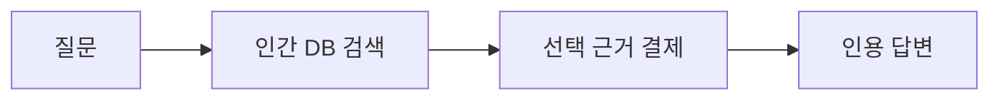
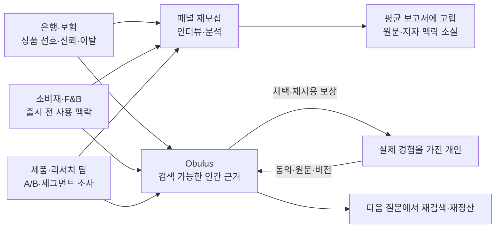
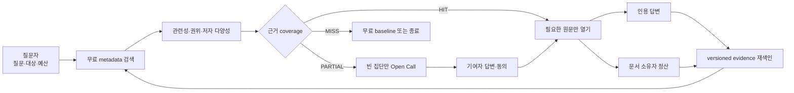
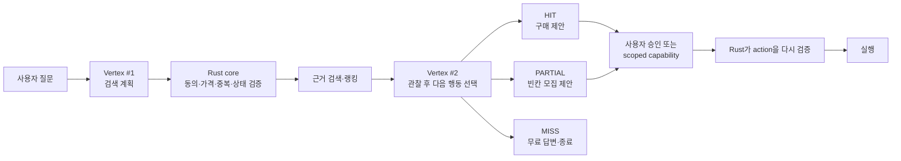
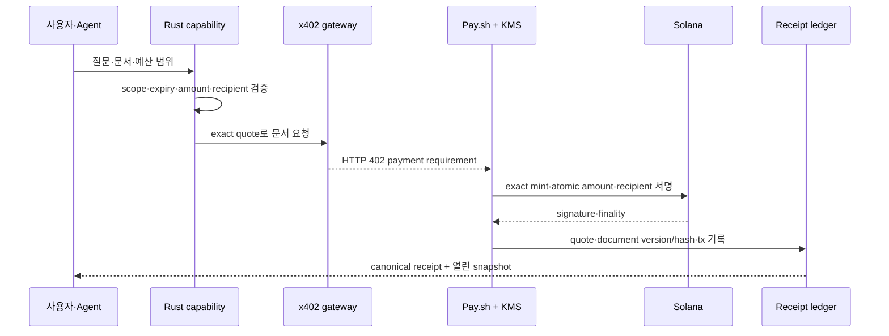
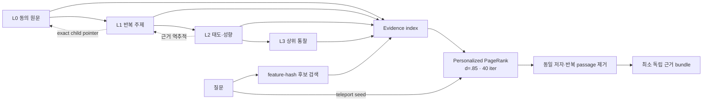
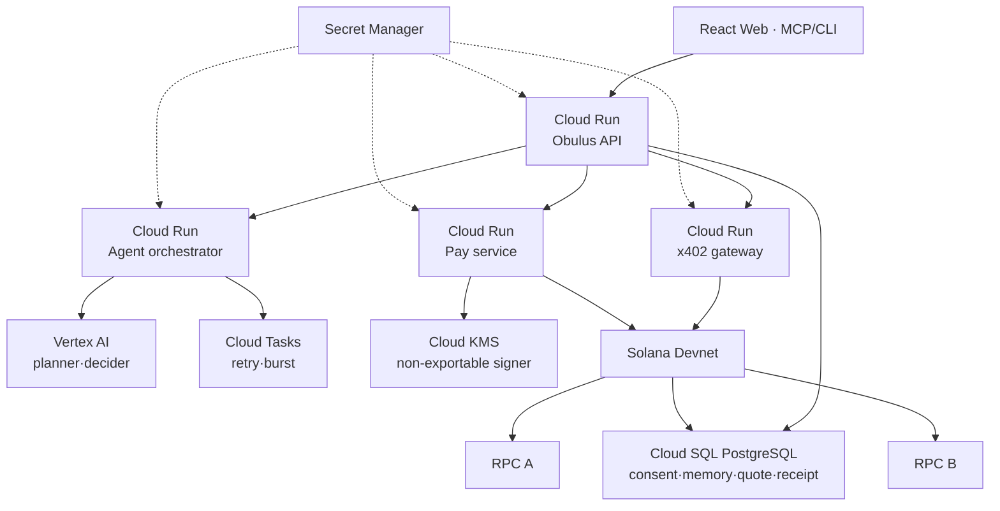
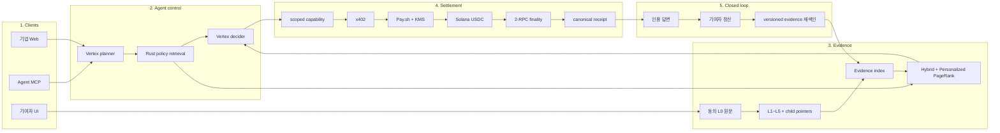
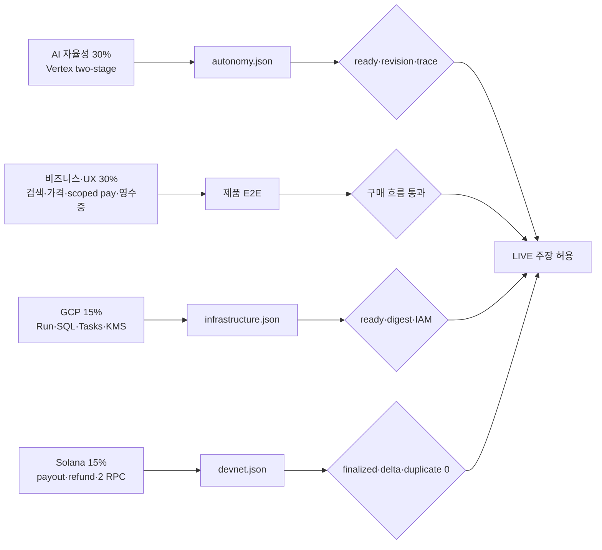

# Obulus 발표 다이어그램 브리프

## 0. 주최 측 요청을 어떻게 해석할 것인가

주최 측이 요구한 것은 기술 로고 모음이 아니라 다음 세 질문에 답하는 한 편의 시각적 설명이다.

1. **누가 어떤 문제를 겪는가?** — 타깃 기관·기업·개인과 현재 비용 누수
2. **Obulus를 도입하면 일이 어떻게 바뀌는가?** — 구매자·기여자·플랫폼의 실제 사용 시나리오와 이해관계
3. **그 약속을 어떤 시스템이 지키는가?** — Agent, GCP, 검색·추상화, x402·Pay.sh·Solana, 영수증의 전체 아키텍처

최종 심사 경로는 **표지 포함 8장**이다. 표지의 D0부터 검증 지도의 D8, 타깃별
도입 비교의 D9까지 **총 10개 다이어그램**을 하나의 번호 체계로 관리한다. D1~D4와
D7은 본편에서 크게 보여주고, D5·D6의 세부 구조는 어펜딕스에서 확대한다. 다만 D5의
검색·추상화 요약은 3·6장에, D6의 GCP 실행 rail은 4·6장에 남긴다. 각 그림은 독립된
장식이 아니라 바로 앞 장의 문제를 다음 장의 시스템으로 넘기는 연결 장치다.

### 다이어그램만 넘겨봐도 남아야 하는 열 문장

| 그림 | 화면에 남길 결론 문장 | 심사위원이 확인하는 것 |
|---|---|---|
| D0 | 질문 하나가 인간 근거 검색·결제·인용 답변으로 이어진다. | 제품을 5초 안에 이해하는가 |
| D1 | 기업은 같은 사람의 경험을 반복 구매하지만, 답변은 다음 질문에 재사용되지 않는다. | 타깃과 실제 비용 누수 |
| D2 | Obulus는 기존 근거를 먼저 검색하고, 비어 있는 집단만 새로 모집한다. | 도입 시나리오와 이해관계 |
| D3 | Gemini는 검색과 다음 행동을 고르고, Rust는 동의·가격·예산·상태를 잠근다. | Agent 자율성과 통제 경계 |
| D4 | 자동 결제라도 정확한 문서 버전·수취인·금액·finality가 한 영수증에 남는다. | Web3 UX와 사기 방지 |
| D5 | 원문은 근거 포인터를 유지한 채 상위 개념으로 자라고, 질문별 권위로 검색된다. | 데이터 moat와 추천 원리 |
| D6 | API·Agent·결제·정산은 분리 확장되고 SQL·Tasks·KMS가 상태·재시도·키를 맡는다. | GCP 프로덕션 구조 |
| D7 | 질문 하나가 검색·판단·결제·정산·재색인을 거쳐 다음 질문의 비용을 낮춘다. | 전체 사업·기술 폐루프 |
| D8 | 구현·운영·AI·Devnet 증거가 모두 통과할 때만 LIVE라고 말한다. | 검증 가능성과 과장 방지 |
| D9 | 은행·소비재·연구기관·개인은 같은 제품 루프를 서로 다른 질문과 KPI로 도입한다. | Go-to-market의 구체성 |

슬라이드에서 위 문장은 제목 또는 결론 캡션으로 사용한다. 기술명은 이 결론을
증명하는 노드 안에서만 보이며, 로고 자체가 메시지가 되지 않게 한다.

## 1. 최종 8장 본편과 다이어그램 배치

| 최종 슬라이드 | 관객이 가져가야 할 결론 | 핵심 시각물 |
|---|---|---|
| 1. 표지 | AI가 사람의 실제 경험을 검색하고 사용한 근거에 지불한다 | **D0 질문→검색→결제→인용** 미니 흐름 |
| 2. AI가 모르는 인간 데이터 | 반복 조사비는 쓰이지만 답변은 다음 질문에 재사용되지 않는다 | **D1 타깃·문제 지도** |
| 3. 제품 해결책 | 먼저 검색하고, 비어 있는 집단만 사람에게 묻는다 | **D2 이해관계 폐루프** + D5 미니 검색선 |
| 4. Gemini와 Google Cloud | Gemini가 두 번 판단하고 Rust가 권한·가격·상태를 잠근다 | **D3 Agent 실행 경로** + D6 실행 rail |
| 5. 유료 URL과 결제 | 자동 결제라도 문서·수취인·금액·finality가 영수증에 남는다 | **D4 결제·신뢰 sequence** |
| 6. 전체 아키텍처 | 질문 하나가 Agent·Evidence·Settlement를 통과해 다음 질문의 비용을 낮춘다 | **D7 전체 아키텍처** |
| 7. 목표 고객과 진입 시장 | 타깃별 도입 지점과 성공 지표가 다르다 | **D9 타깃별 도입 시나리오 small multiples** |
| 8. 증거와 비전 | 구현 주장과 실제 검증 증거를 분리하고 과장하지 않는다 | **D8 평가 증거 지도** + D6 검증 badge |

어펜딕스는 **A0 D7 확대**, **A1 D5 메모리·Personalized PageRank**,
**A2 D6 GCP 운영 구조** 순서로 시작한다. 발표 시간 안에는 구조를 읽히게 하고,
질의응답에서 계산식·서비스 경계·실행 증거를 확대한다.

---

## 2. D0 — 표지의 5초 제품 흐름

### 표지 문장

> 실제 인간의 경험을 검색하고, 열어본 근거에만 지불합니다.

### 그림의 목적

기술 설명 전에 Obulus가 무엇을 하는 제품인지 네 단계로 고정한다. 이 도식에는
서비스명, 블록체인명, 모델명이 들어가지 않는다.

```text
[질문]
   → [인간 DB 검색]
   → [선택 근거 결제]
   → [인용 답변]
```

### 각 노드의 의미

- 질문: 기업 또는 외부 Agent가 대상·상황·최신성·예산을 자연어로 입력한다.
- 인간 DB 검색: 원문을 노출하지 않고 metadata·가격·독립 저자 수를 비교한다.
- 선택 근거 결제: 실제로 사용할 문서 version만 결제한다.
- 인용 답변: 결제된 passage만 근거로 답하고 문서별 영수증을 남긴다.

### 발표 멘트

> “Obulus는 AI가 웹에 없는 실제 인간 경험을 찾는 검색·결제 레이어입니다. 질문을
> 입력하면 사람의 답변을 먼저 검색하고, 쓸 근거만 열어 인용된 답으로 돌려줍니다.”

---

## 3. D1 — 타깃 기관·기업·개인과 해결 문제

### 슬라이드 제목

> 반복해서 사람을 조사하지만, 답은 한 번 쓰이고 사라집니다.

### 그림의 목적

시장 크기를 말하기 전에 “누가 지금 어떤 일을 반복하고 있는가”를 보여준다. 구매자와 데이터 기여자를 같은 ‘사용자’로 뭉뚱그리지 않는다.

### 왼쪽 노드 — 구매자

- 은행·보험 제품/리서치 팀: 금융상품 선호, 신뢰, 이탈 이유
- 소비재·F&B·여행 인사이트 팀: 출시 전 사용 맥락, 메뉴·매장 경험
- 프로덕트 팀·리서치 기관: 반복 A/B 테스트, 세그먼트별 정성 근거

### 중앙 노드 — 현재 작업과 누수

```text
선호 조사·인터뷰·A/B 테스트
              ↓
같은 cohort를 다시 모집
              ↓
평균 보고서로 압축
              ↓
원문과 저자 맥락이 다음 질문에서 사라짐
```

### 오른쪽 노드 — Obulus 이후

```text
질문을 먼저 기존 근거에서 검색
              ↓
맞는 근거만 유료로 열기
              ↓
부족한 경우에만 특정 경험자를 모집
              ↓
채택 답변은 versioned evidence로 재사용
```

### 하단 기여자 흐름

```text
[실제 경험을 가진 개인]
        ── 동의 원문·맥락·버전 ──▶ [Obulus evidence]
        ◀──── 채택·재사용 정산 ────
```

### 화살표에 쓸 문구

- 구매자 → 현재 조사: `반복 모집비·응답비·분석비`
- 현재 조사 → 누수: `보고서에 고립`
- 기여자 → Obulus: `직접 경험·동의·버전`
- Obulus → 기여자: `채택 보상·재사용 정산`

### 발표 멘트

> “은행과 소비재 회사는 사람의 선호를 알기 위해 계속 돈을 씁니다. 문제는 답변이 보고서에 묻혀 다음 질문에서 다시 검색되지 않는다는 점입니다. Obulus는 이 답을 동의·버전·저자 맥락이 있는 재사용 가능한 근거로 바꿉니다.”

### 시각 규칙

- 세 구매자 노드는 검정, 기여자는 teal, 현재 누수는 회색, Obulus 전환 결과는 teal로 표시한다.
- `2023 · $142B` 같은 시장 숫자는 ESOMAR 산업 맥락으로만 작게 두고 흐름의 중심으로 만들지 않는다.

---

## 4. D2 — 도입 시나리오와 이해관계 폐루프

### 슬라이드 제목

> 먼저 검색하고, 빈칸만 사람에게 묻습니다.

### 그림의 목적

기업이 실제로 Obulus를 도입했을 때 질문 하나가 어떻게 검색·구매·추가 모집·재색인으로 이어지는지 보여준다.

### 주 경로

```text
[기업 질문·대상 조건·최대 예산]
                 ↓
[무료 metadata 후보 검색]
                 ↓
[관련성·동의·가격·독립 저자 검증]
                 ↓
        [HIT / PARTIAL / MISS]
          │        │       └─ 무료 baseline 또는 종료
          │        └───────── 기존 근거 + 부족분 Open Call
          └────────────────── 맞는 최소 문서 bundle
                 ↓
[총액·독립 저자 수·열 문서 제시]
                 ↓
[선택 문서만 x402/Pay.sh로 열기]
                 ↓
[질문자는 근거+영수증]  [기여자는 USDC 정산]
                 └──────────┬──────────┘
                            ↓
               [채택 답변을 다시 검색 가능하게 색인]
```

### 화면에서 가장 크게 보여 줄 숫자 예시

```text
40개 후보 → 5개 통과 → 독립 저자 4명 → 총 ₩60
```

이 숫자는 실제 실행 결과로 교체해야 한다. 예시라면 `예시`를 명시한다.

### 세 참여자의 이해관계

| 참여자 | 얻는 것 | 무엇을 통제하는가 |
|---|---|---|
| 질문자/기업 | 반복 조사비 절감, 근거가 있는 답 | 대상·필요 수·예산·채택 조건 |
| 기여자/개인 | 한 번 쓴 답변의 채택·재사용 수익 | 동의·버전·철회·정정 |
| Obulus | 검색·정산·품질 인프라 수수료 | 중복 제거·provenance·receipt·분쟁 처리 |

### 발표에서 사용할 실제 도입 시나리오 3종

다이어그램 중앙에는 하나의 공통 제품 루프만 두고, 발표자는 아래 세 사례 중
관객과 가장 가까운 하나를 말한다. 서로 다른 기능처럼 보이지 않도록 모든 사례는
동일한 `질문 → 무료 검색 → HIT/PARTIAL/MISS → 최소 구매/부족분 모집 → 영수증`
경로를 사용한다.

| 대상 | 시작 질문 | Obulus가 먼저 확인하는 것 | 부족할 때의 행동 | 최종 산출물 |
|---|---|---|---|---|
| 은행·보험 인사이트 팀 | “첫 월급을 받은 20대가 적금 가입을 포기한 실제 이유는?” | 연령·시점·상품 경험이 맞는 독립 근거와 가격 | 해당 경험자만 목표 인원·보상과 함께 Open Call | 인용 가능한 선택 이유, 반례, 문서별 영수증 |
| F&B·소비재 팀 | “성수에서 직장인이 15분 안에 고르는 평일 점심 기준은?” | 지역·시간·직장인 맥락이 맞는 최근 원문 | 비어 있는 시간대나 직군만 추가 모집 | 메뉴·대기·가격의 실제 경험 묶음과 총액 |
| 개인 기여자 | “내 경험이 어느 질문에 실제로 쓰였는가?” | 자신의 동의 버전, 채택 이력, 열린 문서 범위 | 새 Open Call 중 조건이 맞는 질문만 제안 | 첫 채택 보상, 이후 재사용 정산, 철회·정정 이력 |

#### 은행 사례를 20초로 설명하는 순서

```text
은행 질문 입력
  → 기존 동의 답변의 metadata와 가격을 무료 비교
  → 5개 중 서로 다른 저자 3명의 근거만 선택
  → 부족한 20대 첫 월급 cohort 2명만 추가 모집
  → 결제된 원문을 인용해 가입 포기 이유와 반례를 함께 전달
  → 각 문서 소유자에게 USDC 정산, 은행에는 canonical receipt
```

이 시나리오의 핵심은 “AI가 20대를 추정했다”가 아니라 “조건이 맞는 실제 경험을
찾고, 없는 부분만 새로 물었다”는 데 있다.

### 발표 멘트

> “Obulus는 검색 전에 설문을 만들지 않습니다. 먼저 기존 근거의 존재와 가격만 무료로 보여주고, 맞는 문서만 엽니다. 일부만 부족하면 그 빈칸에 맞는 사람만 모집합니다. 그래서 구매자의 비용 절감과 기여자의 반복 정산이 같은 루프 안에서 성립합니다.”

### 반드시 보일 예외 경로

- `MISS → 자동 유료 모집`으로 그리지 않는다.
- 기본은 `무료 baseline 또는 종료`이고, 사람 대상 Open Call은 질문자가 대상·답변 수·보상을 정한 뒤에만 생성한다.

---

## 5. D3 — Gemini와 Rust의 Agent 실행 경로

### 슬라이드 제목

> Gemini가 계획하고, Rust가 경계를 지킵니다.

### 그림의 목적

‘Gemini API를 한 번 호출했다’가 아니라, 관찰 결과에 따라 도구와 다음 행동을 고르는 bounded Agent loop가 구현돼 있음을 보여준다.

### 주 경로

```text
[Web / Gemini·Claude·Codex MCP 질문]
                 ↓
[Vertex Gemini planner]
 검색 domain·filter·limit·허용 tool 선택
                 ↓ typed function schema
[Rust policy core]
 동의·locked·가격·예산·저자 중복·상태 전이 검증
                 ↓
[Hybrid retrieval + Personalized PageRank]
                 ↓ 후보·coverage·trust·총액 관찰
[HIT / PARTIAL / MISS]
                 ↓
[Vertex Gemini coverage decider]
 구매 제안 / 기존 근거+Open Call / 무료 baseline / 종료
                 ↓
[Server 재검증]
 관찰 상태와 다른 action이면 거부 또는 deterministic fallback
```

### 권한 경계 표

| Gemini가 선택할 수 있음 | Gemini가 생성·변경할 수 없음 |
|---|---|
| 검색 필터, 후보 수, 허용된 다음 action | 지갑, 수취인, 문서 가격, 예산 상향, quote, transaction bytes |

### 라이브 데모 애니메이션

1. MCP intake 노드가 점등된다.
2. planner 노드가 violet로 pulse한다.
3. Rust policy 노드가 teal check를 표시한다.
4. retrieval과 PageRank edge를 따라 점이 이동한다.
5. HIT/PARTIAL/MISS 중 실제 상태 하나가 켜진다.
6. coverage decider가 다음 action을 선택한다.
7. server validator를 통과한 결과만 마지막 노드에 도달한다.

### 발표 멘트

> “Gemini는 질문을 해석하고 어떤 검색 도구와 다음 행동이 맞는지 선택합니다. 하지만 가격·수취인·지갑·예산은 모델의 출력 공간에 없습니다. Rust가 실제 상태를 다시 검증해 허용된 행동만 실행합니다. 자율성은 의사결정에 있고, 경제 경계는 결정론적으로 잠깁니다.”

### 표현 금지

- 표준 Agent-to-Agent 프로토콜을 구현하지 않았다면 `A2A 구현`이라고 쓰지 않는다.
- 대신 `planner·retrieval·coverage 역할의 구조화된 상태 전달` 또는 `bounded two-stage agent loop`라고 쓴다.

---

## 6. D4 — 자동 결제, 신뢰 경계, 영수증

### 슬라이드 제목

> 매번 승인하지 않아도, 모든 결제는 설명 가능해야 합니다.

### 그림의 목적

Phantom에서 매 건 confirm을 누르지 않는 UX와 임의 결제를 막는 경제적 통제를 동시에 설명한다.

### sequence

```text
구매자 Phantom
  │ 로그인 signMessage / refill 때만 USDC 승인
  ▼
[scoped capability + 선불 잔액]
  │ scope·expiry·한도·잔액
  ▼
[Rust reserve + idempotency]
  │ exact document version·price
  ▼
[x402 gateway: exact HTTP 402 quote]
  ▼
[Pay.sh client + Cloud KMS signer]
  │ exact mint·amount·recipient
  ▼
[Solana Devnet USDC]
  ├─ RPC A finalized
  └─ RPC B finalized
  ▼
[canonical receipt]
  ▼
[정확한 문서 version만 unlock]
```

### 영수증 카드에 넣을 정보

- document ID, version, content hash, 열린 passage 범위
- quote ID, payer, recipient, USDC mint, atomic amount, 표시 총액
- expiry, nonce, idempotency key, attempt ID
- transaction signature, slot, finalized, provider count, Explorer URL
- refund claim/signature, dispute·correction 상태

### 신뢰 경계 세 문장

1. 서버는 Phantom private key를 받지 않는다.
2. 모델은 가격·수취인·거래 bytes를 만들지 않는다.
3. 영수증은 승인·결제·접근을 증명하지만 답변의 진실 자체를 증명하지는 않는다.

### 발표 멘트

> “자동 결제는 무제한 위임이 아닙니다. 사용자가 미리 정한 범위와 잔액 안에서만 정확한 문서 버전을 열고, quote와 Solana transaction과 접근 기록을 하나의 영수증으로 묶습니다. 현재는 hosted Devnet 구조이며, 완전 trustless escrow는 다음 단계로 분리해 말합니다.”

### 상태 라벨

`CURRENT DEVNET · hosted trust boundary`

---

## 7. D5 — 메모리 추상화와 질문별 Personalized PageRank

### 슬라이드 제목

> 원문은 버리지 않고, 근거 포인터를 가진 상위 개념으로 자랍니다.

### 그림의 목적

데이터가 많아질수록 단순 벡터 검색으로 끝나는 것이 아니라, 원문→추상화→근거 그래프→질문별 권위 계산으로 이어지는 제품의 데이터 moat를 설명한다.

### 상단: 추상화 트리

```text
[L0 원문 A] ─┐
[L0 원문 B] ─┼─▶ [L1 반복 패턴] ─┐
[L0 원문 C] ─┘    pointers A·B·C  │
                                      ├─▶ [L2 규칙] ─▶ [L3 성향] ─▶ [L4/L5 상위 통찰]
[L1 반복 패턴 2] ──────────────────┘

어떤 L2/L3가 검색돼도 pointer를 따라 L0 원문까지 내려갈 수 있음
```

현재 구현은 `3개 관측 → deterministic keyword/template reflection`이며, 각 상위 노드는 정확한 child pointer를 유지한다. importance 누적합과 LLM recursive reflection은 미래 고밀도 정책으로 점선 처리한다.

### 하단: 검색과 권위 계산

```text
[질문]
  ↓
[768-d local feature hashing: 단어 + 2~3자 n-gram]
  ↓ relevance gate + consent + budget
[후보 근거 그래프]
  ↓ 질문을 teleport seed로 주입
[Personalized PageRank: damping .85 · 40 iterations]
  ↓
[관련성 + 독립 권위 + 신뢰 + 최신성]
  ↓ 동일 저자·반복 passage 제거
[최소 독립 근거 bundle 추천]
```

### 그래프 범례

- 노드 크기: 이 질문에서의 최종 점수
- 외곽선 밝기: 질문과의 relevance
- teal incoming edge: 독립 인용·교차 확인·검증된 outcome
- 회색 edge: 근거를 따라가기 위한 pointer, authority는 전달하지 않음
- 끊긴 edge: paid/sponsored/self/raw UGC/agent-inferred, authority 0
- 상호 반복 인용: `×0.2`

### 어펜딕스 수식

```text
final = relevance×0.60 + term coverage×0.12
      + authority×0.13 + trust×0.10 + freshness×0.05
```

### 발표 멘트

> “웹 PageRank의 핵심은 링크 수가 아니라 권위의 전달입니다. Obulus에서는 사람·문서·답변의 검증 관계가 링크 역할을 합니다. 질문 자체를 teleport seed로 넣기 때문에 같은 인기 문서가 늘 뜨는 것이 아니라, 그 질문과 관련된 독립 근거 그래프 안에서 권위가 계산됩니다.”

---

## 8. D6 — GCP 운영·확장 아키텍처

**배치:** 슬라이드 4·6에는 핵심 실행 rail만, 어펜딕스 A2에는 아래 전체 구조를 넣는다.

### 슬라이드 제목

> Agent, 결제, 상태, 키를 분리해 실패가 전체 시스템으로 번지지 않게 했습니다.

### 그림의 목적

Cloud Run에 올렸다는 사실이 아니라, 왜 서비스를 나눴고 상태·재시도·키·모델 호출이 어떤 managed service에 맡겨졌는지 설명한다.

### 아키텍처

```text
[React Web / MCP·CLI]
            │ HTTPS
            ▼
┌──────────────────── Google Cloud Run ─────────────────────┐
│ [Obulus API] ── job ──▶ [Agent orchestrator]              │
│      │                         │                           │
│      │ quote·ledger            ├── Vertex planner/decider │
│      │                         └── Pay.sh purchase         │
│      ├──────────────────────▶ [x402 gateway]              │
│      └──────────────────────▶ [Pay service/worker]        │
└───────────────┬──────────────────┬──────────────┬──────────┘
                ▼                  ▼              ▼
     [Cloud SQL PostgreSQL]   [Cloud Tasks]   [Cloud KMS]
     consent·memory·quote·    retry·burst     non-exportable
     reserve·receipt ledger   delivery        Ed25519 key
                ▲                                 │
                └──── finalized receipt ◀─────────┘
                                      │
                                [Solana Devnet]
                                  ├─ RPC A
                                  └─ RPC B

[Secret Manager] → 필요한 서비스에만 runtime secret 주입
```

### 서비스 카드 한 줄

| 서비스 | 책임 |
|---|---|
| Obulus API | 동의·메모리·검색·quote·원장 |
| Agent orchestrator | funded job·Vertex action·Pay.sh client |
| x402 gateway | HTTP 402·SIWX·settlement ingress |
| Pay service | 수집·정산·복구 worker |
| Cloud SQL | 내구 상태·backup·PITR·encrypted only |
| Cloud Tasks | at-least-once delivery를 idempotent Rust 상태기로 흡수 |
| Cloud KMS | private key를 내보내지 않는 signer |
| Vertex AI | planner와 next-action decider |

### 발표 멘트

> “요청 처리, Agent 판단, x402 경계, 정산 worker를 각각 다른 Cloud Run revision과 service account로 분리했습니다. Cloud SQL은 상태를, Tasks는 재시도를, KMS는 서명 키를, Vertex는 제한된 판단을 맡습니다. 그래서 트래픽이 늘어도 stateless 서비스는 독립 확장하고, 중복 요청은 Rust 상태기와 idempotency key가 막습니다.”

### 검증 배지

실제 verifier가 통과한 경우에만 다음 네 값을 함께 표시한다.

```text
77/77 · summary.ready=true
sweetspot-ax · asia-northeast3
verified YYYY-MM-DD HH:mm KST
read-only infrastructure audit
```

---

## 9. D7 — 도입 시나리오와 전체 아키텍처 한 장

**배치:** 슬라이드 6의 본편 정본이며, 어펜딕스 A0에서 service·trust rail을 확대한다.

### 본편 제목

> 질문 하나가 사람의 근거, Agent 판단, 결제, 재사용 데이터로 닫히는 전체 경로

### 5개 plane

```text
① CLIENTS
[기업 Web] [Gemini·Claude·Codex MCP] [기여자 UI]
                         │
                         ▼
② AGENT CONTROL
[Vertex planner] → [Rust policy·retrieval] → [Vertex coverage decider]
                         │
            HIT / PARTIAL / MISS
                         │
                         ▼
③ EVIDENCE
[동의 L0 원문] → [pointer-preserving L1~L5] → [Evidence index]
                                                  │
                         [Hybrid 후보] → [Personalized PageRank]
                                                  │
                                                  ▼
④ SETTLEMENT
[scoped capability] → [x402] → [Pay.sh + KMS] → [Solana USDC]
                                                       │
                                              [2-RPC finality]
                                                       │
                                              [canonical receipt]
                                                       │
                                                       ▼
⑤ CLOSED LOOP
[채택 답변] → [기여자 정산] → [versioned evidence 재색인] → [다음 HIT 증가]
```

### D7에 반드시 보일 데이터·권한·돈의 세 레일

종합 그림은 서비스 상자만 연결하면 이해되지 않는다. 같은 노드 사이를 지나더라도
무엇이 이동하는지 세 종류의 선으로 구분한다.

| 레일 | 선 스타일 | 실제로 이동하는 값 | 시작과 끝 |
|---|---|---|---|
| 데이터 레일 | teal 실선 | 질문 metadata, 후보 ID, 결제된 passage snapshot, citation | Web/MCP → Agent → Evidence → 답변 |
| 권한 레일 | violet 점선 | consent version, scope, expiry, budget cap, allowed action | 사용자 승인 → Rust policy → unlock validator |
| 결제 레일 | amber 굵은 선 | exact mint, atomic amount, recipient, signature, finality | capability → x402/Pay.sh → Solana → receipt |

원문 전체는 결제 레일이나 체인으로 이동하지 않는다. Solana에는 USDC 이동과
transaction 증거만 남고, 개인 원문은 오프체인 evidence store에 남는다. 이 구분을
D7 하단 한 줄로 명시한다.

> **온체인:** 금액·수취인·transaction finality  /  **오프체인:** 동의된 원문·버전·접근 범위

### 그림 우측에 둘 Trust rail

```text
동의 → provenance → version/hash → budget cap
    → idempotency → finality → receipt → dispute/withdrawal
```

### 발표자가 따라갈 순서

1. 기업이 질문·대상·예산을 보낸다.
2. Gemini가 검색 계획과 허용된 다음 행동만 선택한다.
3. Rust가 동의·가격·중복·PageRank·상태 전이를 고정한다.
4. 맞는 근거가 있으면 필요한 문서만 열고, 부족할 때만 사람을 모집한다.
5. Pay.sh·x402가 정확한 USDC 거래를 만들고 KMS와 두 RPC가 실행·확정을 증명한다.
6. 채택 답변은 원문 pointer가 있는 새 evidence가 되어 다음 질문의 비용을 낮춘다.

### 평가 기준과의 연결

| 평가 기준 | 그림에서 심사위원이 확인할 위치 |
|---|---|
| AI 기술 자율성 30% | Agent control의 planner→observation→decider와 Rust 재검증 |
| 비즈니스 가치·UX 30% | Clients, HIT/PARTIAL/MISS, 무료 검색, scoped capability, closed loop |
| GCP 확장성 15% | D6의 Cloud Run·SQL·Tasks·KMS·Vertex 분리 |
| Solana 결제 15% | Settlement의 x402·Pay.sh·KMS·Solana·2-RPC·receipt |

---

## 10. D8 — 평가 주장과 실제 증거 지도

### 슬라이드 제목

> LIVE라는 단어는 운영·Agent·Devnet 증거가 모두 연결될 때만 씁니다.

### 그림의 목적

기술을 많이 썼다는 목록이 아니라, 네 평가 항목의 주장과 재현 가능한 artifact를
일대일로 연결한다. 심사위원이 “실제로 동작했는가?”라고 물었을 때 같은 그림에서
검증 파일과 남은 경계를 찾을 수 있어야 한다.

```text
[AI 자율성 30%]
  bounded two-stage Vertex run
       → autonomy.json → deployed revision·provider call 2회·trace correlation

[비즈니스·UX 30%]
  무료 후보 검색→정확한 총액→scoped auto-pay→별도 영수증
       → 제품 E2E·receipt view → PoC 지표는 아직 검증 전

[GCP 확장성 15%]
  Cloud Run 4서비스·SQL·Tasks·KMS·Vertex 분리
       → infrastructure.json → project·region·revision·digest·service account

[Solana 결제 15%]
  funded call→소유자 payout→unused refund
       → devnet.json → signature·두 RPC finality·잔액 delta·duplicate 0
```

### 화면 상태 규칙

- `ready=true`: teal 체크와 검증 시각을 표시한다.
- 파일 없음·오래됨·revision 불일치: 회색 `PENDING`, `STALE`, `MISMATCH`로 표시한다.
- 코드 테스트 통과와 실제 운영 run을 같은 체크로 합치지 않는다.
- 실제 JSON에서 읽은 값만 보여주며 예시 signature나 가짜 readiness를 넣지 않는다.

### 발표 멘트

> “이 장은 구현 목록이 아니라 주장과 증거의 지도입니다. 인프라, 실제 Vertex
> 두 단계 실행, 실제 Devnet 정산이 같은 evidence window 안에서 확인될 때만 라이브
> 상태라고 말합니다. 아직 검증되지 않은 PoC 지표와 상용 수익성은 계획으로 분리합니다.”

---

## 11. D9 — 타깃별 도입 시나리오와 성공 지표

### 슬라이드 제목

> 같은 검색·결제 루프를, 반복 조사비가 큰 조직부터 도입합니다.

### 그림의 목적

“모든 사람이 고객”이라는 모호한 시장 설명을 피하고, 기관·기업·개인이 어떤 질문으로
시작해 무엇을 구매하며 어떤 지표로 PoC를 판단하는지 한 좌표계에서 비교한다.

### 같은 위치에 반복할 네 단계

```text
[시작 질문] → [기존 근거 검색] → [부족분만 모집] → [근거·영수증·재사용]
```

| 타깃 | 시작 질문 | 첫 구매 단위 | 부족할 때 | 6주 PoC 성공 지표 |
|---|---|---|---|---|
| 은행·보험 | “첫 월급을 받은 20대가 이 상품 가입을 포기한 실제 이유는?” | 조건이 맞는 독립 답변 bundle | 해당 상품 경험자만 Open Call | 재모집 시간·답변당 비용·독립 근거 coverage |
| 소비재·F&B | “성수 직장인이 15분 점심에서 이 메뉴를 고른 이유는?” | 지역·시간·직군 맥락의 최근 원문 | 비어 있는 시간대·직군만 모집 | 리서치 lead time·중복 감소·후속 질문 재사용률 |
| 연구기관·AI 팀 | “모델의 추정과 다른 실제 행동 반례는 무엇인가?” | provenance가 있는 인터뷰 passage | 평가 cohort의 빈 segment만 모집 | 근거 추적성·반례 발견률·데이터 재사용 가치 |
| 개인 기여자·외부 Agent | “내 경험이 어디에 쓰였고 얼마가 정산됐는가?” | 동의 범위·version·열람 receipt | 조건이 맞는 Open Call만 제안 | 철회 처리시간·receipt 완결성·재사용 수익 |

### 화면 하단의 공통 루프

```text
기업·기관 질문
  → 기존 동의 근거 HIT 증가
  → 신규 모집 인원 감소
  → 기여자 재사용 정산 증가
  → 더 촘촘한 인간 DB
  → 다음 질문의 시간·비용 감소
```

### 발표 멘트

> “첫 고객은 반복 조사비가 이미 큰 은행·소비재·리서치 조직입니다. 제품은 달라지지
> 않습니다. 기존 답을 먼저 찾고, 빈 집단만 모집하며, 사용한 근거와 결제를 영수증으로
> 남깁니다. 개인은 공급자가 아니라 동의와 정산을 통제하는 데이터 소유자입니다.”

---

## 12. 바로 렌더링 가능한 Mermaid 정본

아래 코드는 내용 검수와 화살표 관계 확인을 위한 정본이다. 최종 HTML에서는 Obulus의
흰 배경, 검정 타이포그래피, teal 강조색으로 다시 그리되 **노드 이름·방향·분기·현재/미래
경계는 바꾸지 않는다.**

### D0 — 표지의 5초 제품 흐름



### D1 — 타깃과 문제



### D2 — 도입 시나리오와 이해관계 폐루프



### D3 — Gemini 계획과 결정적 실행 경계



### D4 — 자동 결제와 canonical receipt



### D5 — 원문 보존 추상화와 질문별 권위 검색



### D6 — GCP 운영·확장 구조



### D7 — 도입 시나리오+전체 아키텍처



### D8 — 평가 주장과 실제 증거



### D9 — 타깃별 도입 시나리오 small multiples

```mermaid
flowchart TB
  subgraph B["은행·보험"]
    BQ["상품 가입 포기 이유"] --> BS["기존 독립 근거"] --> BO["빈 연령·경험만 모집"] --> BK["비용·coverage"]
  end
  subgraph C["소비재·F&B"]
    CQ["실제 선택 맥락"] --> CS["지역·시간 원문"] --> CO["빈 직군만 모집"] --> CK["lead time·재사용률"]
  end
  subgraph R["연구기관·AI 팀"]
    RQ["모델 추정의 반례"] --> RS["provenance passage"] --> RO["빈 cohort만 모집"] --> RK["추적성·반례 발견률"]
  end
  subgraph P["개인·외부 Agent"]
    PQ["내 경험의 사용처"] --> PS["동의·version"] --> PO["맞는 공고만 제안"] --> PK["receipt·재사용 수익"]
  end
```



최종 슬라이드에서는 네 사례를 카드로 분리하지 않고 같은 좌표계의 작은 흐름으로
그린다. 각 열의 `질문 → 검색 → 부족분 모집 → 근거·영수증·KPI` 위치를 고정해 한눈에
비교되게 한다.

---

## 13. 제작자가 지켜야 할 공통 규칙

- 읽는 방향은 왼쪽→오른쪽, 조건 분기만 위→아래로 둔다.
- 한 그림의 주 경로는 7개 노드를 넘기지 않는다. 세부 서비스는 group box로 묶는다.
- connector는 곡선 또는 round elbow를 쓰고, 선이 교차하거나 노드를 관통하지 않게 한다.
- 실선은 현재 구현, 점선은 조건부 경로, 얇은 외곽선은 미래 로드맵이다.
- 색 의미는 전 장에서 고정한다.
  - 검정·짙은 회색: 사용자·기업·외부 시스템
  - teal: 검증·실행 완료·실제 데이터 경로
  - violet: Gemini의 bounded 판단
  - amber: 돈·quote·정산
  - 연한 회색: metadata·대기·fallback
- 기술 로고보다 역할명을 크게 쓴다. 로고 wall을 만들지 않는다.
- 각 다이어그램에 `CURRENT`, `DEVNET`, `P1`, `TARGET POLICY` 상태를 표시해 구현과 계획을 섞지 않는다.
- 본편 수식은 숨기고 의미만 보여준다. 정확한 계수와 필드는 어펜딕스로 보낸다.
- 영수증·거래·검증 배지는 실제 실행값만 쓴다. 빈 원장이나 가짜 signature를 증거처럼 사용하지 않는다.

## 14. 최종 체크리스트

- [ ] 슬라이드 2에서 기관·기업·개인 타깃이 모두 구분돼 보이는가?
- [ ] 슬라이드 3에서 질문자·기여자·Obulus의 돈과 데이터 방향이 보이는가?
- [ ] 슬라이드 3의 MISS가 무조건 유료 Open Call로 연결되지 않는가?
- [ ] 슬라이드 4에서 Gemini의 선택 권한과 Rust의 금지 경계가 동시에 보이는가?
- [ ] 슬라이드 5에서 자동 결제 범위와 canonical receipt 필드가 읽히는가?
- [ ] 슬라이드 6에서 데이터·권한·결제 레일과 폐루프가 서로 구분되는가?
- [ ] 슬라이드 7에서 은행·F&B·개인 타깃의 도입 질문과 성공 지표가 비교되는가?
- [ ] 슬라이드 8에서 `infra/autonomy/devnet`의 실제 검증 상태와 남은 gate가 보이는가?
- [ ] A0 한 장만 보고도 도입 시나리오와 전체 아키텍처를 60초 안에 설명할 수 있는가?
- [ ] A1에서 상위 추상화가 L0 근거 pointer를 유지하고 질문별 teleport seed와 authority edge가 구분되는가?
- [ ] A2에서 4개 Cloud Run 서비스와 SQL·Tasks·KMS·Vertex의 책임이 분리돼 보이는가?

더 세부적인 wireframe, 상태 라벨, 실제 캡처 배치는 [`OBULUS-FINAL-PITCH-COMPLETE-AUDIT.ko.md`](OBULUS-FINAL-PITCH-COMPLETE-AUDIT.ko.md)의 D0~D9과 이미지 배치표를 기준으로 한다.
