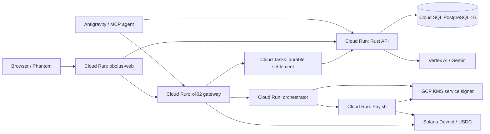

# Obolus 프로젝트 일시 종료 인수인계

기준 시각: **2026-08-04 (Asia/Seoul)**<br>
상태: **개발 일시 중단 · Solana Devnet 전용 · mainnet/상용 출시 아님**<br>
현재 통합 PR: **[#20 Harden signed wallets and the Seoul Cloud Run runtime](https://github.com/DanRo-AX/Obolus-GoogleCloudAI-Solana/pull/20)** (Draft)

이 문서는 몇 달 뒤 다른 사람이 들어와도 현재 상태를 재구성할 수 있게 만든
종료 스냅샷이다. 구현 사실, 실제 검증 범위, 배포 상태, 남은 위험, 비용이 계속
발생하는 자원, 재개 순서를 한곳에 모았다.

> 결론부터 말하면, 로컬 자동 검증과 지갑을 제외한 후보 환경 E2E는 통과했다.
> 그러나 후보 환경에서 Phantom이 직접 서명한 마지막 Devnet 결제와 두 지갑의
> 완전한 브라우저 왕복은 끝내지 않았다. 후보 revision은 stable 트래픽을 받지
> 않는다. PR #20을 그대로 “상용 완성”으로 간주하거나 mainnet에 배포하면 안 된다.

## 1. 코드와 PR의 기준점

| 항목 | 값 |
| --- | --- |
| 저장소 | `DanRo-AX/Obolus-GoogleCloudAI-Solana` (로컬 remote 이름은 아직 `openshelf`) |
| 브랜드 | **Obolus** |
| 이전 코드명 | OpenShelf, `OPENSHELF_*`, SHELF-1 |
| 기준 브랜치 | `agent/e2e-cloud-run-hardening` |
| 기준 커밋 | `3cdceab85673672e067e29efdb42f6885a34c59a` |
| 기준 main | `00085eaa074b74c75c725c3c09f9dba882185abc` (PR #18 merge) |
| 통합 PR | #20, Draft, merge state `CLEAN`, CI 4개 성공 |
| 선행 PR | #19 head `2918701`은 #20의 조상으로 완전히 포함됨 |
| 이전 실험 PR | #9와 #11은 #20의 커밋 조상이 아니며 둘 다 `DIRTY`; 최신 통합본 위에 merge하지 말 것 |

PR #20에만 현재 배포 후보와 지갑 인증 보강이 모두 모여 있다. #19는 코드상
포함되므로 별도로 merge할 필요가 없다. #9와 #11은 제품 아이디어의 이전
구현이므로, 필요한 차이를 다시 검토하지 않고 #20 위에 merge하면 안 된다.

### 기준 브랜치에 main 이후 들어간 핵심 커밋

```text
2918701 Document the Seoul durable deployment contract
8d1fd1c Make gateway builds reproducible on Node 22
6443cb8 Make PostgreSQL safe inside the API runtime
f7bd7ab Require signed wallet authentication
ef9b06f Add focused web image build
049b606 Close the production open-call bypass
16179e6 Sign out when the connected wallet changes
91e6303 Speed up release API builds
2557514 Complete wallet-native asker and contributor flows
659bc88 Document canonical Cloud Run service URLs
3cdceab Resolve Cloud Run origins from service metadata
```

## 2. 제품을 한 문장으로

Obolus는 **사람이 직접 겪고 쓴 경험을 검색 가능한 작은 데이터베이스로 만들고,
질문에 실제로 쓰인 문서만 x402 마이크로페이로 여는 인간 경험 검색·결제
네트워크**다.

웹 검색과 다른 점은 원문을 무료로 긁지 않는다는 것이다. 공개 검색에는 핸들,
분야, 가격, 적합도와 안전한 메타데이터만 나온다. 질문자가 선택된 문서를 열 때
그 문서의 버전·해시·수취인·가격에 묶인 결제가 이뤄지고, 원문은 결제가 확인된
질문에만 전달된다. 맞는 문서가 없으면 검색 실패가 끝이 아니라 Open Call이 되어
새로운 인간 경험을 수집한다.

## 3. 왜 필요한가

- 공개 웹과 범용 모델에는 최근의 지역적·구체적·사적인 실제 경험이 부족하다.
- 기존 시장조사는 질문마다 패널을 다시 모집하고, 풍부한 원문을 한 번 쓰고
  보고서로 소진한다.
- 응답자는 보통 한 번만 보상받고, 같은 경험이 재사용될 때 생기는 가치를 나누지
  못한다.
- AI 에이전트는 유료 데이터가 필요해도 어떤 근거를 살지, 얼마까지 쓸지, 실패한
  결제를 어떻게 복구할지에 대한 표준 흐름이 약하다.
- Obolus는 검색, 권한, 문서 버전, 가격, 결제, 인용, 신규 모집을 한 질문의
  생애주기로 묶는다.

처음 아이디어 회의에서 살아남은 핵심은 “사람 복제 페르소나”가 아니라
**개인 DB = 웹사이트, 경험 문서 = 웹페이지, x402 주소 = 유료 URL**이라는
대응이다. 유명인 자서전, 거대한 설문 도구, 에이전트 간 가격 협상은 핵심에서
제외됐다. 가격 협상 대신 질문자 예산과 명확한 한도 안에서 작은 결제를 반복하는
방향을 선택했다.

## 4. 타깃 사용자와 도입 시나리오

### 1차 구매자

- 소비재, F&B, 리테일, 커머스 기업의 소비자 인사이트·브랜드·제품 전략팀
- 시장조사 회사와 패널 운영사
- 특정 지역·연령·직군의 최근 경험이 필요한 컨설팅·투자·산업 리서치 조직

대표 도입 흐름은 기존 후보 문서를 무료로 찾고, 독립적인 소수 근거만 구매한 뒤,
비어 있는 세그먼트만 Open Call로 새로 모집하는 것이다. 전사문을 가진 조사
기관은 기존 자료를 private shelf로 전환하고, 같은 패널의 경험이 다시 쓰일 때
기여자에게 재보상할 수 있다.

### 확장 구매자

- AI·소셜 월드모델 기업: 합성 결과를 실제 인간 근거로 검증
- 자율 AI Agent 개발사: MCP/CLI에서 검색하고 한도 안에서 자동 결제
- 대학·정책 연구기관: 출처·동의·최신성이 보이는 질적 근거 수집
- 개인 질문자: 동네, 여행, 직무, 구매와 같이 “겪은 사람”의 답이 필요한 질문

### 기여자

직접 겪은 일을 문서로 쌓고, 새로운 질문에 답하고, 이미 쓴 답변의 자동 매칭에
동의해 반복 수익을 얻는 개인이다. 공개되는 것은 검색용 메타데이터이고, 유료
원문은 결제된 질문에만 열린다. 기여자는 문서를 잠그고, 정정 버전을 만들고,
접근 기록과 수익을 보고, 자신의 데이터를 내보내거나 계정을 삭제할 수 있어야
한다.

### 운영자

신고·분쟁·스트라이크·지급 보류를 검토하고, Cloud Tasks 재시도와 온체인
정산을 대조하며, 랭킹 편향·스팸·Sybil 공격을 감시하는 역할이다. 관리자 UI의
일부는 있지만 실제 운영 조직과 당직·감사 절차는 아직 없다.

## 5. 수익 모델 기록

다음은 제품 기획상 수익원이며 **상용 가격이 확정된 것은 아니다**.

1. 근거 열람 수수료: 실제 인간 문서가 열릴 때만 플랫폼 수수료 부과
2. Open Call 수수료: 모집, 품질 검증, 정산, 환불, 분쟁 처리 비용
3. 기업용 구독/API: 팀 권한, 예산 통제, private panel, 감사 로그, MCP/API
4. 전용 데이터망 구축: 과거 인터뷰 변환, 동의 체계, 전용 검색과 마이그레이션
5. 검증·보정 서비스: 실제 성과를 연결한 품질 평가, 편향 분석, 랭킹 보정

현재 코드의 direct Pay.sh 분배는 문서당 **1 USDC atomic unit**만 플랫폼
remainder로 남기고 나머지를 기여자에게 보낸다. 이는 Devnet에서 분배 합계와
반올림 불변식을 검증하기 위한 구현값이지, 지속 가능한 take rate가 아니다.
mainnet 전에 통화·환율·수수료·세금·환불·최소 지급액을 포함한 버전형 서버
정책을 별도로 확정해야 한다.

우선 관찰할 사업 지표는 질문당 근거 확보 시간/비용, 기존 데이터 검색 성공률,
문서 재사용률, 신규 모집 감소율, 구매자 반복 사용률, 기여자 반복 수익이다.

## 6. AI 유동성 원칙

초기에는 질문자만 있거나 기여자만 있는 콜드스타트가 생긴다. Gemini on Vertex
AI는 이 빈 시장에 유동성을 공급하되, 인간 데이터의 가격을 무너뜨리면 안 된다.

- 사람 문서가 얇을 때만 무료 general baseline을 제공한다.
- baseline은 `ai_baselines`에 별도 저장되고 만료된다.
- 가격, 재판매 권리, 인간 coverage, PageRank 권위, 기여자 수익이 없다.
- Open Call의 사람 자리를 채우지 못한다.
- 무료 baseline 생성에는 비공개 인간 원문을 보내지 않는다.
- 유료 답변 합성에는 서버가 결제를 확인한 immutable snapshot만 넣는다.
- Gemini는 기여자에게 더 구체적인 인터뷰 질문을 만들 수 있지만 답변을 대신
  작성하지 않는다.

즉 AI는 **바닥 유동성·질문 생성·허용된 근거의 합성**을 맡고, 가격을 갖는 재고와
권위는 사람에게만 남긴다.

## 7. 구현된 기능과 경계

| 영역 | 현재 상태 | 주의할 경계 |
| --- | --- | --- |
| 무료 검색 | 구현·검증 | 원문 대신 핸들, 가격, 점수, 메타데이터만 반환 |
| Google식 랭킹 | 구현·단위 테스트 | 어휘/해시 적합도, 최신성, 신뢰, query-personalized PageRank, 저자 다양성; 학습형 임베딩이나 웹 규모 그래프는 아님 |
| HIT 구매 | 구현 | 정확한 문서 묶음·해시·수취인·가격을 commit하고 선불 잔액에서 예약 |
| Phantom 선불 | 구현 | 로그인 메시지 서명 1회, 잔액 부족 시에만 top-up 승인; 후보 환경 최종 실지갑 결제는 미완료 |
| x402/Pay.sh | 구현·부분 live 검증 | unpaid `402`와 quote까지 검증; 후보에서 Phantom 서명부터 최종 온체인 receipt까지 미완료 |
| 결제 복구 | 구현·테스트 | 같은 job을 idempotent하게 복구하고 영구 실패분은 잔액으로 반환 |
| MISS/Open Call | 구현·후보 API E2E | 유료 call은 x402 예치 필수, 명시적 무료 call은 허용 |
| 기여자 흐름 | 구현·후보 API E2E | profile, payout wallet, listing, reserve, 인터뷰, 답변, memory, earning |
| 지갑 로그인 | 구현·후보 API E2E | 만료형 one-time Ed25519 challenge; 공개키로 만든 비밀번호는 제거 |
| 지갑 전환 | 구현·자동 테스트 | Phantom account가 바뀌면 이전 앱 세션 logout; 후보 브라우저 실지갑 왕복은 미완료 |
| 자동 매칭 | 구현·테스트 | opt-in, 유사도 82% 이상, target/price/lock/conduct 조건을 모두 통과할 때만 재사용 |
| AI baseline | 구현·테스트 | 무료·비판매·비권위·비인간 coverage |
| Memory version/correction | 구현·테스트 | 정정은 새 버전을 만들고 이전 passage를 잠금 |
| Memory reflection | 부분 구현 | settled observation 3건마다 최근 3건의 잘린 excerpt를 묶은 reflection 생성 |
| 자동 망각/압축 | **미구현** | freshness 감쇠는 랭킹에만 있음. 오래된 원본의 자동 보관·삭제, 의미 기반 추상화, 압축 검증/복원 정책과 스케줄러가 필요 |
| 관리자 품질 흐름 | 구현·테스트 | 신고/피드백/분쟁 UI와 API는 있으나 실제 reviewer 운영·감사 체계 없음 |
| 이메일 알림 | 선택형 구조만 구현 | provider/발신자/운영 정책 없으면 실제 발송 안 됨 |
| Antigravity/MCP | 구현·자동 테스트 | 질문자·기여자 23개 tool, profile별 로컬 세션, Pay.sh account 선택 |
| Mainnet | **의도적으로 미구현** | 현재 Devnet SOL/USDC만 사용 |

자세한 랭킹/메모리 경계는 [PERSONA-WEB-RANKING.md](PERSONA-WEB-RANKING.md),
결제 위협 모델은 [agent-payment-threat-model.md](agent-payment-threat-model.md),
기존 전체 코드 리뷰는 [CODE-REVIEW.md](CODE-REVIEW.md)를 본다.

## 8. 사용자별 정확한 흐름

### 질문자 브라우저 흐름

```text
공개 질문 입력
→ 무료 shelf 검색/랭킹
→ HIT: 후보 핸들·가격 확인
→ 지갑 연결 + one-time 로그인 메시지 서명
→ 익명 chat을 계정에 귀속하고 원래 URL로 복귀
→ 선택된 문서 묶음을 선불 잔액에서 예약
→ 잔액 부족 시에만 Phantom으로 Devnet USDC 한 번 충전
→ KMS service wallet이 문서별 Pay.sh/MPP 실행
→ 결제된 snapshot만 공개
→ Vertex AI가 인용 합성
→ receipt/ledger/transaction link 확인
```

한 질문에 문서가 100개라고 해서 Phantom 승인을 100번 받는 구조가 아니다.
브라우저 사용자는 선불 잔액을 한 번 충전하고, 그 뒤 문서별 마이크로페이는 제한된
KMS agent가 수행한다. 잔액이 떨어질 때만 다시 승인한다.

MISS이면 필요한 답변 수와 답변당 가격을 정해 Open Call로 전환한다. 유료
공고는 전체 예산을 먼저 예치하고, 채택 답변별 지급과 취소 시 미사용 환불을
원자 단위로 맞춘다. 무료 공고는 토큰 결제 없는 별도 sandbox 경로다.

### 기여자 브라우저 흐름

```text
별도 Phantom 계정 선택
→ 이전 Obolus 세션 자동 logout 확인
→ 지갑 연결 + 로그인 메시지 서명
→ 기여자 profile 생성
→ 로그인에 증명한 지갑을 payout wallet으로 자동 검증
→ 맞는 Open Call 검색/예약
→ Gemini가 만든 3개 인터뷰 질문에 직접 경험으로 답변
→ 제출/채택
→ observation memory와 유료 document 생성
→ earnings/notification/access log 확인
→ 이후 opt-in auto-match 가능
```

Apple/Google 계정 이름과 Phantom 계정 이름은 동일한 신원을 뜻하지 않는다.
브라우저 지갑의 공개키가 Obolus 계정 신원이다. Google 로그인은 Vertex/CLI 등
Google 도구 세션일 뿐, 마켓 계정이나 지급 소유자를 자동 결정하지 않는다.

### Antigravity/CLI 흐름

Antigravity plugin은 질문자와 기여자의 전체 동작을 23개 `openshelf` MCP tool로
노출하고 공식 Pay.sh MCP를 좁은 adapter 뒤에서 호출한다. 여러 신원을 동시에
시험할 때는 Google 계정이 아니라 다음 두 selector를 명시한다.

```bash
OPENSHELF_AGENT_PROFILE=buyer OPENSHELF_PAY_ACCOUNT=buyer agy
OPENSHELF_AGENT_PROFILE=contributor OPENSHELF_PAY_ACCOUNT=contributor agy
```

각 shell에서 같은 `OPENSHELF_AGENT_PROFILE`로 Obolus 로그인을 먼저 실행한다.
자세한 내용은 [Antigravity integration README](../integrations/antigravity/openshelf/README.md)와
[PAY-SH.md](PAY-SH.md)를 본다.

## 9. 시스템 구조



Rust API가 사용자, 검색, 문서 버전, 동의, 가격, entitlement, prepaid ledger,
Open Call, memory, earning의 최종 상태를 결정한다. LLM은 가격·동의·결제 상태를
판정하지 않는다. gateway는 x402 확인과 durable reconciliation을 맡고,
orchestrator/Pay.sh는 KMS 키로 제한된 지급을 수행한다. 구현 다이어그램과 ERD는
[architecture.html](../architecture.html)에 있다.

## 10. GCP 배포 스냅샷

모든 관리 자원은 프로젝트 `sweetspot-ax`, 서울 `asia-northeast3`에 있다.

### 관리 자원

| 자원 | 현재 값 |
| --- | --- |
| Cloud SQL | `obolus-pg-kr2`, PostgreSQL 16, DB `obolus`, `RUNNABLE` |
| SQL 보호 | deletion protection, backup, 7개 backup 보존, 7일 PITR, activation `ALWAYS` |
| Cloud Tasks | `obolus-settlements`, `RUNNING`, 스냅샷 시 대기 task 0개 |
| Tasks retry | 최대 100회/7일, 5–300초 backoff, 20 dispatch/s, 동시 20 |
| Artifact Registry | `asia-northeast3-docker.pkg.dev/sweetspot-ax/obolus` |
| API/Web runtime SA | `obolus-runtime@sweetspot-ax.iam.gserviceaccount.com` |
| Pay/Orchestrator SA | `obolus-pay@sweetspot-ax.iam.gserviceaccount.com` |
| Secret 이름 | `obolus-database-url`, `obolus-internal-token`, `obolus-rpc-url` |
| KMS key version | `projects/sweetspot-ax/locations/asia-northeast3/keyRings/obolus/cryptoKeys/solana-service-wallet/cryptoKeyVersions/1` |

Secret의 **값**과 개인키는 이 문서나 Git에 기록하지 않았다.

### 서비스, stable, 후보

| 서비스 | canonical URL | stable 100% | `e2e-2557514` 후보 0% |
| --- | --- | --- | --- |
| API | `https://obolus-api-amjeodet3q-du.a.run.app` | `obolus-api-00007-veg` | `obolus-api-00013-xon` |
| Web | `https://obolus-web-amjeodet3q-du.a.run.app` | `obolus-web-00004-p8d` | `obolus-web-00008-keb` |
| Gateway | `https://obolus-gateway-amjeodet3q-du.a.run.app` | `obolus-gateway-00004-qel` | `obolus-gateway-00008-wuy` |
| Pay.sh | `https://obolus-pay-amjeodet3q-du.a.run.app` | `obolus-pay-00003-ts7` | `obolus-pay-00004-doz` |
| Orchestrator | `https://obolus-orchestrator-amjeodet3q-du.a.run.app` | `obolus-orchestrator-00001-5wf` | `obolus-orchestrator-00002-qal` |

후보 URL은 모두 다음 형식이고, 2026-08-04에 `/readyz` 또는 web `/`가 HTTP
200인 것을 다시 확인했다.

```text
https://e2e-2557514---obolus-api-amjeodet3q-du.a.run.app
https://e2e-2557514---obolus-web-amjeodet3q-du.a.run.app
https://e2e-2557514---obolus-gateway-amjeodet3q-du.a.run.app
https://e2e-2557514---obolus-pay-amjeodet3q-du.a.run.app
https://e2e-2557514---obolus-orchestrator-amjeodet3q-du.a.run.app
```

후보 API/Web 이미지 태그는 각각 `api:2557514`, `web:2557514`다. 후보
gateway digest는 `sha256:6cba110f...`, Pay.sh는 `sha256:0757e1a...`,
orchestrator는 `sha256:5418a04...`다. 정확한 digest는 `gcloud run revisions
describe`로 다시 읽는다.

`obolus-gateway-00009-kop`은 Pay.sh 이미지를 gateway 서비스에 잘못 배포한
비활성 revision이다. stable 트래픽과 후보 태그는 받지 않지만 release 대상으로
선택하면 안 된다. 필요할 때 revision 정리 대상으로 취급한다.

### 후보 내부 연결

- candidate Web → candidate API + candidate Gateway
- candidate Gateway → candidate API + candidate Web + candidate Orchestrator
- candidate Gateway settlement callback → candidate API
- candidate Orchestrator → candidate API + candidate Pay.sh
- candidate Pay.sh → candidate API

stable revision들은 예전 `PROJECT_NUMBER.REGION.run.app` 형태의 구성 URL을 일부
환경변수에 갖고 있다. 후보는 실제 `gcloud run services describe ...
--format='value(status.url)'`와 tag URL로 교체했다. Cloud Run URL을 문자열로
조립하면 GFE의 generic 404로 빠질 수 있으므로 재배포 때도 반드시 metadata에서
읽는다. 세부 명령은 [Cloud Run deployment README](../deploy/cloud-run/README.md)에
있다.

## 11. Solana/지갑 기준값

| 용도 | 공개값 |
| --- | --- |
| 네트워크 | `solana:EtWTRABZaYq6iMfeYKouRu166VU2xqa1` (Devnet) |
| Circle Devnet USDC mint | `4zMMC9srt5Ri5X14GAgXhaHii3GnPAEERYPJgZJDncDU` |
| 질문자/기본 Phantom 계정 | `GTH5Xfc3pTX8n78dhb7AtbjPinXEGuCwb4H8WXBUurz5` |
| 기여자/Receiver 1 | `FhRsUMzQieS8TXacCaGhLZrFNEQrUwqGkYBVzLeiUP8H` |
| KMS service/bundle wallet | `Ep6grip9Q4JC2nsPCdcMB9hBM1RnwctxgSfW3YtNAcNV` |

이 주소들은 공개키다. seed phrase, Phantom 비밀번호, 개인키는 어디에도 남기면
안 된다. 설정 중 Google OAuth authorization code 형태의 값이 대화에 한 번
붙여 넣어졌으므로, 다시 사용할 계획이면 해당 Google 연결을 폐기/재인증하고
기존 값을 노출된 것으로 취급한다. 그 값 자체는 저장하지 않았다.

`OPENSHELF_REQUIRE_MAINNET=false`가 의도된 현재 상태다. Devnet 토큰은 실화폐가
아니며 “unknown token” 표시는 Phantom이 custom Devnet mint 메타데이터를 알지
못할 때 나타날 수 있다. mint와 network를 위 값으로 대조하지 않은 토큰에는
서명하지 않는다.

## 12. 검증 완료 증거

### 자동 검증

기준 커밋의 GitHub CI 4개가 모두 성공했다.

- Frontend: production build + lint
- Rust backend: 77 unit tests + contract test + Clippy `-D warnings`
- Payment gateway: typecheck + 3 tests
- Agent orchestrator: typecheck + 4 tests
- Antigravity runtime: 11 tests
- 전체 로컬 기준 명령: `npm run check:all`

`npm audit --omit=dev`는 2026-08-04 기준 high 2개를 보고한다. 둘 다 최신
`react-router`/`react-router-dom` 7.18.2의 RSC/server-action advisory
`GHSA-qwww-vcr4-c8h2` 경로다. 현재 앱은 client-only `BrowserRouter`라 해당 RSC
action 경로를 노출하지 않는다. audit의 자동 downgrade는 더 오래된 취약점을
되살리므로 적용하지 않았다. upstream 수정판이 나오면 재평가한다.

### 후보 환경 API E2E

실제 Cloud SQL을 사용해 두 공개지갑 신원을 코드로 서명한 E2E에서 다음을
확인했다.

- API readiness
- 질문자 지갑 challenge/signature 로그인
- 기여자 profile 없이 질문자 prepaid session 생성 및 balance 조회
- 결제하지 않은 paid direct open 거부 (`403`)
- 무료 Open Call 생성
- 별도 기여자 지갑 로그인과 payout wallet 자동 검증
- 기여자 listing, reservation, answer 제출
- answer accepted/settled 상태
- 질문자 answer 조회, notification
- Cloud SQL memory 생성
- 테스트 계정 cleanup (`204`)

### 후보 gateway/browser 확인

- 다섯 문서 bundle quote 생성
- canonical `402 Payment Required` 응답과 Payment-Required payload
- durable Cloud Tasks readiness
- candidate web origin의 제한 RPC/CORS 동작
- 공개 질문 `Where do people who live in Seongsu eat lunch on weekdays?`에서
  5개 후보와 총 ₩50 표시
- 로그인 후 원래 chat으로 돌아갈 `returnTo` 보존
- 공개 contributor board에서 Open Call 5개 렌더링
- 위 공개 화면에서 console warning/error 없음
- 후보 API/Gateway/Pay/Orchestrator `/readyz`와 후보 Web `/` 모두 HTTP 200

새 tag 직후 `/healthz`에서 잠시 Google GFE 404가 캐시된 적이 있다. container
readiness 판단은 `/readyz`를 사용한다. query string cache busting은 진단에만
쓰고 운영 health contract로 만들지 않는다.

## 13. 끝내지 못한 마지막 E2E

브라우저 보안 경계 때문에 자동화가 Phantom extension의 승인 버튼을 대신 누를
수 없었다. 마지막 수동 단계는 다음과 같다.

1. 후보 Web에서 기본/질문자 지갑 연결
2. 로그인 메시지 서명
3. 잔액 부족 시 Devnet USDC top-up 한 번 승인
4. 문서 묶음 settlement 완료 확인
5. receipt, prepaid ledger, Solana Explorer Devnet signature 확인
6. Phantom을 `Receiver 1`로 전환하고 앱이 이전 질문자 세션을 자동 logout하는지 확인
7. 기여자 로그인, profile, reserve, 인터뷰, answer 제출
8. 기본/질문자 지갑으로 다시 전환하고 도착한 답변 확인
9. Cloud Tasks가 0으로 돌아오고 warning/error 로그가 없는지 확인

이 수동 왕복을 통과하기 전에는 PR #20을 ready로 바꾸거나 후보를 stable로
승격하지 않는다.

## 14. 재개할 때의 순서

### 코드와 상태 확인

```bash
git fetch --all --prune
git switch agent/e2e-cloud-run-hardening
git pull --ff-only fork agent/e2e-cloud-run-hardening
npm ci
npm run check:all

gh pr view 20 --json state,isDraft,mergeStateStatus,statusCheckRollup,url
```

현재 Cloud Run URL과 트래픽은 저장된 URL을 믿지 말고 다시 읽는다.

```bash
for service in obolus-api obolus-web obolus-gateway obolus-pay obolus-orchestrator; do
  gcloud run services describe "$service" \
    --project=sweetspot-ax --region=asia-northeast3 \
    --format='yaml(status.url,status.traffic)'
done
```

그다음 13절의 Phantom 왕복 E2E를 먼저 끝낸다. 최근 warning/error와 queue를
확인한다.

```bash
gcloud logging read \
  'resource.type="cloud_run_revision" AND resource.labels.service_name=~"obolus-.*" AND severity>=WARNING' \
  --project=sweetspot-ax --freshness=2h --limit=100

gcloud tasks list --queue=obolus-settlements \
  --project=sweetspot-ax --location=asia-northeast3
```

### stable 승격 시 중요한 함정

현재 candidate Web/Gateway/Pay/Orchestrator는 내부 dependency를 candidate tag
URL로 가리킨다. 이 revision을 그대로 100% stable로 승격한 뒤 tag를 지우면
내부 연결이 끊어진다. 따라서 다음 순서로 **canonical stable URL을 넣은 release
revision을 새로 만든 뒤** 각 revision을 확인하고 승격한다.

1. API release: canonical Web/API origin 사용
2. Pay.sh release: canonical API 사용
3. Orchestrator release: canonical API + Pay.sh 사용
4. Gateway release: canonical API + Web + Orchestrator + settlement target 사용
5. Web release: canonical API + Gateway 사용
6. stable URL에서 질문자/기여자 전체 회귀
7. PR #20을 ready로 전환하고 리뷰 후 merge

API를 gateway보다 먼저 전환해야 durable settlement가 폐기된 ledger로 돌아가지
않는다. 자세한 환경변수 계약은 [deploy/cloud-run/README.md](../deploy/cloud-run/README.md)를
따른다.

### 현재 revision으로 즉시 롤백할 기준

새 release에 문제가 생기면 데이터베이스를 되돌리지 말고 application traffic을
다음 revision으로 먼저 복구한다.

```bash
gcloud run services update-traffic obolus-api \
  --project=sweetspot-ax --region=asia-northeast3 \
  --to-revisions=obolus-api-00007-veg=100
gcloud run services update-traffic obolus-gateway \
  --project=sweetspot-ax --region=asia-northeast3 \
  --to-revisions=obolus-gateway-00004-qel=100
gcloud run services update-traffic obolus-pay \
  --project=sweetspot-ax --region=asia-northeast3 \
  --to-revisions=obolus-pay-00003-ts7=100
gcloud run services update-traffic obolus-orchestrator \
  --project=sweetspot-ax --region=asia-northeast3 \
  --to-revisions=obolus-orchestrator-00001-5wf=100
gcloud run services update-traffic obolus-web \
  --project=sweetspot-ax --region=asia-northeast3 \
  --to-revisions=obolus-web-00004-p8d=100
```

Cloud SQL은 application rollback과 함께 되돌리지 않는다. 실제 데이터 사고일
때만 backup/PITR 절차를 별도로 사용한다.

## 15. 당장 계속 발생할 수 있는 비용

프로젝트를 중단했지만 GCP 자원을 종료하지는 않았다.

- Cloud SQL `obolus-pg-kr2`는 activation `ALWAYS`라 지속 비용이 발생한다.
- API, Gateway, Orchestrator는 min scale 1 설정이 있다.
- `e2e-2557514` tag가 붙은 API/Gateway/Orchestrator 후보도 min scale 1이라 추가
  instance 비용이 발생할 수 있다.
- Web과 Pay.sh는 min scale이 없어 idle 시 scale-to-zero 가능하다.
- Artifact Registry 이미지, Cloud SQL backup/PITR, KMS, Secret Manager에도 작은
  저장/운영 비용이 남는다.
- Cloud Tasks queue는 비어 있지만 `RUNNING` 상태다.

비용 절감은 데이터와 빠른 재개 가능성을 바꾸는 운영 결정이므로 이 종료 작업에서
자동 실행하지 않았다. 장기 휴면할 경우 다음을 순서대로 검토한다.

1. billing 화면에서 실제 일별 비용 확인
2. 필요한 DB export/backup 생성과 복구 시험
3. `e2e-2557514` traffic tag 제거
4. Cloud Run min instances를 0으로 낮출지 검토
5. Cloud SQL을 중지하거나 삭제할지 결정
6. 삭제 전 Secret/KMS/Artifact 보존 정책 확인

tag 제거는 image와 Cloud SQL 데이터를 지우지 않지만 후보 URL은 사라진다.
Cloud SQL 삭제는 되돌리기 어렵고 deletion protection을 해제해야 하므로 별도
승인 없이 실행하지 않는다.

## 16. 상용 서비스가 되기 전에 남은 일

### 제품/시장

- 최초 shelf를 채울 구체적인 공급 획득 방식과 품질 기준
- 기업 한 곳의 실제 PoC 질문, 시간·비용 비교, 반복 구매 검증
- 문서 가격과 플랫폼 take rate의 실제 단위경제
- 기여자가 재사용·정정·삭제를 이해하는 동의 UX
- 자동 망각/압축의 정확한 정책: 보존 기간, 추상화 단위, 원본 복원, 판매 가능성,
  contributor 승인, 수익 귀속

### 검색/품질

- learned multilingual embedding과 outcome 기반 weight calibration
- Sybil/스팸/담합에 견디는 신원·근거·랭킹 평가
- query별 대표성, 편향, 중복 저자, 반례 coverage 지표
- admin-curated edge를 실제 검증 데이터로 확장

### 결제/운영

- finality를 독립적으로 재검증하고 체인→queue 사이 crash window를 대조하는 worker
- managed RPC/facilitator, KMS rotation, alert, reconciliation runbook
- mainnet mint/network/수수료/세금/환불/수탁/회계 검토
- distributed rate limit, wallet/IP/account Sybil controls
- 운영자 bootstrap/rotation과 reviewer staffing

### 개인정보/법률

- application-readable passage의 field-level encryption
- staff authorization과 immutable access audit
- retention/deletion worker와 삭제 증명
- 민감정보 redaction, 신고, 법적 보존 절차
- 현재 privacy copy가 약속하는 30일 grace, 90일 backup erasure, processor control,
  contact channel을 실제 운영과 일치시키기

### 전달/프론트엔드

- CSP, HSTS, frame policy, SBOM/dependency scan
- browser bundle 결제의 자동 회귀 범위 확대
- backend outage와 signed-out 상태를 구분하는 명시적 오류 UI
- 지갑 전환과 pending payment 상태의 더 분명한 사용자 안내
- email/브라우저 notification provider의 실제 운영 연결

이 목록의 더 자세한 근거는 [CODE-REVIEW.md](CODE-REVIEW.md)에 있다.

## 17. 로컬에만 남은 사용자 작업물

종료 시점 로컬 working tree에는 발표 HTML 수정, 여러 PPTX, 캡처 이미지,
프레젠테이션 생성 중간물, `.omc/`, `.tmp/`, 회의 원문 등이 추적되지 않은 상태로
남아 있다. 이들은 코드 PR #20에 섞지 않았다. 특히 다음 범주는 GitHub에 없는
로컬 자료일 수 있으므로 필요하면 별도 Drive/아카이브에 백업한다.

- `MEETING-2026-07-31.md`
- `OBOLUS-*.pptx`, `OPENSHELF-service-deck.pptx`
- `presentation-variants/`
- `service-presentation/`의 수정본과 추가 assets
- `OBOLUS-PRESENTATION-AGENT-PROMPT*.md`

이 문서는 회의 원문의 핵심 결정과 폐기 방향을 요약했지만, 원문과 발표 파일
자체를 대신하는 백업은 아니다.

## 18. 종료 체크

- [x] 통합 코드 브랜치와 PR 번호 기록
- [x] main과 후보 커밋 기록
- [x] 구현 기능과 미구현 경계 기록
- [x] 질문자/기여자/agent 흐름 기록
- [x] 제품 철학, 타깃, 도입 시나리오, 수익모델 기록
- [x] AI 유동성 원칙 기록
- [x] Cloud Run/SQL/Tasks/KMS/Secret 이름과 region 기록
- [x] stable/candidate revision과 rollback 기준 기록
- [x] 자동 테스트와 live 검증 범위 기록
- [x] Phantom 수동 E2E 미완료 사실 기록
- [x] 지속 비용과 장기 휴면 선택지 기록
- [x] 비밀값을 기록하지 않고 노출 가능 credential 회전 주의 기록
- [ ] Phantom 두 지갑 후보 환경 전체 왕복
- [ ] canonical release revision 생성과 stable 승격
- [ ] PR #20 ready 전환, 리뷰, merge
- [ ] #9, #11, #19 정리
- [ ] mainnet/상용 출시 검토

프로젝트를 재개하는 사람은 **13절 → 14절 → 16절** 순서로 읽으면 된다.
