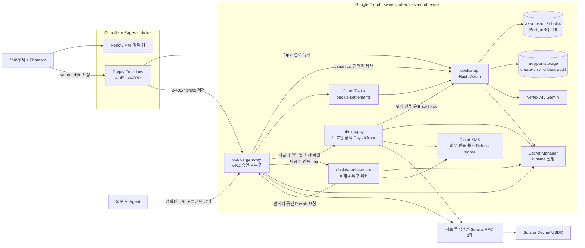

<h1 align="center">
   Obolus
</h1>

<p align="center">
  <a href="https://github.com/DanRo-AX/Obolus-GoogleCloudAI-Solana"></a>
  <a href="https://github.com/DanRo-AX/Obolus-GoogleCloudAI-Solana/actions/workflows/ci.yml"></a>
  
  
  
</p>

<p align="center">
  <sub><a href="../../README.md">English</a></sub>
</p>

<p align="center">
  <strong>인터넷을 데이터베이스로. 값은 문서 한 건 단위로.</strong><br/>
  Obolus는 웹 대신 사람이 직접 쓴 문서를 검색하고, 한 건씩 값을 치르는 검색 서비스입니다.<br/>
  데모용 초기 근거는 ₩5~₩25에 열고 Open Call 답변은 공고 단가를 이어받습니다.<br/>
  제품 정책은 90/10이며 현재 결제 rail은 Mainnet 자금이 아닌 Devnet test USDC입니다.
</p>

<h3 align="center"><a href="#시작하기"><ins>시작하기</ins></a></h3>

> **Devnet 운영 배포 (2026-08-11):** 공개 앱은
> [Cloudflare Pages](https://obolus-9qi.pages.dev)에 있고 API와 결제 서비스는
> Google Cloud에서 별도로 실행됩니다. [결선 발표자료](https://obolus-9qi.pages.dev/pitch/?mode=final)와
> [인프라](https://obolus-9qi.pages.dev/artifacts/finalist-evidence/infrastructure.json),
> [제한된 Gemini 루프](https://obolus-9qi.pages.dev/artifacts/finalist-evidence/autonomy.json),
> [Solana Devnet](https://obolus-9qi.pages.dev/artifacts/finalist-evidence/devnet.json)
> 증거를 공개했습니다. 프로덕션형 Devnet 시스템이며 Solana Mainnet 출시는 아닙니다.

<p align="center">
  
</p>

## 주요 기능

<table>
<tr>
<td width="50%" valign="middle">

### 웹이 아니라 사람이 쓴 글을 검색

일반 모델은 빈칸을 가장 그럴듯한 문장으로 채웁니다. Obolus는 그곳에 실제로 사는 사람들이 쓴 문서를 열고, 각자에게 값을 치릅니다.

검색과 랭킹은 무료입니다. 실제로 인용된 문서에만 값이 붙습니다.

</td>
<td width="50%">
  
</td>
</tr>
<tr>
<td width="50%" valign="middle">

### 검색 결과가 없으면 유료 공고로 전환

서가에 맞는 문서가 없을 때 "검색 결과 없음"으로 끝나지 않습니다. 답변 하나에 매길 값을 정하면 그 질문이 알 만한 사람들에게 유료 공고로 나갑니다.

- 분야 11개, 세로 레일 방식의 분류
- 단가, 적합도, 남은 자리 기준 필터

</td>
<td width="50%">
  
</td>
</tr>
<tr>
<td width="50%" valign="middle">

### HTTP 402 기반 자동 결제

HTTP에는 이미 [이 용도로 예약된 상태 코드](https://www.rfc-editor.org/rfc/rfc9110.html#name-402-payment-required)가 있습니다. 서버가 `402`와 exact quote를 돌려주면 질문자가 선택 문서와 합산 금액을 한 번 확인하고 승인합니다. Phantom은 선택한 선불 잔액이 부족해 충전할 때만 나타나며 문서마다 반복하지 않습니다.

가격을 원으로 표시하는 이유는 서가에 있는 사람들이 원으로 생각하기 때문입니다. 솔라나 위에서 실제로 움직이는 자산은 USDC입니다.

</td>
<td width="50%">
  
</td>
</tr>
<tr>
<td width="50%" valign="middle">

### 지갑 하나로 로그인

이메일, 비밀번호, 이름을 받지 않습니다. 지갑을 연결하면 공개 주소를 읽고, 들어갈 때 송금 권한이 없는 만료형 메시지 하나만 서명합니다. 질문자에게 보이는 정보는 핸들뿐입니다.

x402 facilitator가 Devnet 네트워크 수수료를 부담하므로 구매자 지갑에는 SOL이 필요하지 않습니다. 로그인 화면에서 테스트 USDC faucet을 바로 열 수 있습니다.

</td>
<td width="50%">
  
</td>
</tr>
<tr>
<td width="50%" valign="middle">

### 문서 한 건 단위 거래

사람이 아는 내용은 지금까지 통째로만 거래됐습니다. 패널 조사, 연간 라이선스, 삼백 명의 응답을 보고서 한 편으로 압축한 형태입니다.

Obolus의 거래 단위는 문서 하나, 열람 한 번, 답변 하나입니다. 답변의 소유권은 작성자에게 남고, 열릴 때마다 계속 정산됩니다.

</td>
<td width="50%">
  
</td>
</tr>
<tr>
<td width="50%" valign="middle">

### 약관 대신 화면에 적은 조건

무엇을 넘기고 무엇은 가져가지 않는지 정책 문서 대신 랜딩 페이지에 나란히 적어 뒀습니다.

서가를 지우면 작성한 문서는 즉시 검색에서 빠집니다. 원문·handle·서비스에서 복구
가능한 passage snapshot은 파기하고 익명화된 금전 audit row와 공개 chain receipt만
남깁니다.

</td>
<td width="50%">
  
</td>
</tr>
<tr>
<td width="50%" valign="middle">

### 부족한 분야를 공개하는 커버리지 지표

공개 인덱스는 문서 본문을 노출하지 않고 분야별 공급량과 실제 검색 miss를 aggregate로 보여 줍니다. 단순 문서 수는 coverage 신호이지 질문에 답할 수 있다는 보증이 아닙니다.

공개되는 정보는 질문이 빈손으로 돌아오는 자리, 그리고 그 자리를 채우겠다고 이미 붙은 값입니다.

</td>
<td width="50%">
  
</td>
</tr>
<tr>
<td width="50%" valign="middle">

### 한국어와 영어 동등 지원

번역 레이어를 나중에 얹은 구조가 아닙니다. 한국어에는 별도 서체 스택과 굵기, 자간, `word-break: keep-all`이 적용돼 있고, 문장은 화면 단위로 다시 썼습니다. 한 문장씩 옮긴 번역이 아닙니다.

사이드바 하단에서 전환할 수 있고, 선택한 언어는 새로고침 후에도 유지됩니다.

</td>
<td width="50%">
  
</td>
</tr>
</table>

**그 외 포함된 기능**

- **[Antigravity 플러그인](../../integrations/antigravity/openshelf/README.md)**: 질문자와 기여자의 전체 흐름을 `openshelf` MCP 툴 24개로 제공합니다. 공식 Pay.sh MCP 지갑도 얇은 핸드셰이크 어댑터를 통해 함께 붙습니다.
- **선불 크레딧과 복구**: 지갑 소유는 한 번만 증명하고, 잔액이 부족할 때만 충전합니다. 브라우저가 응답을 잃으면 서버와 대조해 이미 결제된 건은 복구하고 결제되지 않은 핸들만 재시도합니다.
- **공고 에스크로**: 유료 공고는 최대 예산을 먼저 잡아 둡니다. 채택된 답변마다 한 몫씩 풀리고, 공고를 취소하거나 계정을 삭제하면 쓰지 않은 잔액이 그대로 지급 청구로 돌아갑니다.
- **가입 전에 밝히는 conduct ladder**: 확정된 void가 2회면 자동 매칭에서 빠지고 새 수익을 14일 보류하며, 3회면 새 답변을 막습니다. 잘못된 void는 1회 dispute와 admin review로 복원할 수 있습니다.
- **AI는 유동성 보조 역할만**: 사람이 쓴 문서가 부족할 때 Vertex AI의 Gemini가 무료 기준선을 제공할 수 있습니다. 이 결과는 `ai_baselines`에 남고 가격이 붙지 않으며, 재판매와 권위 획득이 불가능하고 공고 자리도 채우지 못합니다.
- **의도적으로 좁게 설계한 기여자 메모리 에이전트**: 동의한 사용자에 한해, 유사도 82% 이상의 거의 동일한 공고이면서 타깃, 가격, 잠금, 행동 규칙까지 모두 통과할 때만 기존 유료 답변을 재사용합니다. 나머지는 전부 사람이 직접 답해야 합니다.
- **영수증**: 대화, 구매한 문서, 트랜잭션 링크를 한곳에서 확인합니다.

---

## 거래 단위와 현재 경제 조건

| 용어 | 이 build에서의 정확한 의미 |
| --- | --- |
| 인간 문서 | 채택된 open-call 답변이나 opt-in shelf-starter 답변에서 만들어진 quality-checked, versioned 최종 답변 한 건입니다. 몸풀기 interview 답변은 비공개로 남고 별도 검색·판매하지 않습니다. |
| 검색과 열람 | 검색은 무료이며 handle·가격·matching metadata만 돌려줍니다. 유료 열람 한 번은 해당 query와 receipt에 묶인 immutable passage version과 citation을 전달하며 기여자의 저작권을 이전하지 않습니다. 이후 correction이나 lock이 생겨도 이미 전달된 version은 바뀌지 않습니다. |
| 기여자 가격 | 채택된 Open Call 답변은 해당 공고의 답변당 가격을 이어받습니다. Opt-in shelf-starter는 기여자가 향후 가격을 정합니다. 현재 hosted Pay.sh rail은 test 고정 band ₩5·₩10·₩15·₩25·₩100·₩300·₩500·₩700·₩800·₩1,000만 받습니다. |
| 브라우저 승인 | UI가 선택 문서, 전체 원화 가격, exact Devnet USDC를 한 번에 보여 줍니다. **선불 잔액으로 열기**를 누르면 해당 견적만 예약합니다. Phantom은 잔액이 부족할 때 질문자가 고른 충전액만 서명합니다. 미사용 잔액은 출금할 수 있고 Obolus는 지갑에서 추가 금액을 가져올 수 없습니다. |
| Agent 승인 | 로컬 구매 Agent는 exact intent 하나를 저장하고 aggregate atomic amount에 대해 interactive one-time 승인을 요구합니다. 모델은 URL·수취인·mint·network·금액을 바꿀 수 없습니다. |
| 환산 | 운영 견적은 실시간 환율이 아닌 test 고정값 **1 USDC = ₩1,350**을 사용합니다. 각 문서를 six-decimal USDC atomic으로 따로 올림합니다: `ceil(priceKrw × 1,000,000 / 1,350)`. |
| 현재 split | 제품 UI는 checkout 추가금 없이 소유자 90% / 프로토콜 10% 정책을 표시합니다. 현재 hosted Devnet Pay.sh endpoint는 primary split이 양수여야 해서 1 atomic만 남기고 나머지를 소유자에게 보냅니다. 따라서 동일 receipt의 온체인 90/10 split은 Mainnet 전 gate이며 구현된 상용 take rate로 주장하지 않습니다. |
| 삭제와 기록 | 판매자가 탈퇴하면 원문·handle·서비스에서 복구 가능한 passage snapshot을 삭제하고, 익명화된 금전 audit row와 공개 chain receipt만 남깁니다. correction이나 lock 뒤에는 구매한 version을 복구하지만 판매자 탈퇴 뒤 영구 복구는 보장하지 않으며 이미 구매자에게 전달된 사본을 회수할 수도 없습니다. |

원화 표시액과 Devnet USDC는 test economics입니다. Exact 견적·정산·복구·지급·환불
동작을 증명하기 위한 것이며 법정화폐·환금 가치·실시간 환율 약속이 아닙니다.

---

## 질문 처리 흐름

```text
질문 → 서가 탐색 → 유사도 랭킹 → 있음 / 없음
  있음 → exact 합산 preview → 선불 크레딧 예약 → 저자 N명에게 지급 → 인용 붙은 답변 + 영수증
  없음 → 선택형 무료 Gemini 기준선 (질문만 전달, 인간 근거 아님)
       → "이건 아직 아무도 안 썼네요. 물어볼까요?"
       → "몇 명한테요?"  → "답변당 얼마 붙일까요?"
       → 공고 게시 → 답변 모집 보드
```

이 분기가 이 프로젝트에서 새로 만들어야 했던 유일한 부분입니다. 그래서
`src/pages/Chat.tsx`는 위 대화를 그대로 따라가는 상태 기계로 구현돼 있습니다.
조건에 맞는 문서가 이미 충분하면 순서가 뒤집혀서, 공고 없이 "값은 얼마입니다,
결제하시겠습니까?"로 바로 넘어갑니다.

매칭, 랭킹, 예산 필터, 저자 중복 제거, 있음/없음 판정은 모두 Rust 서비스에서
처리합니다. 768차원 해시 임베딩, 단어와 문자 n-gram, 개체 앵커, 신뢰도, 신선도,
그리고 큐레이터가 검증한 근거 간선 위의 토픽 개인화 PageRank를 사용합니다.
유료, 자기소유, 추론, 가공 전 UGC 간선으로는 권위를 살 수 없습니다. 검색 응답에는
핸들과 가격만 담기고 구절은 담기지 않습니다.

<details>
<summary><strong>정산 경로 두 가지 상세</strong></summary>

**에이전트 경로: 공식 Pay.sh 게이트웨이.** 자율 에이전트의 기본 경로입니다.

1. 무료 검색이 결제에 안전한 핸들과 질의 범위 복구 토큰을 돌려줍니다.
2. 에이전트가 무료 복구 URL을 확인한 뒤, 아직 열지 않은 핸들마다 질의에 묶인 Pay.sh 리소스를 하나씩 준비합니다.
3. `pay curl`이 HTTP 402/MPP 교환을 처리합니다. 현재 Devnet Pay.sh endpoint는 총액에서 1 USDC atomic을 제외한 금액을 검증된 기여자 지갑에 직접 보냅니다.
4. Rust가 불변 견적, 가격 대역, 자산, 네트워크, 질의, 핸들, 런타임 수취인을 다시 검증한 뒤에 스냅샷을 내줍니다.
5. 응답을 잃어버리면 무료로 복구되고, 재시도해도 두 번 적립되지 않습니다.

이 Devnet transport는 제품의 90/10 상용 정책을 동일 온체인 receipt에 구현한 상태가 아닙니다. 해당 split은 Mainnet 전 필수 gate로 남아 있습니다.

**브라우저 경로: 팬텀과 선불 크레딧.** 별도 프로세스나 추가 설치가 필요 없습니다.

1. Rust가 비공개 문서를 검색해 안전한 핸들과 원화 가격만 돌려줍니다.
2. 정확한 핸들, 콘텐츠 해시, 수취 지갑, 문서별 원자 가격, 총액, 민트, 네트워크, 만료를 작업 하나에 확정해 넣습니다.
3. 검증된 선불 크레딧에서 작업 비용을 원자적으로 예약합니다. 잔액이 부족하면 미결제 충전 리소스가 x402 v2 `402 Payment Required`를 반환하고 팬텀이 USDC 예치를 한 번 승인합니다. facilitator가 네트워크 수수료를 부담하므로 사용자 SOL은 필요하지 않습니다.
4. 확인된 충전은 원장에 반영돼 작업 자금이 됩니다. 구절을 공개하지도, 수익으로 적립되지도 않습니다.
5. 서버 에이전트가 문서마다 Pay.sh/MPP를 실행하고, Rust는 결제된 스냅샷만 멱등하게 내보냅니다.
6. Rust가 서버에서 결제가 증명된 구절만 다시 읽고, Vertex AI의 Gemini가 인용 붙은 종합을 작성합니다. 제공자가 설정돼 있지 않으면 답을 지어내는 대신 근거만 있는 결과를 그대로 보여 줍니다.
7. 영구 부분 실패가 발생하면 결제되지 않은 원자 잔액이 그대로 선불 크레딧으로 복원됩니다.

예치된 USDC는 출금 가능한 Obolus 선불 잔액으로 관리되지만, 사용자 개인키,
브라우저 보조 키, SPL 위임과 지갑의 나머지 자산에 대한 권한은 Rust와 게이트웨이,
Cloud Run 어디에도 전달되지 않습니다. 서비스 지갑은 GCP KMS를 통해 서명합니다. 자세한 내용은
[`docs/agent-payment-threat-model.md`](../agent-payment-threat-model.md)를 참고하세요.
정산 키를 바꾸면 예전 지갑의 미완료 지급을 먼저 모두 비워야 합니다. 한 건이라도
남거나 반복 실패가 10회에 이르면 새 워커의 준비 상태는 의도적으로 실패합니다.

</details>

## 현재 배포 아키텍처

`pages.dev`는 프런트엔드 엣지 주소일 뿐입니다. Obolus는 브라우저만으로 동작하는 애플리케이션이 아닙니다. Cloudflare Pages는 React 빌드와 두 개의 제한된 same-origin 프록시를 제공하고, 애플리케이션 로직·결제 승인·오케스트레이션·보호된 Pay.sh 경계는 네 개의 독립 Cloud Run 서비스가 담당합니다.



### 구성요소와 신뢰 경계

| 영역 | 런타임 | 책임과 경계 |
| --- | --- | --- |
| 웹 엣지 | Cloudflare Pages 프로젝트 `obolus` | fingerprint가 붙은 Vite asset과 SPA 경로를 제공합니다. 비즈니스 원장, 사용자 키, 서비스 서명키, 데이터베이스는 여기에 없습니다. |
| Same-origin 프록시 | Pages Functions | `/api/*`는 경로를 유지해 `obolus-api`로 보내고, `/x402/*`는 `/x402`만 제거해 `obolus-gateway`로 스트리밍합니다. 동적 응답은 `private, no-store`입니다. |
| 핵심 API | Cloud Run `obolus-api`, identity `obolus-api-run` | 지갑 세션, 프로필, 검색·랭킹, 불변 견적, 선불 원장, 공고 에스크로, 영수증, 분쟁, Gemini 정책, 내부 정산 API를 담당합니다. |
| 결제 경계 | Cloud Run `obolus-gateway`, identity `obolus-gateway-run` | 정확한 x402/MPP 경제 조건을 검증하고, 유료 본문을 버퍼링하고, 독립 최종성을 요구하며, 복구 fence를 내구화하고, API와 Cloud Tasks를 통해 정산을 기록합니다. 사용자 키를 보관하지 않습니다. |
| 결제·복구 워커 | Cloud Run `obolus-orchestrator`, identity `obolus-orchestrator-run` | 선택된 근거를 결정적으로 Pay.sh로 구매하고, 불확실한 시도를 대사하며, KMS 기반 기여자 지급과 환불을 준비합니다. 배포 서비스 이름과 달리 이 워커는 Gemini를 호출하지 않습니다. |
| 보호된 Pay front | Cloud Run `obolus-pay`, identity `obolus-pay` | GCP KMS 기능을 포함한 공식 Pay.sh collector를 실행합니다. 비공개 gateway token이 없는 요청은 `404`이며, 브라우저와 Agent에는 이 token과 private origin을 제공하지 않습니다. |
| 내구 데이터베이스 | Cloud SQL `ax-apps-db`, database/user `obolus` | 계정, capability, 견적, 결제 fence, 에스크로, payout claim, 복구 상태의 PostgreSQL 16 기준 원장입니다. Managed 배포에서는 SQLite fallback을 거부합니다. |
| 내구 전달 | Cloud Tasks `obolus-settlements` | 응답 또는 인스턴스를 잃어도 gateway에서 원장으로 가는 멱등 정산을 재시도합니다. |
| 독립 감사 | Cloud Storage `ax-apps-storage`, prefix `obolus/rollback-audit/**` | 외부 결제 또는 비용이 발생하는 모델 호출 전에 create-only 경제 intent를 temporary hold와 함께 기록합니다. 런타임은 이를 덮어쓰거나 삭제할 수 없습니다. |
| 서명 | Cloud KMS key `solana-service-wallet` | 외부 반출 불가능한 Ed25519 서비스 signer입니다. 워크로드에는 좁은 서명 권한만 주며 service account key나 raw private key를 만들지 않습니다. |
| 런타임 설정 | Secret Manager | DB URL, RPC origin, 서비스 간 credential을 필요한 workload에만 주입합니다. secret은 저장소에 커밋하거나 Pages를 거쳐 전달하지 않습니다. |
| AI | `obolus-api` 내부 Vertex AI의 Gemini | 1차 호출은 로그인된 질문을 제한된 검색 metadata로 바꿉니다. Rust가 검색을 실행한 뒤 2차 호출은 aggregate HIT/PARTIAL/MISS만 보고 검토된 비결제 다음 행동 하나를 고릅니다. 유료 합성은 정산 뒤 별도 호출입니다. AI 산출물은 유료 인간 inventory나 권위가 될 수 없습니다. |
| 체인 | Solana Devnet USDC | 실제 테스트 토큰으로 funding, 소유자 지급, 환불을 실행합니다. 서로 독립적인 RPC 두 곳의 일치하는 finalized 증거가 있어야 결과를 공개합니다. [Devnet token은 실제 가치가 없는 test asset](https://solana.com/docs/references/clusters#devnet)입니다. |

이 배포는 기존 `ax-apps-*` 규약에 따라 공유 `ax-apps-db`와 `ax-apps-storage`를 사용합니다. Obolus 전용 서비스와 revision에는 `initiative=kr2`와 실측 inventory label을 붙이고, runtime마다 keyless 전용 service account를 둡니다. 데이터와 IAM은 workload 범위로 제한합니다. API는 `obolus` DB와 등록된 storage prefix에만 접근하며 service account key는 만들지 않습니다. Cloud Build가 서비스별 image를 Artifact Registry에 만든 뒤 명시한 revision에만 traffic을 보냅니다.

### 요청·결제·복구 계약

1. **로그인과 무료 검색:** 브라우저는 Pages 주소의 `/api/*`를 호출합니다. 프록시가 같은 경로를 Rust로 스트리밍하므로 HttpOnly `SameSite=Lax` 지갑 세션이 first-party로 유지됩니다.
2. **브라우저 funding:** Pages의 `/x402/*`가 gateway로 이어집니다. Rust의 견적을 다시 읽어 정확한 Devnet USDC 조건을 검증한 뒤에만 Phantom이 서명하며, 서명 전에 compute budget을 보정합니다. 다른 탭이나 불확실한 응답은 다시 결제하지 않고 복구 경로를 따릅니다.
3. **내구 정산:** gateway가 서명된 exact template과 독립 최종성을 확인하고 Cloud Tasks에 넣은 뒤 같은 멱등 정산을 Rust에도 기록합니다. 원장이 받아들이기 전에는 유료 본문을 내보내지 않습니다.
4. **Agent 구매:** 모델에는 무료 메타데이터 tool만 보입니다. 사용자가 정확한 합산 금액을 승인하면 로컬 Pay MCP 또는 hosted orchestrator가 질문에 묶인 URL을 사용합니다. 임의 URL·header·지갑·결제 credential은 모델용 tool 경계 밖입니다.
5. **Pay.sh 전달:** gateway만 보호된 Pay front에 접근할 수 있습니다. callback은 견적에 맞는 응답을 만들 수만 있고 스스로 수익을 적립할 수 없습니다. gateway가 receipt와 byte-identical finalized transaction을 검증한 뒤 Rust가 snapshot을 공개합니다.
6. **지급과 환불:** orchestrator가 KMS로 서명하고 두 RPC에서 exact transaction을 확인한 뒤 payout claim 하나를 완료합니다. 모호한 결과는 다시 서명하지 않고 대사용 fence로 남깁니다.
7. **제한된 AI 루프와 합성:** Gemini가 먼저 metadata 검색 함수 하나를 호출합니다. Rust가 실행·랭킹한 뒤 Gemini가 검토된 다음 행동 후보 중 하나를 두 번째 함수 호출로 고르며, 서버는 실제 coverage와 맞지 않는 행동을 거부합니다. 경제적 제안은 명시적 사용자 승인에서 멈춥니다. 정산 뒤에야 별도 합성 호출이 유료 근거를 받습니다.

### 현재 배포와 운영 증거

| 표면 | 현재 배포 진입점 |
| --- | --- |
| 앱과 same-origin API | [`https://obolus-9qi.pages.dev`](https://obolus-9qi.pages.dev) |
| 결선 발표자료 | [`/pitch/?mode=final`](https://obolus-9qi.pages.dev/pitch/?mode=final) |
| Rust API upstream | `https://obolus-api-amjeodet3q-du.a.run.app` |
| x402 gateway upstream | `https://obolus-gateway-amjeodet3q-du.a.run.app` |
| 결제·복구 워커 | `https://obolus-orchestrator-amjeodet3q-du.a.run.app` (service 인증 전용) |
| 보호된 Pay front | `https://obolus-pay-amjeodet3q-du.a.run.app` (private-token 경계) |

현재 Cloudflare에 custom domain이 연결돼 있지 않아서 `obolus-9qi.pages.dev`가 배포된 Pages 주소입니다. 브라우저 코드는 Cloud Run upstream을 직접 호출하지 않고 상대 경로 `/api`와 `/x402`를 사용해야 합니다. orchestrator와 Pay front URL은 서비스 배치를 설명하기 위한 것이며 공개 client 진입점이 아닙니다.

공개된 [인프라](https://obolus-9qi.pages.dev/artifacts/finalist-evidence/infrastructure.json), [제한된 Gemini 루프](https://obolus-9qi.pages.dev/artifacts/finalist-evidence/autonomy.json), [Devnet 정산](https://obolus-9qi.pages.dev/artifacts/finalist-evidence/devnet.json)은 서로 다른 capability 기록입니다. 이 소스 revision 시점의 공개 autonomy 파일은 아직 두 단계 evidence contract 이전 형식이므로, API를 승격하고 세 artifact를 다시 생성한 뒤 `npm run pitch:verify-live`가 revision·시각을 연결하기 전에는 현재 live 근거로 쓰면 안 됩니다. 자율성 gate는 결정적 검색 전후의 provider-backed 함수 호출 두 번과 일치하는 Cloud Run application log·서빙 revision을 요구합니다. trace의 세 이름은 독립 Agent 3개나 A2A가 아닌 감사 역할입니다. Devnet artifact는 typed Open Call funding → payout → refund lifecycle을 증명하며, 별도 HIT 구매·인용 합성 경로를 대신 증명하지 않습니다. 이 secret-free 기록은 동의된 live inventory, 독립 Vertex audit log, Mainnet 보안·법률·고객 검증을 대신하지 않습니다.

[`architecture.html`](../../architecture.html)은 애플리케이션 내부 구조·데이터 모델·ERD의 상세 보기입니다. [`deploy/cloud-run/README.md`](../../deploy/cloud-run/README.md)는 GCP 경계와 승격을 위한 운영 runbook이고, [`deploy/cloudflare-pages/README.md`](../../deploy/cloudflare-pages/README.md)는 Pages 빌드와 프록시 계약입니다.

---

## 기술 스택

<p>
  <kbd>React&nbsp;19</kbd> &nbsp; <kbd>TypeScript&nbsp;5.9</kbd> &nbsp; <kbd>Vite&nbsp;8</kbd> &nbsp; <kbd>Tailwind&nbsp;v4</kbd> &nbsp; <kbd>React&nbsp;Router&nbsp;7</kbd> &nbsp; <kbd>three.js</kbd> &nbsp;
  <kbd>Rust&nbsp;1.89&nbsp;/&nbsp;Axum</kbd> &nbsp; <kbd>Cloud SQL&nbsp;/&nbsp;PostgreSQL</kbd> &nbsp;
  <kbd>x402&nbsp;v2&nbsp;—&nbsp;exact&nbsp;/&nbsp;SVM</kbd> &nbsp; <kbd>Solana&nbsp;Devnet</kbd> &nbsp; <kbd>USDC</kbd> &nbsp; <kbd>Phantom</kbd> &nbsp;
  <kbd>Pay.sh&nbsp;+&nbsp;MPP</kbd> &nbsp; <kbd>GCP&nbsp;KMS</kbd> &nbsp; <kbd>Cloud&nbsp;Run</kbd> &nbsp; <kbd>Gemini&nbsp;on&nbsp;Vertex&nbsp;AI</kbd>
</p>

---

## 시작하기

필수 도구는 Node.js 24, npm, Rust 1.89입니다. Google Cloud CLI는 로컬 Vertex AI를
선택해서 쓰거나 운영자가 GCP 검사를 실행할 때만 필요합니다.

```bash
npm ci
npm --prefix payment-gateway ci
npm --prefix agent-orchestrator ci

cp .env.example .env             # 최소한 OPENSHELF_DEFAULT_RECEIVER를 실제 값으로 교체

npm run dev:stack                # 프런트엔드, Rust API, x402 게이트웨이 동시 기동
```

`dev:stack`은 process 3개짜리 개발 stack입니다. `backend/openshelf.db`의 로컬
SQLite를 사용하며 Cloud SQL, 결제·복구 워커, 보호된 Pay front를 시작하지
않습니다. 무료 검색과 결정적 UI flow는 로컬에서 동작합니다. Gemini를 쓰려면
`GOOGLE_CLOUD_PROJECT`를 설정하고 Vertex AI를 활성화한 뒤
`gcloud auth application-default login`을 실행합니다. 유료 경로는 관련 `YOUR_...`
payment/RPC placeholder를 모두 실제 값으로 바꾸거나 아래의 격리된 Pay.sh sandbox
E2E를 실행해야 합니다. 배포된 topology는 `dev:stack`이 아니라 앞에서 연결한 Cloud
Run·Pages runbook으로 운영합니다.

| 프로세스 | 포트 | 기동 명령 |
| --- | --- | --- |
| 프런트엔드 (Vite) | `4319` | `npm run dev:stack` |
| Rust API (Axum) | `8787` | `npm run dev:stack` |
| x402 게이트웨이 | `1402` | `npm run dev:stack` |
| Pay.sh 게이트웨이 (샌드박스) | `3402` | `npm run pay:gateway:sandbox` |

선택 사항입니다.

```bash
npm run pay:gateway:sandbox      # 공식 Pay.sh 게이트웨이, 로컬 샌드박스
npm run pay:sandbox:e2e          # Rust + Pay.sh + gateway 복구 계약 전체를 로컬 검증
npm run x402:devnet:smoke        # 자금이 든 지갑으로 정산 검증
```

프런트의 유료 분기는 기본 활성화지만 이 세 프로세스가 hosted payment 전체를
복제하지는 않습니다. 외부 결제 서비스를 설정하거나 격리된 Pay.sh sandbox E2E를
사용해야 유료 조사를 검증할 수 있습니다. 라벨된 sandbox 원장은
`VITE_X402_ENABLED=false`, 완전 정적 fallback은 `VITE_BACKEND_ENABLED=false`입니다.

### 에이전트 연동 (Antigravity와 일반 MCP)

저장소 루트의 `.agents/mcp_config.json`은 계정이 필요 없는 구매자 전용
[`apps/obulus-local-agent`](../../apps/obulus-local-agent) 경로를 사용합니다. Obolus
계정·이메일·프로필·Phantom session·서버 보관 서명키가 필요 없습니다. 검색 시에는
최소화한 질문과 거친 filter만 전송하고, query capability는 mode `0600` 로컬 파일에
남깁니다. 실제 서명은 별도 Pay.sh process에 위임합니다. 모델용 payment MCP에는
임의 URL이나 header가 없으며 사용자가 terminal에서 승인해 로컬에 저장된 intent만
실행할 수 있습니다.

```bash
export OBULUS_PAY_ACCOUNT=research           # 필수: 로컬 Pay.sh named account
npm run local-agent:doctor
npm run local-agent:tools
npm run local-agent:mcp
# 다른 terminal에서 MCP가 intent_...를 준비한 뒤
npm run local-agent:approve -- intent_...
```

이는 로컬 key custody와 데이터 최소화이며 온체인 익명성을 뜻하지 않습니다. Solana
정산에서는 공개 payer 주소와 transaction receipt가 체인에 남습니다.

기여자 lifecycle까지 포함한 Antigravity plugin도 계속 사용할 수 있습니다.

```bash
agy plugin install ./integrations/antigravity/openshelf
npm run agent:doctor
agy
```

`/mcp`로 `openshelf`와 `pay`가 둘 다 붙었는지 확인하세요. 무료 검색과 AI 기준선은
Pay 계정 없이도 동작합니다. 첫 유료 동작 전에 로컬에서 보호되는 이름 있는 Pay 계정을
만들거나 고르고, Pay 기본값과 달라야 하면 `OPENSHELF_PAY_ACCOUNT=NAME`을 설정하세요.
**플러그인은 Pay를 호출하기 전에 Devnet 합산 금액을 정확히 제시하고 명시적 승인을
받습니다.**

Antigravity 없이도 같은 서비스를 사용할 수 있습니다.

```bash
npm run agent:tools                          # 명령 24개 전체 보기
npm run agent:tools -- ask_people            # 입력 스키마 하나만 정확히
npm run agent:call -- ask_people --json \
  '{"question":"What do people living in Paris actually eat on weeknights?","requestedDocuments":3}'
```

유료 구매자 명령은 개인키를 받는 대신, 별도 Pay MCP에 넘길 정확한 URL과 금액을
돌려줍니다. 운영 기여자 계정 명령은 에이전트가 브라우저와 같은 지갑
challenge/SIWX 증명을 마칠 수 있을 때까지 뒤로 미룹니다. 기존 이메일 `auth login`
명령은 `OPENSHELF_EMAIL_PASSWORD_AUTH_ENABLED=true`인 테스트 전용이며 출시 경로가
아닙니다.

Cloud Run과 GCP KMS 배포는
[`integrations/antigravity/openshelf/README.md`](../../integrations/antigravity/openshelf/README.md),
[`docs/ACCOUNT-LINKING.md`](../ACCOUNT-LINKING.md), [`pay/PAY.md`](../../pay/PAY.md),
[`docs/PAY-SH.md`](../PAY-SH.md)를 참고하세요.

---

## 빌드와 테스트

```bash
npm run build                    # TypeScript + Vite 빌드 후 발표자료 stage
npm run lint                     # oxlint
npm run check:all                # 전 워크스페이스: 빌드, 린트, 타입체크, 테스트, clippy
npm run pitch:verify-live        # 공개 발표자료와 운영 evidence gate 3개 검증
```

`check:all`은 `backend/`에 `cargo test`와 `cargo clippy -D warnings`를 실행하기 때문에
Rust 툴체인이 필요합니다(`rust-toolchain.toml`이 1.89.0으로 고정). CI는 프런트엔드,
Pay front 경계, agent-orchestrator, payment-gateway, 백엔드를 별도 job으로 실행합니다.
[`.github/workflows/ci.yml`](../../.github/workflows/ci.yml)을 참고하세요.

2026-08-11 engineering 기준선은 **일반 테스트 362/362**입니다. frontend 18, Pages proxy 3,
Antigravity MCP 14, local agent 15, evidence tooling 13, gateway 97, orchestrator 50,
Rust 152개가 통과했습니다. build, bundle 검증, typecheck, lint, Clippy도 통과했고
네 npm workspace의 production dependency audit은 취약점 0입니다. Gateway mutation은
범위 내 200/200을 모두 kill했습니다. Rust 전체 mutation은 통과로 부르지 않습니다.
437개 중 197 caught, 221 survived, 19 unviable이며 RustSec과 survivor 축소는 Mainnet
gate입니다. [`docs/MUTATION-TESTING.md`](../MUTATION-TESTING.md)와
[engineering readiness 기록](../FINALIST-ENGINEERING-READINESS.ko.md)을 참고하세요.

---

## 화면 구성

| 경로 | 화면 | 설명 |
| --- | --- | --- |
| `/` | **질문하기** | 정문. 질문하면 SHELF가 서가를 탐색하고, 결과가 없으면 공고로 넘어갑니다. |
| `/chat/:id` | 대화 | 질문 한 건의 스레드. 있음/없음 대화와 결제 미리보기를 포함합니다. |
| `/dashboard` | **답변 모집** | 답변자용 보드. 답변당 단가가 붙은 공고를 골라 답하고 정산받습니다. |
| `/memory` | **내 서가** | 지금까지 답한 문서가 쌓이는 곳. 쌓일수록 자동 매칭이 잘 붙습니다. |
| `/archive` | 영수증 | 대화, 구매한 문서, 트랜잭션 링크. |
| `/coverage` | 빈 곳 | 질문이 빈손으로 돌아오는 자리와 그 자리에 붙은 값. |
| `/answer/:orderId` | 답변 | 한 화면에 질문 하나. 앞에 몸풀기 문항 몇 개. |
| `/onboarding` | 설정 | 핸들, 구간, 분야, 정산 지갑, 3진 아웃 규칙. |
| `/whitepaper` | 왜 만들었나 | 이 프로젝트를 만드는 이유를 정리한 긴 글. |
| `/login` `/terms` `/privacy` `/admin/disputes` `/admin/operations` | | 지갑 로그인, 법적 고지, 관리자 분쟁 검토, aggregate-only 읽기 전용 운영 콘솔. |

---

## 프로젝트 구조

| 경로 | 내용 |
| --- | --- |
| `src/` | React 앱. 페이지, 컴포넌트, `i18n/`, 그리고 랜딩에서 예시로 표시하는 `data/` 픽스처. |
| `cloudflare/` + `functions/` | Pages proxy 구현·테스트와 `/api/*`, `/x402/*` Functions 진입점. |
| `backend/` | Rust/Axum 서비스. 검색, 랭킹, 원장, 에스크로, 분쟁, 세션. 정확한 경계는 [`backend/README.md`](../../backend/README.md)를 참고하세요. |
| `payment-gateway/` | x402 v2 게이트웨이. 견적, verify/settle 위임, 지급 및 에스크로 워커. |
| `agent-orchestrator/` | Pay.sh challenge 결제, 불확실성 대사, 지급·환불 준비를 담당하는 결정적 Cloud Run 결제·복구 워커입니다. Gemini/Vertex 계획 루프는 없습니다. |
| `pay/` | Pay.sh 페이월 정의, Dockerfile, Cloud Build + GCP KMS 배포. |
| `apps/obulus-local-agent/` | Phantom 없는 구매자 MCP. 로컬 capability, privacy guard, 정확한 견적 검증, Pay.sh handoff. |
| `integrations/antigravity/openshelf/` | 플러그인. MCP 툴 24개, 스킬, Pay 핸드셰이크 어댑터. |
| `deploy/cloudflare-pages/` + `deploy/cloud-run/` | Edge와 GCP 배포 계약, 승격 검사, rollback runbook. |
| `docs/` | 위협 모델, 계정 연동, Pay.sh 배포, 코드 리뷰, 랭킹 노트. |
| `architecture.html` | 애플리케이션·데이터 모델·ERD 상세 보기. 이 README는 배포를 요약하고, 연결된 evidence와 deploy runbook이 실측 상태·운영 계약을 보유합니다. |

---

## 구현 범위

현재 상태는 배포된 프로덕션형 **Devnet** 시스템입니다. Mainnet 또는 유료 고객
출시 완료 상태는 아닙니다.

### 지금 검증된 것

- Cloudflare Pages가 공개 앱과 same-origin proxy를 제공하고, Cloud Run 서비스 4개가 전용 identity와 명시적 100% revision으로 실행됩니다.
- Rust API는 실제 `ax-apps-db/obolus` PostgreSQL을 사용합니다. Cloud Tasks, `ax-apps-storage`의 create-only audit prefix, Secret Manager, KMS signer가 필요한 workload에 연결돼 있습니다.
- 출시 인증 경로는 지갑 challenge/SIWX입니다. 서버 발급 HttpOnly session을 사용하고 client가 보낸 identity는 거부합니다. 이메일/비밀번호는 비활성 flag 뒤의 test-only 기능입니다.
- 결정적 코드가 검색·랭킹, 불변 견적, DB 기반 커스터디얼 escrow 원장, settlement fence, 복구, 지급·환불, AI 승인 경계를 소유합니다. API의 제한된 두 호출 루프에서 Gemini는 metadata를 계획하고 Rust 검색 결과를 관측한 뒤 비결제 제안 하나를 고릅니다. 이후 결제된 근거만 별도로 합성합니다. A2A나 multi-agent 구현이라고 주장하지 않습니다.
- Hosted Devnet evidence 실행으로 실제 test-USDC funding, 소유자 지급, 정확한 나머지 환불, 서로 독립적인 RPC 두 곳의 일치하는 finality, 중복 정산 0건을 기록했습니다.

### 주장하지 않는 것

- Mainnet custody·상용 정산, passkey, A2A/AP2 연동, 외부 감사된 Solana escrow program.
- 출시 시 이메일/비밀번호 또는 소셜 로그인. 현재 제품 결정은 wallet-only 인증입니다.
- 대표성 있는 시장 검증. 제품 example과 fixture는 시연 자료이지 고객 성과 증거가 아닙니다.

### 유료 고객 또는 Mainnet 전 필수 gate

1. 실제 질문 20~50개와 전문가 30~100명 규모의 좁은 고객 PoC를 진행하고 답변 품질, 시간 절감, 지불 의사, 기여자 잔존을 독립적으로 측정합니다.
2. 데모 가격 가정을 실제 PoC 단위경제 측정으로 교체한 뒤 선택한 split을 하나의 exact 온체인 견적·receipt에 묶습니다. [`docs/UNIT-ECONOMICS.md`](../UNIT-ECONOMICS.md)의 측정 계약과 treasury, 환불, 분쟁, 세무, 제재, KYC/AML, 관할, 구매자 이용권, 구체적 보존 기간 결정이 gate입니다.
3. error budget, queue age, reconciliation backlog, Vertex fallback, RPC 불일치에 Cloud Monitoring SLO·alert를 만들고 incident 대응을 연습합니다.
4. Cloud SQL HA·private IP·restore drill, KMS rotation, 외부 rate limit·Cloud Armor 검증, branded custom domain을 material traffic 전에 완료합니다.
5. Rust mutation survivor 221개를 줄이고 CI에서 RustSec을 실행하며 identity·자금 이동·복구 경계의 독립 보안 검토를 마칩니다.

브라우저로 검증한 시나리오와 우선순위 gap은 [`SCENARIO-AUDIT.md`](../../SCENARIO-AUDIT.md),
보안 검토는 [`docs/CODE-REVIEW.md`](../CODE-REVIEW.md), 제품 brief는
[`BRIEF.md`](../../BRIEF.md)에 있습니다.

---

## 라이선스

아직 `LICENSE` 파일이 없습니다. 따라서 기본 저작권이 적용되며 모든 권리를
유보합니다. 특정 용도로 사용할 조건이 필요하면 이슈를 열어 주세요.
