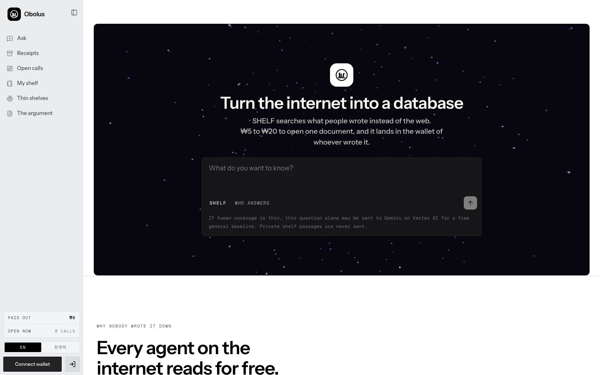
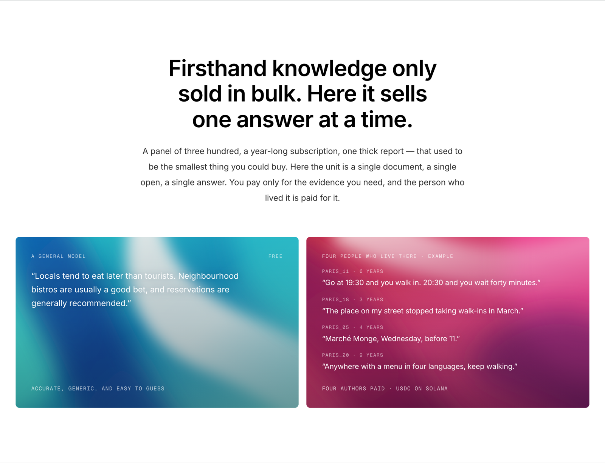
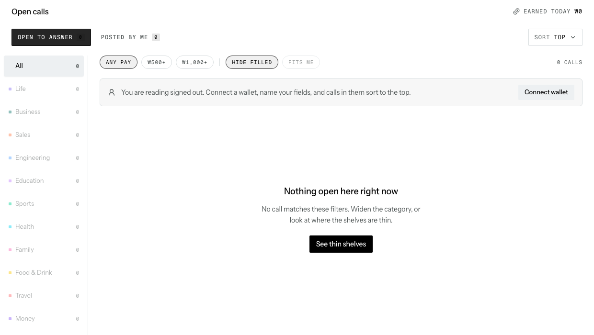
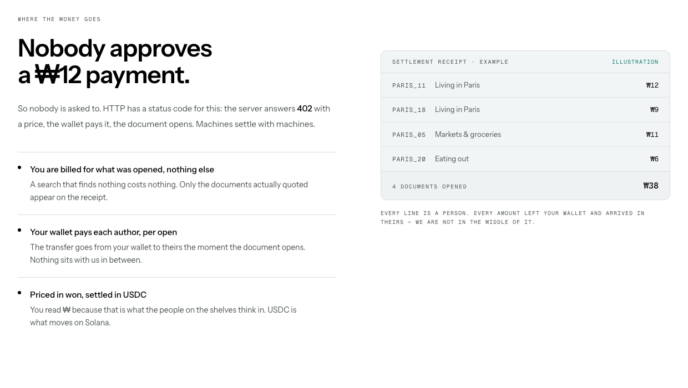
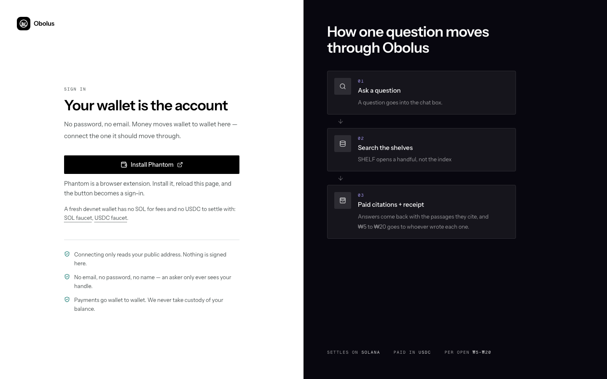
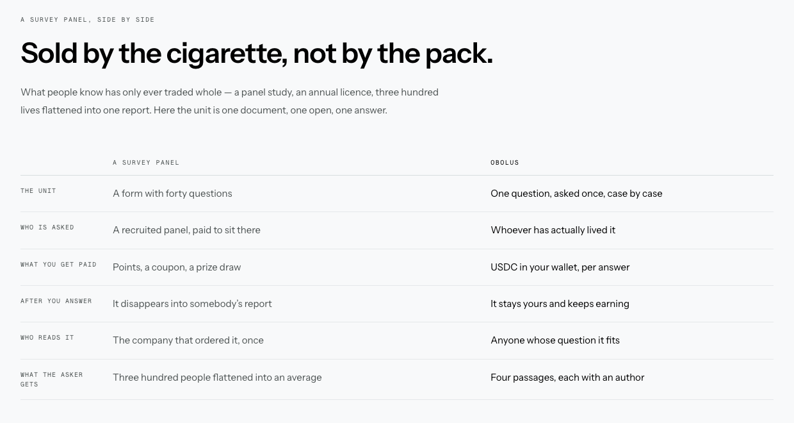
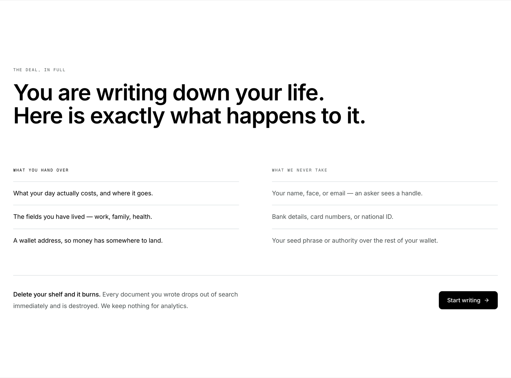
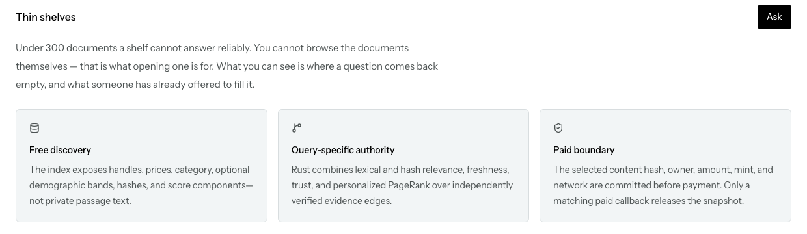
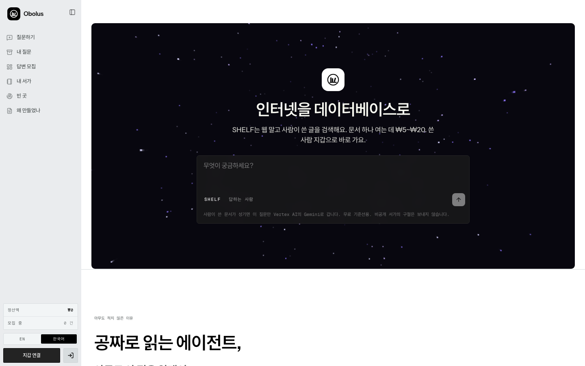

<h1 align="center">
   Obolus
</h1>

<p align="center">
  <a href="https://github.com/DanRo-AX/Obolus-GoogleCloudAI-Solana"></a>
  <a href="https://github.com/DanRo-AX/Obolus-GoogleCloudAI-Solana/actions/workflows/ci.yml"></a>
  
  
  
</p>

<p align="center">
  <sub><a href="../../README.md">English</a></sub>
</p>

<p align="center">
  <strong>인터넷을 데이터베이스로. 값은 문서 한 건 단위로.</strong><br/>
  Obolus는 웹 대신 사람이 직접 쓴 문서를 검색하고, 한 건씩 값을 치르는 검색 서비스입니다.<br/>
  문서 하나를 여는 데 ₩5~₩25이 들며, 열람료는 소유자 90%와 프로토콜 10%로 배분됩니다.<br/>
  문서마다 결제를 반복 승인할 필요가 없고 구독료도 없습니다.
</p>

<h3 align="center"><a href="#시작하기"><ins>시작하기</ins></a></h3>

> **프로젝트 일시 종료 기록 (2026-08-04):** 현재 코드, Devnet 배포, 검증한
> 범위, 남은 위험, 비용이 계속 발생하는 자원, 롤백과 정확한 재개 순서는
> **[프로젝트 인수인계](../PROJECT-HANDOFF-2026-08-04.ko.md)**에 정리했습니다.

<p align="center">
  
</p>

## 주요 기능

<table>
<tr>
<td width="50%" valign="middle">

### 웹이 아니라 사람이 쓴 글을 검색

일반 모델은 빈칸을 가장 그럴듯한 문장으로 채웁니다. Obolus는 그곳에 실제로 사는 사람들이 쓴 문서를 열고, 각자에게 값을 치릅니다.

검색과 랭킹은 무료입니다. 실제로 인용된 문서에만 값이 붙습니다.

</td>
<td width="50%">
  
</td>
</tr>
<tr>
<td width="50%" valign="middle">

### 검색 결과가 없으면 유료 공고로 전환

서가에 맞는 문서가 없을 때 "검색 결과 없음"으로 끝나지 않습니다. 답변 하나에 매길 값을 정하면 그 질문이 알 만한 사람들에게 유료 공고로 나갑니다.

- 분야 11개, 세로 레일 방식의 분류
- 단가, 적합도, 남은 자리 기준 필터

</td>
<td width="50%">
  
</td>
</tr>
<tr>
<td width="50%" valign="middle">

### HTTP 402 기반 자동 결제

HTTP에는 이미 이 용도의 상태 코드가 있습니다. 서버가 `402`와 가격을 돌려주면 Agent가 수취인과 금액을 검증하고 제한된 선불 잔액으로 정산한 뒤 문서를 엽니다. ₩10 결제마다 사람을 불러 승인받지 않습니다.

가격을 원으로 표시하는 이유는 서가에 있는 사람들이 원으로 생각하기 때문입니다. 솔라나 위에서 실제로 움직이는 자산은 USDC입니다.

</td>
<td width="50%">
  
</td>
</tr>
<tr>
<td width="50%" valign="middle">

### 지갑 하나로 로그인

이메일, 비밀번호, 이름을 받지 않습니다. 지갑을 연결하면 공개 주소를 읽고, 들어갈 때 송금 권한이 없는 만료형 메시지 하나만 서명합니다. 질문자에게 보이는 정보는 핸들뿐입니다.

x402 facilitator가 Devnet 네트워크 수수료를 부담하므로 구매자 지갑에는 SOL이 필요하지 않습니다. 로그인 화면에서 테스트 USDC faucet을 바로 열 수 있습니다.

</td>
<td width="50%">
  
</td>
</tr>
<tr>
<td width="50%" valign="middle">

### 문서 한 건 단위 거래

사람이 아는 내용은 지금까지 통째로만 거래됐습니다. 패널 조사, 연간 라이선스, 삼백 명의 응답을 보고서 한 편으로 압축한 형태입니다.

Obolus의 거래 단위는 문서 하나, 열람 한 번, 답변 하나입니다. 답변의 소유권은 작성자에게 남고, 열릴 때마다 계속 정산됩니다.

</td>
<td width="50%">
  
</td>
</tr>
<tr>
<td width="50%" valign="middle">

### 약관 대신 화면에 적은 조건

무엇을 넘기고 무엇은 가져가지 않는지 정책 문서 대신 랜딩 페이지에 나란히 적어 뒀습니다.

서가를 지우면 소각됩니다. 작성한 문서는 즉시 검색에서 빠지고 파기됩니다.

</td>
<td width="50%">
  
</td>
</tr>
<tr>
<td width="50%" valign="middle">

### 부족한 분야를 공개하는 커버리지 지표

문서 300건 아래에서는 서가가 믿을 만한 답을 내지 못합니다. 그 사실을 인덱스가 그대로 보여 줍니다. 문서 본문은 미리 훑어볼 수 없습니다.

공개되는 정보는 질문이 빈손으로 돌아오는 자리, 그리고 그 자리를 채우겠다고 이미 붙은 값입니다.

</td>
<td width="50%">
  
</td>
</tr>
<tr>
<td width="50%" valign="middle">

### 한국어와 영어 동등 지원

번역 레이어를 나중에 얹은 구조가 아닙니다. 한국어에는 별도 서체 스택과 굵기, 자간, `word-break: keep-all`이 적용돼 있고, 문장은 화면 단위로 다시 썼습니다. 한 문장씩 옮긴 번역이 아닙니다.

사이드바 하단에서 전환할 수 있고, 선택한 언어는 새로고침 후에도 유지됩니다.

</td>
<td width="50%">
  
</td>
</tr>
</table>

**그 외 포함된 기능**

- **[Antigravity 플러그인](../../integrations/antigravity/openshelf/README.md)**: 질문자와 기여자의 전체 흐름을 `openshelf` MCP 툴 24개로 제공합니다. 공식 Pay.sh MCP 지갑도 얇은 핸드셰이크 어댑터를 통해 함께 붙습니다.
- **선불 크레딧과 복구**: 지갑 소유는 한 번만 증명하고, 잔액이 부족할 때만 충전합니다. 브라우저가 응답을 잃으면 서버와 대조해 이미 결제된 건은 복구하고 결제되지 않은 핸들만 재시도합니다.
- **공고 에스크로**: 유료 공고는 최대 예산을 먼저 잡아 둡니다. 채택된 답변마다 한 몫씩 풀리고, 공고를 취소하거나 계정을 삭제하면 쓰지 않은 잔액이 그대로 지급 청구로 돌아갑니다.
- **가입 전에 밝히는 3진 아웃**: 허위 사실이나 질 낮은 답변은 경고 1회, 경고 3회면 계정 정지입니다. 약관이 아니라 온보딩 화면에 적혀 있습니다.
- **AI는 유동성 보조 역할만**: 사람이 쓴 문서가 부족할 때 Vertex AI의 Gemini가 무료 기준선을 제공할 수 있습니다. 이 결과는 `ai_baselines`에 남고 가격이 붙지 않으며, 재판매와 권위 획득이 불가능하고 공고 자리도 채우지 못합니다.
- **의도적으로 좁게 설계한 기여자 메모리 에이전트**: 동의한 사용자에 한해, 유사도 82% 이상의 거의 동일한 공고이면서 타깃, 가격, 잠금, 행동 규칙까지 모두 통과할 때만 기존 유료 답변을 재사용합니다. 나머지는 전부 사람이 직접 답해야 합니다.
- **영수증**: 대화, 구매한 문서, 트랜잭션 링크를 한곳에서 확인합니다.

---

## 질문 처리 흐름

```text
질문 → 서가 탐색 → 유사도 랭킹 → 있음 / 없음
  있음 → 선불 크레딧 예약 → 저자 N명에게 지급 → 인용 붙은 답변 + 영수증
  없음 → "이건 아직 아무도 안 썼네요. 물어볼까요?"
       → "몇 명한테요?"  → "답변당 얼마 붙일까요?"
       → 공고 게시 → 답변 모집 보드
```

이 분기가 이 프로젝트에서 새로 만들어야 했던 유일한 부분입니다. 그래서
`src/pages/Chat.tsx`는 위 대화를 그대로 따라가는 상태 기계로 구현돼 있습니다.
조건에 맞는 문서가 이미 충분하면 순서가 뒤집혀서, 공고 없이 "값은 얼마입니다,
결제하시겠습니까?"로 바로 넘어갑니다.

매칭, 랭킹, 예산 필터, 저자 중복 제거, 있음/없음 판정은 모두 Rust 서비스에서
처리합니다. 768차원 해시 임베딩, 단어와 문자 n-gram, 개체 앵커, 신뢰도, 신선도,
그리고 큐레이터가 검증한 근거 간선 위의 토픽 개인화 PageRank를 사용합니다.
유료, 자기소유, 추론, 가공 전 UGC 간선으로는 권위를 살 수 없습니다. 검색 응답에는
핸들과 가격만 담기고 구절은 담기지 않습니다.

<details>
<summary><strong>정산 경로 두 가지 상세</strong></summary>

**에이전트 경로: 공식 Pay.sh 게이트웨이.** 자율 에이전트의 기본 경로입니다.

1. 무료 검색이 결제에 안전한 핸들과 질의 범위 복구 토큰을 돌려줍니다.
2. 에이전트가 무료 복구 URL을 확인한 뒤, 아직 열지 않은 핸들마다 질의에 묶인 Pay.sh 리소스를 하나씩 준비합니다.
3. `pay curl`이 HTTP 402/MPP 교환을 처리합니다. 표시 가격은 근거 소유자 90%와 프로토콜 10%로 나뉘며, 정확한 배분은 견적과 영수증에 고정됩니다.
4. Rust가 불변 견적, 가격 대역, 자산, 네트워크, 질의, 핸들, 런타임 수취인을 다시 검증한 뒤에 스냅샷을 내줍니다.
5. 응답을 잃어버리면 무료로 복구되고, 재시도해도 두 번 적립되지 않습니다.

**브라우저 경로: 팬텀과 선불 크레딧.** 별도 프로세스나 추가 설치가 필요 없습니다.

1. Rust가 비공개 문서를 검색해 안전한 핸들과 원화 가격만 돌려줍니다.
2. 정확한 핸들, 콘텐츠 해시, 수취 지갑, 문서별 원자 가격, 총액, 민트, 네트워크, 만료를 작업 하나에 확정해 넣습니다.
3. 검증된 선불 크레딧에서 작업 비용을 원자적으로 예약합니다. 잔액이 부족하면 미결제 충전 리소스가 x402 v2 `402 Payment Required`를 반환하고 팬텀이 USDC 예치를 한 번 승인합니다. facilitator가 네트워크 수수료를 부담하므로 사용자 SOL은 필요하지 않습니다.
4. 확인된 충전은 원장에 반영돼 작업 자금이 됩니다. 구절을 공개하지도, 수익으로 적립되지도 않습니다.
5. 서버 에이전트가 문서마다 Pay.sh/MPP를 실행하고, Rust는 결제된 스냅샷만 멱등하게 내보냅니다.
6. Rust가 서버에서 결제가 증명된 구절만 다시 읽고, Vertex AI의 Gemini가 인용 붙은 종합을 작성합니다. 제공자가 설정돼 있지 않으면 답을 지어내는 대신 근거만 있는 결과를 그대로 보여 줍니다.
7. 영구 부분 실패가 발생하면 결제되지 않은 원자 잔액이 그대로 선불 크레딧으로 복원됩니다.

예치된 USDC는 출금 가능한 Obolus 선불 잔액으로 관리되지만, 사용자 개인키,
브라우저 보조 키, SPL 위임과 지갑의 나머지 자산에 대한 권한은 Rust와 게이트웨이,
Cloud Run 어디에도 전달되지 않습니다. 서비스 지갑은 GCP KMS를 통해 서명합니다. 자세한 내용은
[`docs/agent-payment-threat-model.md`](../agent-payment-threat-model.md)를 참고하세요.
정산 키를 바꾸면 예전 지갑의 미완료 지급을 먼저 모두 비워야 합니다. 한 건이라도
남거나 반복 실패가 10회에 이르면 새 워커의 준비 상태는 의도적으로 실패합니다.

</details>

구현 다이어그램은 **[시스템 아키텍처와 ERD](../../architecture.html)**에 있습니다.

---

## 기술 스택

<p>
  <kbd>React&nbsp;19</kbd> &nbsp; <kbd>TypeScript&nbsp;5.9</kbd> &nbsp; <kbd>Vite&nbsp;8</kbd> &nbsp; <kbd>Tailwind&nbsp;v4</kbd> &nbsp; <kbd>React&nbsp;Router&nbsp;7</kbd> &nbsp; <kbd>three.js</kbd> &nbsp;
  <kbd>Rust&nbsp;1.89&nbsp;/&nbsp;Axum</kbd> &nbsp; <kbd>Cloud SQL&nbsp;/&nbsp;PostgreSQL</kbd> &nbsp;
  <kbd>x402&nbsp;v2&nbsp;—&nbsp;exact&nbsp;/&nbsp;SVM</kbd> &nbsp; <kbd>Solana&nbsp;Devnet</kbd> &nbsp; <kbd>USDC</kbd> &nbsp; <kbd>Phantom</kbd> &nbsp;
  <kbd>Pay.sh&nbsp;+&nbsp;MPP</kbd> &nbsp; <kbd>GCP&nbsp;KMS</kbd> &nbsp; <kbd>Cloud&nbsp;Run</kbd> &nbsp; <kbd>Gemini&nbsp;on&nbsp;Vertex&nbsp;AI</kbd>
</p>

---

## 시작하기

```bash
npm ci
npm --prefix payment-gateway ci
npm --prefix agent-orchestrator ci

cp .env.example .env             # KMS 서비스 지갑 공개키와 Devnet RPC 설정
gcloud auth application-default login   # 로컬 Vertex AI ADC, API 키 불필요
                                 # .env에 GOOGLE_CLOUD_PROJECT 설정, 해당 프로젝트에 Vertex AI API 활성화

npm run dev:stack                # 프런트엔드, Rust API, x402 게이트웨이 동시 기동
```

| 프로세스 | 포트 | 기동 명령 |
| --- | --- | --- |
| 프런트엔드 (Vite) | `4319` | `npm run dev:stack` |
| Rust API (Axum) | `8787` | `npm run dev:stack` |
| x402 게이트웨이 | `1402` | `npm run dev:stack` |
| Pay.sh 게이트웨이 (샌드박스) | `3402` | `npm run pay:gateway:sandbox` |

선택 사항입니다.

```bash
npm run pay:gateway:sandbox      # 공식 Pay.sh 게이트웨이, 로컬 샌드박스
npm run x402:devnet:smoke        # 자금이 든 지갑으로 정산 검증
```

유료 경로가 기본값입니다. 예전 샌드박스 원장 경로를 의도적으로 사용할 때만
`VITE_X402_ENABLED=false`로 두고, 완전 정적 폴백이 필요하면
`VITE_BACKEND_ENABLED=false`로 설정하세요.

### 에이전트 연동 (Antigravity와 일반 MCP)

```bash
agy plugin install ./integrations/antigravity/openshelf
npm run agent:doctor
agy
```

`/mcp`로 `openshelf`와 `pay`가 둘 다 붙었는지 확인하세요. 무료 검색과 AI 기준선은
Pay 계정 없이도 동작합니다. 첫 유료 동작 전에 로컬에서 보호되는 이름 있는 Pay 계정을
만들거나 고르고, Pay 기본값과 달라야 하면 `OPENSHELF_PAY_ACCOUNT=NAME`을 설정하세요.
**플러그인은 Pay를 호출하기 전에 Devnet 합산 금액을 정확히 제시하고 명시적 승인을
받습니다.**

Antigravity 없이도 같은 서비스를 사용할 수 있습니다.

```bash
npm run agent:tools                          # 명령 24개 전체 보기
npm run agent:tools -- ask_people            # 입력 스키마 하나만 정확히
npm run agent:call -- ask_people --json \
  '{"question":"What do people living in Paris actually eat on weeknights?","requestedDocuments":3}'
```

유료 구매자 명령은 개인키를 받는 대신, 별도 Pay MCP에 넘길 정확한 URL과 금액을
돌려줍니다. 운영 기여자 계정 명령은 에이전트가 브라우저와 같은 지갑
challenge/SIWX 증명을 마칠 수 있을 때까지 뒤로 미룹니다. 기존 이메일 `auth login`
명령은 `OPENSHELF_EMAIL_PASSWORD_AUTH_ENABLED=true`인 테스트 전용이며 출시 경로가
아닙니다.

Cloud Run과 GCP KMS 배포는
[`integrations/antigravity/openshelf/README.md`](../../integrations/antigravity/openshelf/README.md),
[`docs/ACCOUNT-LINKING.md`](../ACCOUNT-LINKING.md), [`pay/PAY.md`](../../pay/PAY.md),
[`docs/PAY-SH.md`](../PAY-SH.md)를 참고하세요.

---

## 빌드와 테스트

```bash
npm run build                    # tsc -b && vite build
npm run lint                     # oxlint
npm run check:all                # 전 워크스페이스: 빌드, 린트, 타입체크, 테스트, clippy
```

`check:all`은 `backend/`에 `cargo test`와 `cargo clippy -D warnings`를 실행하기 때문에
Rust 툴체인이 필요합니다(`rust-toolchain.toml`이 1.89.0으로 고정). CI는 프런트엔드,
agent-orchestrator, payment-gateway, 백엔드를 각각 별도 잡으로 실행합니다.
[`.github/workflows/ci.yml`](../../.github/workflows/ci.yml)을 참고하세요.

---

## 화면 구성

| 경로 | 화면 | 설명 |
| --- | --- | --- |
| `/` | **질문하기** | 정문. 질문하면 SHELF가 서가를 탐색하고, 결과가 없으면 공고로 넘어갑니다. |
| `/chat/:id` | 대화 | 질문 한 건의 스레드. 있음/없음 대화와 결제 미리보기를 포함합니다. |
| `/dashboard` | **답변 모집** | 답변자용 보드. 답변당 단가가 붙은 공고를 골라 답하고 정산받습니다. |
| `/memory` | **내 서가** | 지금까지 답한 문서가 쌓이는 곳. 쌓일수록 자동 매칭이 잘 붙습니다. |
| `/archive` | 내 질문 | 대화, 구매한 문서, 트랜잭션 링크. |
| `/coverage` | 빈 곳 | 질문이 빈손으로 돌아오는 자리와 그 자리에 붙은 값. |
| `/answer/:orderId` | 답변 | 한 화면에 질문 하나. 앞에 몸풀기 문항 몇 개. |
| `/onboarding` | 설정 | 핸들, 구간, 분야, 정산 지갑, 3진 아웃 규칙. |
| `/whitepaper` | 왜 만들었나 | 이 프로젝트를 만드는 이유를 정리한 긴 글. |
| `/login` `/terms` `/privacy` `/admin/disputes` | | 지갑 로그인, 법적 고지, 관리자 분쟁 검토. |

---

## 프로젝트 구조

| 경로 | 내용 |
| --- | --- |
| `src/` | React 앱. 페이지, 컴포넌트, `i18n/`, 그리고 랜딩에서 예시로 표시하는 `data/` 픽스처. |
| `backend/` | Rust/Axum 서비스. 검색, 랭킹, 원장, 에스크로, 분쟁, 세션. 정확한 경계는 [`backend/README.md`](../../backend/README.md)를 참고하세요. |
| `payment-gateway/` | x402 v2 게이트웨이. 견적, verify/settle 위임, 지급 및 에스크로 워커. |
| `agent-orchestrator/` | 문서마다 Pay.sh 챌린지를 처리하는 Cloud Run 에이전트. |
| `pay/` | Pay.sh 페이월 정의, Dockerfile, Cloud Build + GCP KMS 배포. |
| `integrations/antigravity/openshelf/` | 플러그인. MCP 툴 24개, 스킬, Pay 핸드셰이크 어댑터. |
| `docs/` | 위협 모델, 계정 연동, Pay.sh 배포, 코드 리뷰, 랭킹 노트. |
| `architecture.html` | 시스템 아키텍처와 ERD. 파일 하나로 열립니다. |

---

## 구현 범위

코드를 읽는 사람에게 필요한 구분이라 그대로 적습니다.

**실제로 동작하는 것.** 유료 문서 열람과 유료 공고 예산은 솔라나 Devnet에서 실제
x402 exact/SVM 정산을 사용합니다. 세션은 서버가 발급하는 HttpOnly 쿠키이고,
클라이언트가 보낸 `userId`는 받지 않습니다. 에스크로 예약, 답변당 결정적 지급,
취소와 계정 삭제 시 정확한 환불이 모두 구현돼 있습니다. 계정 삭제는 모든 세션을
폐기하고 프로필, 메모리, 문서 본문을 삭제하며, 추가만 가능한 금전 감사 기록은
익명화합니다. 진행 중인 외부 결제가 있으면 결과가 확정될 때까지 삭제를 거부하고,
삭제가 먼저 이긴 경우 복사된 결제 URL과 결제·번들 스냅숏을 원문 삭제와 같은
트랜잭션에서 폐기합니다. 이미 전달된 글은 수신자에게서 회수할 수 없지만 서비스의
복구 API에서는 다시 제공하지 않습니다. 콘텐츠 해시, 불변 버전, 수정 시 이전 구절 잠금, 비공개 내보내기 로그,
매칭 메타데이터만 노출하는 공개 매니페스트도 실제로 동작합니다. 2진 자동매칭 및
지급 보류와 3진 계정 정지는 서버가 강제합니다.

**샌드박스로 표시된 것.** 가입 시 ₩100,000 잔액과 0원 공고는 명확히 표시된
원장이며 법정화폐가 아닙니다. 로컬 Pay.sh 샌드박스는 402, 전달, 복구 계약 전체를
증명하는 것이지 Devnet 전송을 증명하지 않습니다. 자금이 실린 Devnet 영수증에는
팀의 외부 Pay 계정, KMS IAM 주체, Devnet USDC가 필요합니다.

**범위 밖.** 메인넷은 범위 밖입니다. 공개 Devnet 서비스를 열려면 관리형 RPC,
다중 인스턴스용 내구 큐와 데이터베이스, 분산 레이트 리밋, 이메일 인증, KMS 시크릿
관리가 추가로 필요하고, 소셜 로그인을 쓴다면 외부 신원 제공자도 필요합니다.

**아직 정하지 못한 것.** 최초 회의에서 넘어온 그대로이고, 제품 FAQ에서도 감추지
않고 다룹니다.

1. **초기에 서가를 어떻게 채울 것인가.** 가장 큰 난제입니다. 서가가 비면 사서가 할 일이 없습니다.
2. **음성이냐 채팅이냐.** 미정입니다. v1은 공고 답변 방식입니다.
3. **콜드 스타트 권위.** 관련성 탐색은 가능하지만, 그래프 권위를 신뢰하려면 실서비스 보정과 시빌 저항 신원이 먼저 필요합니다.
4. **불성실한 답변.** 신분증 기반 실명 인증은 v1 범위 밖입니다.

더 읽을거리는 다음과 같습니다. 크롬으로 검증한 시나리오와 우선순위 갭은
[`SCENARIO-AUDIT.md`](../../SCENARIO-AUDIT.md), 프로덕션 감사는
[`docs/CODE-REVIEW.md`](../CODE-REVIEW.md), 모든 카피가 기준으로 삼은 원본 제품
브리프는 [`BRIEF.md`](../../BRIEF.md)에 있습니다.

---

## 라이선스

아직 `LICENSE` 파일이 없습니다. 따라서 기본 저작권이 적용되며 모든 권리를
유보합니다. 특정 용도로 사용할 조건이 필요하면 이슈를 열어 주세요.
